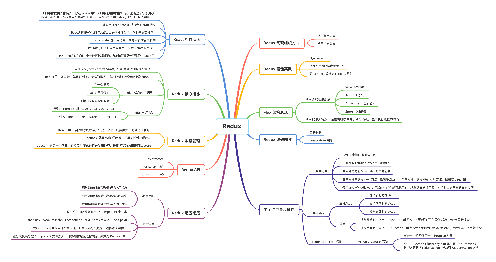
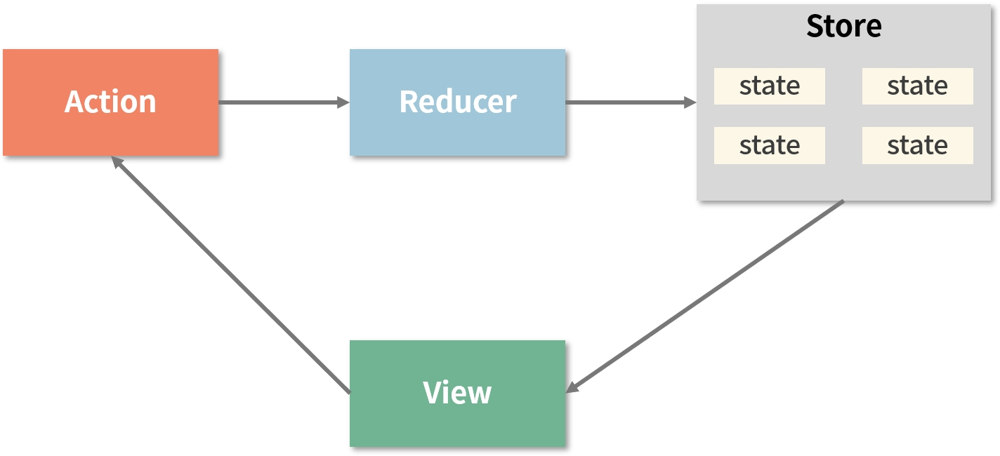
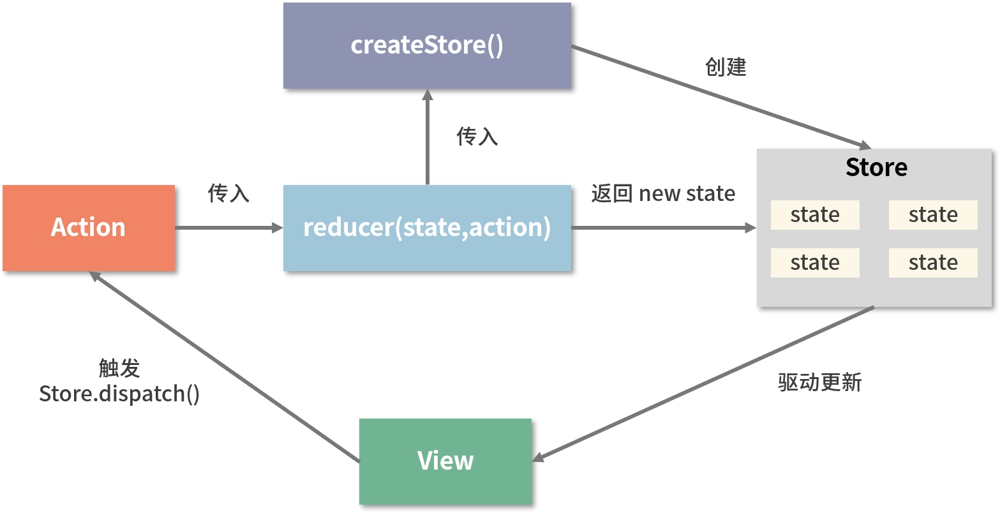
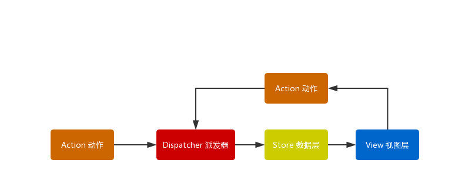
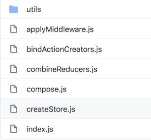
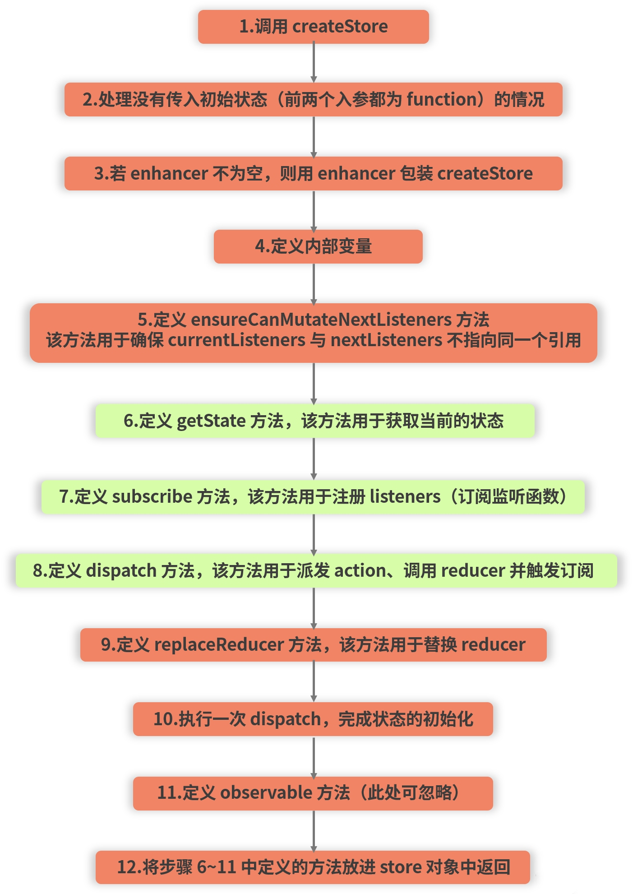
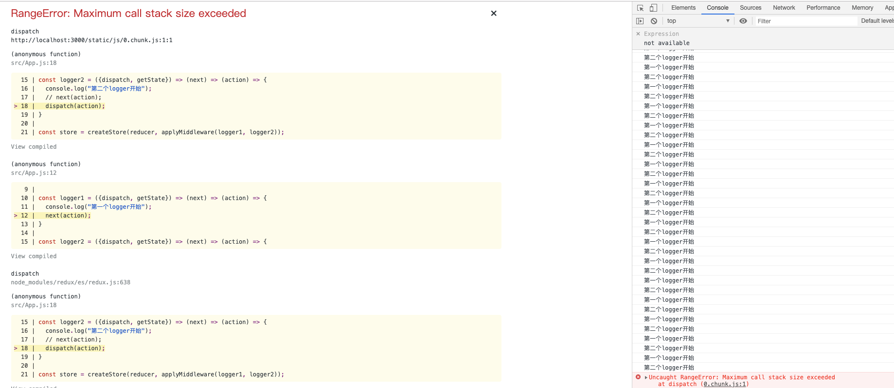

# Redux



## 1. React 组件状态

React 其实就是这样一个公式：

```jsx
UI = f(data)
```

f 的参数 data，除了 props，就是 state。**props 是组件外传递进来的数据，state 代表的就是 React 组件的内部状态。**


在说 Redux 这样的状态管理工具之前，我们先从了解 React 组件自身的管理开始。为什么呢？

- 因为 React 组件自身的状态管理是基础，其他第三方工具都是在这个基础上构筑的，只有了解了基础才能更好的理解第三方工具。
- 对于很多应用场景，React 组件自身的状态管理就足够解决问题，犯不上动用 Redux 这样的状态管理工具，简单问题简单处理，可以让代码更容易维护。

### （1）什么数据放在 state 中

对于 React 组件而言，数据分为两种：

- props
- state

二者的区别显而易见，简单说就是，props 是外部传给组件的数据，而 state 是组件自己维护的数据，对外部是不可见的。所以，判断某个数据以 props 方式存在，还是以 state 方式存在，并不难，只需要判断这个状态是否是组件内部状态。


那为什么不把组件的数据直接存放在组件类的成员变量中？比如像下面这样：

```jsx
class Foo extends React.Component {
  foo = 'foo'
  
  render() {
    return (
      <React.Fragment>{this.foo}</React.Fragment>
    );
  }
}
```

这里数据存在 `this.foo` 中，而不是存在 `this.state.foo` 中，当这个组件渲染的时候，当然 `this.foo` 的值也就被渲染出来了，问题是，更新 `this.foo` 并不会引发组件的重新渲染，这很可能不是我们想要的。所以，判断一个数据应该放在哪里，用下面的原则：

- 如果数据由外部传入，放在 props 中；
- 如果是组件内部状态，是否这个状态更改应该立刻引发一次组件重新渲染？如果是，放在 state 中；不是，放在成员变量中。

### （2）修改 state 的正确方式

组件自身的状态可以通过 `this.state` 读取到，`this.state` 本身就是一个对象，但是修改状态不应该通过直接修改 `this.state` 对象来完成。因为，修改 state，当然不只是想修改这个对象的值，而是想引发 React 组件的重新渲染。

```jsx
this.state.foo = 'bar'; //错误的方式
this.setState({foo:'bar'}); //正确的方式
```

如果只是修改 `this.state`，那改了也就只是改了这个对象，其他的什么都不会发生；如果使用 `setState` 函数，那不光修改 `state`，还能引发组件的重新渲染，在重新渲染中就会使用修改后的 `state`，这也就是达到根据 `state` 改变公式左侧 UI 的目的。

```jsx
UI = f(state)
```

### （3）state 改变引发重新渲染的时机

使用 `setState` 函数可以来修改组件 state，而且会引发组件重新渲染。但是，并不是一次 `setState` 调用肯定会引发一次重新渲染。这是 React 的一种性能优化策略，如果 React 对每一次 `setState` 都立刻做一次组件重新渲染，那代价有点大，比如下面的代码：

```jsx
this.setState({count: 1});
this.setState({caption: 'foo'});
this.setState({count: 2});
```

连续的同步调用 `setState`，第三次还覆盖了第一次调用的效果，但是效果只相当于调用了下面这样一次：

```jsx
this.setState({count: 2, caption: 'foo'});
```

虽然一般不会故意连续写三个 setState 调用，但是代码一旦写得复杂，可能有多个 setState 分布在一次执行的不同代码片段中，还是会同步连续调用 setState，这时候，如果真的每个 setState 都引发一次重新渲染，实在太浪费了。


React 非常巧妙地用任务队列解决了这个问题，可以理解为每次 setState 函数调用都会往 React 的任务队列里放一个任务，多次 setState 调用自然会往队列里放多个任务。React 会选择时机去批量处理队列里执行任务，当批量处理开始时，React 会合并多个 setState 的操作，比如上面的三个 setState 就被合并为只更新 state 一次，也只引发一次重新渲染。因为这个任务队列的存在，React 并不会同步更新 state，所以，在 React 中，setState 也不保证同步更新 state 中的数据。

### （4）this.setState() 的同步与异步

调用 setState 之后的下一行代码，读取 this.state 并不是修改之后的结果。

```jsx
console.log(this.state.count);// 修改之前this.state.count为0
this.setState({count: 1})
console.log(this.state.count);// 在这里this.state.count依然为0
```

setState 只是给任务队列里增加了一个修改 `this.state` 的任务，这个任务并没有立即执行，所以 `this.state` 并不会立刻改变。


其实问题没有这么简单，上面例子中，都假设 setState 是由 React 的生命周期函数或者事件处理函数中同步调用，这种情况下 setState 不会立即同步更新 state 和重新渲染。但是，如果调用 setState 由其他条件引发，就不是这样了。看下面的代码，结果可能会出乎你的所料：

```jsx
setTimeout(() => {
    this.setState({count: 2}); //这会立刻引发重新渲染
    console.log(this.state.count); //这里读取的count就是2
  }, 0);
```

为什么 setTimeout 能够强迫 setState 同步更新 state 呢？


当 React 调用某个组件的生命周期函数或者事件处理函数时，React 会想：“这一次函数可能调用多次 setState，先打开一个标记，只要这个标记是打开的，所有的 setState 调用都是往任务队列里放任务，当这一次函数调用结束的时候，我再去批量处理任务队列，然后把这个标记关闭。”


因为 setTimeout 是一个 JavaScript 函数，和 React 无关，对于 setTimeout 的第一个函数参数，这个函数参数的执行时机，已经不是 React 能够控制的了，换句话说，React 不知道什么时候这个函数参数会被执行，所以那个“标记”也没有打开。


当那个“标记”没有打开时，setState 就不会给任务列表里增加任务，而是强行立刻更新 state 和引发重新渲染。这种情况下，React 认为：“这个 setState 发生在自己控制能力之外，也许开发者就是想要强行同步更新呢，宁滥勿缺，那就同步更新了吧。”


但是最好不要用 setTimeout 来调用 setState ，React 选择不同步更新 state，是一种性能优化，如果用上 setTimeout，就没机会让 React 优化了。而且，每当你觉得需要同步更新 state 的时候，往往说明你的代码设计存在问题，绝大部分情况下，你所需要的，并不是“state 立刻更新”，而是，“确定 state 更新之后我要做什么”，这就引出了 setState 另一个功能。

### （5）setState 的第二个参数

setState 的第二个参数可以是一个回调函数，当 state 真的被修改时，这个回调函数会被调用：

```jsx
console.log(this.state.count); // 0
this.setState({count: 1}, () => {
  console.log(this.state.count); // 这里是1
})
console.log(this.state.count); // 依然为0
```

当 setState 的第二个参数被调用时，React 已经处理完了任务列表，所以 this.state 就是更新后的数据。如果需要在 state 更新之后做点什么，就要利用第二个参数。

### （6）函数式 setState

setState 不能同步更新的确会带来一些麻烦，尤其是多个 setState 调用之间有依赖关系的时候，很容易写错代码。一个很典型的例子，当不断增加一个 state 的值时：

```jsx
this.setState({count: this.state.count + 1});
this.setState({count: this.state.count + 1});
this.setState({count: this.state.count + 1});
```

上面的代码表面上看会让 `this.state.count` 增加 3，实际上只增加了 1，因为 setState 没有同步更新 `this.state` 啊，所以给任务队列加的三个任务都是给 `this.state.count` 同一个值而已。面对这种情况如果任务列表中的任务不只是给 state 一个固定数据，如果任务列表里的“任务”是一个函数，能够根据当前 state 计算新的状态，那该多好！实际上，setState 已经支持这种功能，到现在为止我们给 setState 的第一个参数都是对象，其实也可以传入一个函数。


当 setState 的第一个参数为函数时，任务列表上增加的就是一个可执行的任务函数了，React 每处理完一个任务，都会更新 `this.state`，然后把新的 state 传递给这个任务函数。setState 第一个参数的形式如下：

```jsx
function increment(state, props) {
  return {count: state.count + 1};
}
```

可以看到，这是一个纯函数，不光接受当前的 state，还接受组件的 props，在这个函数中可以根据 state 和 props 任意计算，返回的结果会用于修改`this.state`。这样，就可以这样连续调用 setState：

```jsx
this.setState(increment);
this.setState(increment);
this.setState(increment);
```

用这种函数式方式连续调用 setState，就真的能够让 `this.state.count` 增加 3，而不只是增加 1。

## 2. Redux 核心概念

先来看一下官方对 Redux 的描述：

Redux 是 JavaScript 状态容器，它提供可预测的状态管理。

来看一下这句话背后的深意：

- Redux 是为JavaScript应用而生的，也就是说它不是 React 的专利，React 可以用，Vue 可以用，原生 JavaScript 也可以用；
- Redux 是一个状态容器，什么是状态容器？来看个例子：

假如把一个 React 项目里面的所有组件拉进一个群，那么 Redux 就充当了这个群里的“群文件”角色，所有的组件都可以把需要在组件树里流动的数据存储在群文件里。当某个数据改变的时候，其他组件都能够通过下载最新的群文件来获取到数据的最新值。这就是“状态容器”的含义——**存放公共数据的仓库**。


应用的状态往往十分复杂，如果应用状态就是一个普通 JavaScript 对象，而任何能够访问到这个对象的代码都可以修改这个状态，就很容易乱了套。当 bug 发生的时候，我们发现是状态错了，但是也很难理清到底谁把状态改错了，到底是如何走到出 bug 这一步。Redux 的主要贡献，就是**限制了对状态的修改方式，让所有改变都可以被追踪。**


**Redux 基本使用：**

（1）在使用Redux之前，我们需要**安装稳定版的Redux包。**

因为 Redux 是一个中立的状态管理工具，和 React 没有直接联系。所以，如果在 React 应用中使用 Redux，除了要引入 Redux，还需要导入 react-redux 这个安装包，安装方法如下：

```jsx
npm install --save redux react-redux
```

（2）在使用Redux时，需要将其引入组件：

```jsx
import { createStore } from 'redux';
```

## 3. Redux 数据管理

Redux 主要由三部分组成：store、reducer 和 action。先来看看它们各自代表什么：

- store：就好比组件群里的“群文件”，它是一个单一的数据源，而且是**只读**的；
- action：就是“动作”的意思，它是对变化的描述。

- reducer 是一个函数，它负责对变化进行分发和处理，最终将新的数据返回给 store。

### （1）Store

Store 就是保存所有状态数据的地方，整个应用只能有一个 Store。可以使用 `createStore` 函数来创建 Store：

```jsx
import { createStore } from 'redux'
const reducer = (state, action) => {
    // ...
    return new_state
}
const store = createStore(reducer)
```

使用 `createStore` 函数接收了一个 reducer 函数，这里 `createStore` 接收了一个函数，并返回了 store。


Store 对象包含了所有数据，如果想获取某个时点的数据，就要对 Store 生成快照，这种时点的数据集合，就叫做 State。


对于 state，有三大原则：

1. **唯一数据源**：所有的状态值保存在 Redux 的 `store` 中，整个应用只有一个 `store`，状态是一个树形对象，每个组件使用状态树上的一部分数据；
2. **保持状态只读**：在任何时候都不能直接修改应用状态。只能通过发送一个 `Action`，由这个 `Action` 描述如何去修改应用状态；

1. **只有纯函数能改变数据**：这里的函数指的就是 `reducer`，它接收两个参数，第一个参数是 `state`，也就是当前状态，第二个参数是 `action`。`reducer` 根据这两个参数的值，创建并返回一个新的对象。

```jsx
import { createStore } from 'redux'
const reducer = (state, action) => {
    // ...
    return new_state
}
const store = createStore(reducer)
// 获取state 
const state = store.getState()
```

**注意**：这里说的纯函数是指不依赖于且不改变它作用域之外的变量的函数，也就是说函数返回的结果必须完全由传入的参数决定

### （2）Action

State 的变化，会导致 View 的变化。用户只能接触到 View 视图层，所以，我们 State 的变化必然是由于 View 导致的。视图层 View 通过 Action 发出通知，告知 State 它该上场了，需要发生改变了。


那么 Action 是什么呢？它是一个对象，type 属性是其必须的，它标识 Action 的名称，可能会有的属性有三个：`error`、`payload` 和 `meta`：

```jsx
const action = {
    type: 'ADD_TODO',
    payload: 'Learn Redux'
}
```

上面代码中，给 Action 定义了一个名称: “ADD_TODO”，它携带的是字符串 “Learn Redux”。


**注意：**Action 是改变 State 的唯一方式。

### （3）Reducer

Store 收到 Action 之后，会返回一个新的 State，此时 View 会更新。State 的计算过程就称为 Reducer。Reducer 是一个函数，接收两个参数 Action 和当前的 State，并返回一个新的 State：

```jsx
const reducer = (state, action) => {
    // ...
    return new_state
}
```

Reducer 不需要手动调用，`store.dispatch()` 方法会触发 Reducer 的自动执行，就是在生成 Store 的时候，将 Reducer 传入 `createStore` 方法，上面的 Store、State 就一直在使用。


store、action 和 reducer 三者紧密配合，便形成了 Redux 独树一帜的工作流：

从上图可以看出，**在 Redux 的整个工作过程中，数据流是严格单向的。**


对于一个 React 应用来说，视图（View）层面的所有数据（state）都来自 store（再一次诠释了单一数据源的原则）。如果想对数据进行修改，只有一种途径：派发 action。action 会被 reducer 读取，进而根据 action 内容的不同对数据进行修改、生成新的 state（状态），这个新的 state 会更新到 store 对象里，进而驱动视图层面做出对应的改变。


对于组件来说，任何组件都可以通过约定的方式从 store 读取到全局的状态，任何组件也都可以通过合理地派发 action 来修改全局的状态。**Redux 通过提供一个统一的状态容器，使得数据能够自由而有序地在任意组件之间穿梭，**这就是 Redux 实现组件间通信的思路。

## 4. Redux API

### （1）createStore

```jsx
const store = createStore(
    reducer,
    initial_state,
    applyMiddleware(middleware1, middleware2, ...)
);
```

createStore 方法是一切的开始，它接收三个入参：

- reducer；
- 初始状态内容；

- 指定中间件；

一般来说，只有 reducer 是必须有的。

### （2）store.dispatch()

Action 是改变 state 的唯一方式，Action 是 View 发出的，那么 View 是怎样发出 Action 呢？这时就需要用到 `store.dispatch()`。


`store.dispatch()` 接收一个 Action 对象作为参数，并将它发送出去。

```jsx
import { crateStore } from 'redux'
const reducer = (state, action) => {
    // ...
    return new_state
}
const store = createStore(reducer)
store.dispatch({
    type: 'ADD_TODO',
    payload: 'Learn Redux'
})
```

**注意：**`store.dispatch()` 是 View 发出 Action 的唯一方法。

### （3）store.subscribe()

Store 允许使用 `store.subscribe()` 方法设置监听函数，State 发生变化时会自动执行这个函数。

```jsx
import { createStore } from 'redux'
const reducer = (state, action) => {
    // ...
    return new_state
}
const store = createStore(reducer)
store.subscribe(listener)
```

`store.subscribe` 方法返回一个函数，调用这个函数就可以解除监听。

```jsx
let unsubscribe = store.subscribe(() =>
  console.log(store.getState())
)
unsubscribe()
```


通过上面的API，总结出Redux的工作流如下：



## 5. Redux 适用场景

Redux虽好，但并不适用于所有项目。使用Redux需要创建很多模版代码，会让 state 的更新变得非常繁琐。正如 Redux 的作者 Dan Abramov 所言，Redux 提供了一个交换方案，它要求应用牺牲一定的灵活性以达到以下三个要求：

- 通过简单对象和数组描述应用状态
- 通过简单对象描述应用状态的改变

- 使用纯函数来描述状态改变的逻辑


相应的，会得到以下好处：

- 可以很方便的将 state 存储到 Local Storage 中并在需要的时候取出并启动应用
- 可以在服务器端直接计算出 state 再存到 HTML 中，然后在客户端秒开页面

- 方便的序列化用户操作和对应的 state 快照，在出现 bug 的时候可以利用这些信息快速复现问题
- 通过在网络中传递 action 对象，可以在对代码进行很小改动的情况下实现分布式应用

- 可以在对代码进行很小改动的情况下实现撤销和恢复功能
- 在开发过程中可以任意跳转到应用的某个历史状态并进行操作

- 提供全面的审查和控制功能，让开发者可以定制自己的开发工具
- 将 UI 和业务逻辑分离，使业务逻辑可以在多个地方重用


另外，对于 React 来说，当遇到以下情况你或许需要 Redux 的帮助：

- 同一个 state 需要在多个 Component 中共享
- 需要操作一些全局性的常驻 Component，比如 Notifications，Tooltips 等

- 太多 props 需要在组件树中传递，其中大部分只是为了透传给子组件
- 业务太复杂导致 Component 文件太大，可以考虑将业务逻辑拆出来放到 Reducer 中

## 6. **Redux** 代码组织方式

在应用中引入 Redux 之后，就会引入 action 和 reducer。从方便管理的角度出发，和 React 组件一样，action 和 reducer 都有自己独立的源代码文件，很自然，我们需要决定如何组织这些代码。


更好的方法，是把源代码文件分类放在不同的目录中，根据分类方式，可以分为两种：

- 基于角色的分类（role based）
- 基于功能的分类（feature based）


**（1）基于角色的分类**

在MVC 应用中，在一个目录下放所有的 controller，在另一个目录下放所有的 view，在第三个目录下放所有的 model，每个目录下的文件都是同样的“角色”，这就是基于角色的分类。对应到使用 React 和 Redux 的应用，做法就是把所有 reducer 放在一个目录（通常就叫做 reducers)，把所有 action 放在另一个目录（通常叫 actions）。最后，把所有的纯 React 组件放在另一个目录。


**（2）基于功能的分类**

基于功能的分类方式，是把一个模块相关的所有源代码放在一个目录。例如，对于博客系统，有 Post（博客文章）和 Comment（注释）两个基本模块，建立两个目录 Post 和 Comment，每个目录下都有各自的 `action.js` 和 `reducer.js` 文件，如下所示，每个目录都代表一个模块功能，这就是基于功能的分类方式。

```jsx
Post -- action.js
     |_ reucer.js
     |_ view.js
Comment -- action.js
        |_ reucer.js
        |_ view.js
```

一般说来，基于功能的分类方式更优。因为每个目录是一个功能的封装，方便共享。具体用哪种方式来组织代码，主要就看是否预期这些模块会被共享，如果会，那采用基于功能的方式就是首选。

## 7. Redux 最佳实践

应用 Redux 的时候，有这些业界已经证明的最佳实践：

**（1）Store 上的数据应该范式化。**

所谓范式化，就是尽量减少冗余信息，像设计 MySQL 这样的关系型数据库一样设计数据结构。

**（2）使用 selector**

对于 React 组件，需要的是『反范式化』的数据，当从 Store 上读取数据得到的是范式化的数据时，需要通过计算来得到反范式化的数据。你可能会因此担心出现问题，这种担心不是没有道理，毕竟，如果每次渲染都要重复计算，这种浪费积少成多可能真会产生性能影响，所以，我们需要使用 seletor。业界应用最广的 selector 就是 [reslector](https://github.com/reduxjs/reselect) 。


reselector 的好处，是把反范式化分为两个步骤，第一个步骤是简单映射，第二个步骤是真正的重量级运算，如果第一个步骤发现产生的结果和上一次调用一样，那么第二个步骤也不用计算了，可以直接复用缓存的上次计算结果。

绝大部分实际场景中，总是只有少部分数据会频繁发生变化，所以 reselector 可以避免大量重复计算。

**（3）只 connect 关键点的 React 组件**

当 Store 上状态发生改变的时候，所有 connect 上这个 Store 的 React 组件会被通知：状态改变了！

然后，这些组件会进行计算。connect 的实现方式包含 `shouldComponentUpdate` 的实现，可以阻挡住大部分不必要的重新渲染，但是，毕竟处理通知也需要消耗 CPU，所以，尽量让关键的 React 组件 connect 到 store 就行。


一个实际的例子就是，一个列表种可能包含几百个项，让每一个项都去 connect 到 Store 上不是一个明智的设计，最好是只让列表去 connect，然后把数据通过 props 传递给各个项。

## 8. Flux 架构思想

Redux 的设计在很大程度上受益于 Flux 架构，可以说 Redux 是 Flux 的一种实现形式。Redux 结合了 Flux 架构和函数式编程，Flux 是一种架构思想，专门解决软件的结构问题。它跟 MVC 架构是同一类东西，但是更加简单和清晰。


Flux 并不是一个具体的框架，它是一套由 Facebook 技术团队提出的应用架构，这套架构约束的是应用处理数据的模式。在 Flux 架构中，一个应用将被拆分为以下 4 个部分：

- **View（视图层）**：用户界面。该用户界面可以是以任何形式实现出来的，React 组件是一种形式，Vue、Angular 也完全 OK。Flux 架构与 React 之间并不存在耦合关系。
- **Action（动作）**：也可以理解为视图层发出的“消息”，它会触发应用状态的改变。

- **Dispatcher（派发器）**：它负责对 action 进行分发。
- **Store（数据层）**：它是存储应用状态的“仓库”，此外还会定义修改状态的逻辑。store 的变化最终会映射到 view 层上去。


这 4 个部分之间的协作将通过下图所示的工作流规则来完成配合：



从上图可以看出，Flux 的最大特点，就是数据的"单向流动"，保证了整个执行流程的清晰。


Flux 在运行中，会按如下过程执行：

- 用户访问 View 视图层；
- 触发了用户的 Action；

- Dispatcher 收到 Action 的动作，通知 Store 需要更新数据；
- Store 更新数据后，发出 “change” 事件通知，通知 View 数据发生了变化，需要更新 UI；

- View 在接收到 “change” 事件通知后，会去更新页面。


Flux 最核心的地方在于**严格的单向数据流**，在单向数据流下，状态的变化是可预测的。如果 store 中的数据发生了变化，那么有且仅有一个原因，那就是由 Dispatcher 派发 Action 来触发的。这样一来，就从根本上避免了混乱的数据关系，使整个流程变得清晰简单。


不过这并不意味着 Flux 是完美的。事实上，Flux 对数据流的约束背后是不可忽视的成本：除了开发者的学习成本会提升外，Flux 架构还意味着项目中代码量的增加。


Flux 架构往往在复杂的项目中才会体现出它的优势和必要性。如果项目中的数据关系并不复杂，其实完全轮不到 Flux 登场，这一点对于 Redux 来说也是一样的。


结合 Flux 架构的特性，来看 Redux 官方给出的这个定义，就更容易理解**可预测**的深意了：

Redux 是 JavaScript 状态容器，它提供可预测的状态管理。

## 9. Redux 源码解读

### （1）目录结构

下面是Redux源码的目录结构：



其中，utils 是工具方法库；index.js 作为入口文件，用于对功能模块进行收敛和导出。真正工作的是功能模块本身，也就是下面这几个文件：

- **applyMiddleware.js****：**中间件模块
- **bindActionCreators.js：**用于将传入的 actionCreator 与 dispatch 方法相结合，合并一个新的方法

- **combineReducers.js：**用于将多个  reducer 合并起来
- **compose.js****：**用于把接收到的函数从右向左进行组合

- **createStore.js：**整个流程的入口，也是 Redux 中最核心的 API


### （2）**createStore源码**

下面主要来看下**createStore.js**的源码（目前github上的源码是TS版的，这里以JS版为例）。


使用 Redux 的第一步，就是调用 createStore 方法。这个方法做的事情似乎就是创建一个 store 对象出来，像这样：

```jsx
// 引入 redux
import { createStore } from 'redux'
// 创建 store
const store = createStore(
    reducer,
    initial_state,
    applyMiddleware(middleware1, middleware2, ...)
);
```

从拿到入参到返回出 store 的过程中，到底都发生了什么呢？我们来看一下 createStore 中主体逻辑的源码：

```jsx
function createStore(reducer, preloadedState, enhancer) {
    // 这里处理的是没有设定初始状态的情况，也就是第一个参数和第二个参数都传 function 的情况
    if (typeof preloadedState === 'function' && typeof enhancer === 'undefined') {
        // 此时第二个参数会被认为是 enhancer（中间件）
        enhancer = preloadedState;
        preloadedState = undefined;
    }
    // 当 enhancer 不为空时，便会将原来的 createStore 作为参数传入到 enhancer 中
    if (typeof enhancer !== 'undefined') {
        return enhancer(createStore)(reducer, preloadedState);
    }
    // 记录当前的 reducer，因为 replaceReducer 会修改 reducer 的内容
    let currentReducer = reducer;
    // 记录当前的 state
    let currentState = preloadedState;
    // 声明 listeners 数组，这个数组用于记录在 subscribe 中订阅的事件
    let currentListeners = [];
    // nextListeners 是 currentListeners 的快照
    let nextListeners = currentListeners;
    // 该变量用于记录当前是否正在进行 dispatch
    let isDispatching = false
    // 该方法用于确认快照是 currentListeners 的副本，而不是 currentListeners 本身
    function ensureCanMutateNextListeners() {
        if (nextListeners === currentListeners) {
            nextListeners = currentListeners.slice();
        }
    }
    // 我们通过调用 getState 来获取当前的状态
    function getState() {
        return currentState;
    }
    // subscribe 订阅方法，它将会定义 dispatch 最后执行的 listeners 数组的内容
    function subscribe(listener) {
        // 校验 listener 的类型
        if (typeof listener !== 'function') {
          throw new Error('Expected the listener to be a function.')
        }
        // 禁止在 reducer 中调用 subscribe
        if (isDispatching) {
          throw new Error(
            'You may not call store.subscribe() while the reducer is executing. ' +
              'If you would like to be notified after the store has been updated, subscribe from a ' +
              'component and invoke store.getState() in the callback to access the latest state. ' +
              'See https://redux.js.org/api-reference/store#subscribe(listener) for more details.'
          )
        }
        // 该变量用于防止调用多次 unsubscribe 函数
        let isSubscribed = true;
        // 确保 nextListeners 与 currentListeners 不指向同一个引用
        ensureCanMutateNextListeners(); 
        // 注册监听函数
        nextListeners.push(listener); 
        // 返回取消订阅当前 listener 的方法
        return function unsubscribe() {
            if (!isSubscribed) {
                return;
            }
            isSubscribed = false;
            ensureCanMutateNextListeners();
            const index = nextListeners.indexOf(listener);
            // 将当前的 listener 从 nextListeners 数组中删除 
            nextListeners.splice(index, 1);
        };
    }
    // 定义 dispatch 方法，用于派发 action 
    function dispatch(action) {
        // 校验 action 的数据格式是否合法
        if (!isPlainObject(action)) {
          throw new Error(
            'Actions must be plain objects. ' +
              'Use custom middleware for async actions.'
          )
        }
        // 约束 action 中必须有 type 属性作为 action 的唯一标识 
        if (typeof action.type === 'undefined') {
          throw new Error(
            'Actions may not have an undefined "type" property. ' +
              'Have you misspelled a constant?'
          )
        }
        // 若当前已经位于 dispatch 的流程中，则不允许再度发起 dispatch（禁止套娃）
        if (isDispatching) {
          throw new Error('Reducers may not dispatch actions.')
        }
        try {
          // 执行 reducer 前，先"上锁"，标记当前已经存在 dispatch 执行流程
          isDispatching = true
          // 调用 reducer，计算新的 state 
          currentState = currentReducer(currentState, action)
        } finally {
          // 执行结束后，把"锁"打开，允许再次进行 dispatch 
          isDispatching = false
        }
        // 触发订阅
        const listeners = (currentListeners = nextListeners);
        for (let i = 0; i < listeners.length; i++) {
            const listener = listeners[i];
            listener();
        }
        return action;
    }
    // replaceReducer 可以更改当前的 reducer
    function replaceReducer(nextReducer) {
        currentReducer = nextReducer;
        dispatch({ type: ActionTypes.REPLACE });
        return store;
    }
    // 初始化 state，当派发一个 type 为 ActionTypes.INIT 的 action，每个 reducer 都会返回
    // 它的初始值
    dispatch({ type: ActionTypes.INIT });
    // observable 方法可以忽略，它在 redux 内部使用，开发者一般不会直接接触
    function observable() {
      // observable 方法的实现
    }
    // 将定义的方法包裹在 store 对象里返回
    return {
      dispatch,
      subscribe,
      getState,
      replaceReducer,
      [$$observable]: observable
    }
}
```

通过上面源码会发现，createStore 从外面看只是一个简单的创建动作，但在内部却涵盖了所有 Redux 主流程中核心方法的定义。


createStore 内部逻辑如下：



## 10. Redux 中间件与异步操作

Action 发出后，Reducer 会立刻算出 State，称为同步。如果 Action 发出后，过一段时间再执行 Reducer，怎样让 Reducer 在异步操作结束之后自动执行呢？这时候就需要用到新的工具：中间件（middleware）。


所谓的中间件，其实就是一个函数，它对 `store.dispatch()` 方法进行了改造，在发出 Action 和执行 Reducer 这两步之间，添加了其他功能。

### （1）开发中间件

下面来看下在开发中间件的过程中需要注意的事项。


**首先第一点：Redux 中间件是有格式的。**

```jsx
({dispatch, store}) => (next) => (action) => {}
```

下面来写两个简单的中间件：

```jsx
import {createStore, applyMiddleware, combineReducers} from "redux"
const reducer = (store={}, action)=>{
    return store
}
const logger1 = ({dispatch, getState}) => (next) => (action) => {
    console.log("第一个logger开始");
    next(action);
}
const logger2 = ({dispatch, getState}) => (next) => (action) => {
    console.log("第二个logger开始");
    next(action);
}
const store = createStore(reducer, applyMiddleware(logger1, logger2));
store.dispatch({
  type: "type1"
})
```

打开控制台，会看到输出：

```jsx
第一个logger开始
第二个logger开始
```

在上面的例子中，使用 applyMiddleware 对 dispatch 方法进行了包装，所以在调用 dispatch 时控制台会有相应的输出，这就是需要注意的**第二点：****中间件是对初始dispatch方法的包装。**


观察输出的结果，可以得出第三点：**使用 applyMiddleware 包装的中间件是有顺序的，从左到右进行包装，执行时也是从左到右的顺序。**


接下来来看第四点：**在中间件中调用** `**next**` **方法，控制权到达下一个中间件，调用** `**dispatch**` **方法，控制权从头开始。**修改下 logger2 的代码：

```jsx
const logger2 = ({dispatch, getState}) => (next) => (action) => {
  console.log("第二个logger开始");
  // next(action);
  dispatch(action);
}
```

我们会看到控制台会持续输出“第一个logger开始 第二个logger开始”，最终 `Maximum call stack size exceeded` 程序终止。这是由于调用 `dispatch` 会把控制权转移到第一个，而 `next` 的调用方法，作用和 express 中间件的 `next` 相同，都是把控制权转移到下一个中间件。



最后一点：**中间件的** `**return**` **只会被上一级捕获。**下面来改写下 logger1 和 logger2:

```jsx
const logger1 = ({dispatch, getState}) => (next) => (action) => {
  console.log("第一个logger开始");
  console.log(next(action));
  return 123;
}
const logger2 = ({dispatch, getState}) => (next) => (action) => {
  console.log("第二个logger开始");
  next(action);
  return 456;
}
```

控制台输出：

```jsx
第一个logger开始
第二个logger开始
456
```

logger1 中的 return 被最外层的 `console.log` 捕获，而 logger2 的 return 只会被 logger1 捕获。


在上面代码中，createStore()方法可以接收整个应用的初始状态作为参数，那么 `applyMiddleware` 就是第三个参数。它是 Redux 的原生方法，作用是将所有中间件组成一个数组，依次执行。既然 `applyMiddleware()` 依次执行数组，那么一定要注意中间件的次序，在使用之前需要查一下文档，譬如说 logger 一定要放在最后，否则不能正确输出结果。

### （2）异步操作

同步操作只需要发出一种 Action，但是异步操作需要发出三种 Action，分别是：

- 操作发起时的 Action
- 操作成功时的 Action

- 操作失败时的 Action


异步过程的思想是：

1. 操作开始时，送出一个 Action，触发 State 更新为“正在操作”状态，View 重新渲染；
2. 操作结束后，再送出一个 Action，触发 State 更新为“操作结束”状态，View 再一次重新渲染。


也就是说异步操作至少要送出两个 Action：用户触发第一个 Action，这个跟同步操作一样，那么如何才能在操作结束时，系统自动送出第二个 Action 呢？这时就需要 `Action Creator` 出场了：

```jsx
class AsyncApp extends Component {
    componentDidMount() {
        const { dispatch, selectedPost } = this.props
        dispatch(fetchPosts(selectedPost))
    }
// ...
```

上面代码是一个异步组件的例子，组件加载成功后即在调用 `componentDidMount` 方法时 `dispatch` 了一个 action (`fetchPosts(selectedPost)`)，此 action 向服务器请求数据，这里的 `fetchPosts` 其实就是 `Action Creator`。


`fetchPosts` 就是关键之处，下面来看下它的代码：

```jsx
// ...
const fetchPosts = postTitle => (dispatch, getState) => {
    dispatch(requestPosts(postTitle));
    return fetch(`/someapi`)
        .then(response => response.json())
        .then(json => dispatch(receivePosts(postTitle, json)));
    };
};
// 使用方法一
store.dispatch(fetchPosts('reactjs'));
// 使用方法二
store.dispatch(fetchPosts('reactjs')).then(() =>
    console.log(store.getState())
);
```

`fetchPosts` 返回的是一个函数，它是 `Action Creator`。这个函数执行后，会先发出一个 action（`requestPosts(postTitle)`），然后进行异步操作，在拿到结果后，先将结果转成 JSON 格式，然后再发出一个 Action（`receivePosts(postTitle, json)`）。


这样的处理，就解决了自动发送第二个 Action 的问题。但是，又带来了一个新的问题，Action 是由`store.dispatch`方法发送的。而 `store.dispatch` 方法正常情况下，参数只能是对象，不能是函数。


这时，就要使用中间件 redux-thunk。

```jsx
import { createStore, applyMiddleware } from 'redux';
import thunk from 'redux-thunk';
import reducer from './reducers';
// Note: this API requires redux@>=3.1.0
const store = createStore(
  reducer,
  applyMiddleware(thunk)
);
```

上面使用 `redux-thunk` 中间件，改造 `store.dispatch`，使得后者可以接受函数作为参数。因此，异步操作的第一种解决方案就是，写出一个返回函数的 Action Creator，然后使用 `redux-thunk` 中间件改造 store.dispatch。

### （3）redux-promise 中间件

既然 Action Creator 可以返回函数，当然也可以返回其他值。另一种异步操作的解决方案，就是让 Action Creator 返回一个 Promise 对象。这就需要使用 `redux-promise` 中间件。


这个中间件使得 `store.dispatch` 方法可以接受 `Promise` 对象作为参数。这时 Action Creator 有两种写法。


**方法一**：返回值是一个 Promise 对象:

```jsx
const fetchPosts = 
  (dispatch, postTitle) => new Promise(function (resolve, reject) {
     dispatch(requestPosts(postTitle));
     return fetch(`/someapi`)
       .then(response => {
         type: 'FETCH_POSTS',
         payload: response.json()
       });
});
```

**方法二**：Action 对象的 `payload` 属性是一个 Promise 对象。这需要从 redux-actions 模块引入`createAction` 方法:

```jsx
import { createAction } from 'redux-actions';
class AsyncApp extends Component {
  componentDidMount() {
    const { dispatch, selectedPost } = this.props
    // 发出同步 Action
    dispatch(requestPosts(selectedPost));
    // 发出异步 Action
    dispatch(createAction(
      'FETCH_POSTS', 
      fetch(`/someapi`)
        .then(response => response.json())
    ));
  }
```

