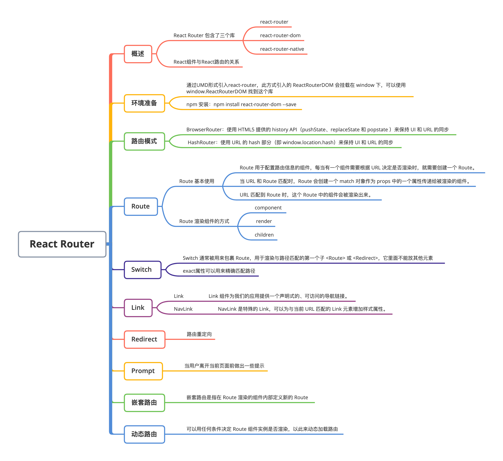

# React路由

### 

## 1. React Router概述

对于多页面应用而言，一个 URL 对应的就是一个 HTML 页面，而对于单页面应用，一个 URL 对应的其实是一个组件的展示。我们可以通过 URL 来控制 UI 或者 HTML 的展示，这就是路由。


React Router 包含了三个库：react-router、react-router-dom 和 react-router-native：

- **react-router：**提供最基本的路由功能，实际使用中我们会根据应用运行的环境选择安装不同的库，并不会直接安装 react-router；

- **react-router-dom：**在浏览器中使用；
- **react-router-native：**在 react-native 中使用。


**注意：**react-router-dom 和 react-router-native 都依赖 react-router，在安装这两个库时 react-router 也会自动安装。


**那React组件和React路由是什么关系呢？**

1. React 路由和 React 组件都遵循相同的事件循环：事件 => 状态变化 => 重新渲染;
2. React 组件在相同路径但是参数不同的路由跳转不允许触发重新渲染，如果需要重新渲染，就需要设置一个名字叫做 RouteKey 的 boolean 属性，它将向组件传递一个唯一的键，该键是 `location.pathname` 和 `location.search` 的组合，在这个场景中，每当路由被请求，组件都能接受一个新的键；而且即使停留在同一个页面，页面也会重新渲染，没有任何副作用。

```jsx
const Login = ({match} => {
    return (
        // 这里 match.url 等于 /login
        <div>
            <Route path={`${match.url}/:id`} component={TestId} RouteKey={true} />
            <Route exact path={match.url} component={Test} />
        </div>
    )    
})
```

上面代码中访问路由 `/login/:id` 时，参数不管是否发生变化，页面都会重新渲染。

## 2. 环境准备

在使用react-router之前需要 将其引入项目：

**（1）UMD 引入**

```jsx
<script src="https://unpkg.com/react-router-dom/umd/react-router-dom.min.js"></script>
```

此方式引入的 ReactRouterDOM 会挂载在 window 下，我们可以使用 window.ReactRouterDOM 找到这个库。

**（2）npm 安装**

```jsx
npm install react-router-dom --save
```

此方式引入的库使用模块管理器方式引入：

```jsx
// 使用 ES6 的转译器，如 babel
import { HashRouter, Route, Switch } from 'react-router-dom'
// 不使用 ES6 的转译器
const ReactRouter = require('react-router-dom')
const { HashRouter, Route, Switch } = ReactRouter
```

## 3. 路由器

路由器负责感知路由的变化并作出反应，它是整个路由系统中最为重要的一环。React-Router 支持我们使用 hash（对应 HashRouter）和 browser（对应 BrowserRouter） 两种路由规则， react-router-dom 提供了 BrowserRouter 和 HashRouter 两个组件来实现应用的 UI 和 URL 同步：

- BrowserRouter 创建的 URL 格式：http://xxx.com/path
- HashRouter 创建的 URL 格式：http://xxx.com/#/path


### （1）BrowserRouter

它使用 HTML5 提供的 history API（pushState、replaceState 和 popstate 事件）来保持 UI 和 URL 的同步。由此可以看出，**BrowserRouter 是使用 HTML 5 的 history API 来控制路由跳转的：**

```jsx
<BrowserRouter
    basename={string}
    forceRefresh={bool}
    getUserConfirmation={func}
    keyLength={number}
/>
```

**其中的属性如下：**

- basename 所有路由的基准 URL。basename 的正确格式是前面有一个前导斜杠，但不能有尾部斜杠；

```jsx
<BrowserRouter basename="/calendar">
    <Link to="/today" />
</BrowserRouter>
```

等同于

```jsx
<a href="/calendar/today" />
```

- forceRefresh 如果为 true，在导航的过程中整个页面将会刷新。一般情况下，只有在不支持 HTML5 history API 的浏览器中使用此功能；
- getUserConfirmation 用于确认导航的函数，默认使用 window.confirm。例如，当从 /a 导航至 /b 时，会使用默认的 confirm 函数弹出一个提示，用户点击确定后才进行导航，否则不做任何处理；

```jsx
// 这是默认的确认函数
const getConfirmation = (message, callback) => {
  const allowTransition = window.confirm(message);
  callback(allowTransition);
}
<BrowserRouter getUserConfirmation={getConfirmation} />
```

需要配合`<Prompt>` 一起使用。

- KeyLength 用来设置 Location.Key 的长度。

### （2）HashRouter

使用 URL 的 hash 部分（即 window.location.hash）来保持 UI 和 URL 的同步。由此可以看出，**HashRouter 是通过 URL 的 hash 属性来控制路由跳转的：**

```jsx
<HashRouter
    basename={string}
    getUserConfirmation={func}
    hashType={string}  
/>
```

**其中的参数如下**：

- basename, getUserConfirmation 和 `BrowserRouter` 功能一样；
- hashType window.location.hash 使用的 hash 类型，有如下几种：

- slash - 后面跟一个斜杠，例如 #/ 和 #/sunshine/lollipops；
- noslash - 后面没有斜杠，例如 # 和 #sunshine/lollipops；

- hashbang - Google 风格的 ajax crawlable，例如 #!/ 和 #!/sunshine/lollipops。

hashType 默认为 slash。

## 4. Route

react-router 的工作方式是在组件树顶层放一个 Router 组件，然后在组件树中散落着很多 Route 组件，顶层的 Router 组件负责分析监听 URL 的变化，而  Route 组件可以直接读取这些信息。Router 和 Route 紧密配合，Router 是“提供者”，Route是“消费者”。

### （1）Route 的基本使用

Route 是 React Router 用于配置路由信息的组件，也是 React Router 中使用频率最高的组件。每当有一个组件需要根据 URL 决定是否渲染时，就需要创建一个 Route。

```jsx
<Route
    exact={bool}
    path={string}
    component={Component} />
```

**其中的属性如下：**

- **exact**：当 URL 完全匹配时，值为 true，否则为 false，它控制匹配到 / 路径时是否会再继续向下匹配；
- **path**：构建嵌套路由时会使用到，每个 Route 都需要定一个 path 属性；

- **component**：表示路径对应显示的组件。

URL 匹配到 Route 时，这个 Route 中的组件会被渲染出来。


当 URL 和 Route 匹配时，Route 会创建一个 match 对象作为 props 中的一个属性传递给被渲染的组件。这个对象包含以下 4 个属性：

- **params**: Route 的 path 可以包含参数，params 就是用于从匹配的 URL 中解析出 path 中的参数；
- **isExact**：同 Route 的 exact；

- **path**：同 Route 的 path；
- **url：URL** 匹配的方式。

### （2）Route 渲染组件的方式


**1. component 属性**

component 属性的值是一个组件，当 URL 和 Route 匹配时，component 属性定义的组件就会被渲染。

```jsx
<Route path='/foo' component={Foo} >
```

当 URL 为 “http://www.react-router-dom.com/foo” 时，Foo 组件会被渲染。


**2. render****（多用于权限验证）**

render 的值是一个函数，它返回的是一个 React 元素。这种方式方便地为待渲染的组件传递额外的属性。

```jsx
<Route 
    path='/foo' 
    render={(props) => {
        <Foo {...props} data={extraProps} />
    }
}>
</Route>
```

Foo 组件接收了一个额外的 `data` 属性。


采用render方式渲染时，组件是否渲染不仅要看路径是否匹配，还要由render属性所接受的函数来共同决定。注意，此时render函数会接受一个参数`props`，即当前`Route`组件的props对象。


**3. children（多用于菜单）**

children 的值也是一个函数，函数返回要渲染的 React 元素。与前两种方式不同之处是，无论是否匹配成功，children 返回的组件都会被渲染。但是，当匹配不成功时，match 属性为 null。例如:

```jsx
<Route
    path='/foo' 
    render={(props) => {
        <div className={props.match ? 'active': ''}>
            <Foo {...props} data={extraProps} />
        </div>
    }
}>
</Route>
```

如果 Route 匹配当前 URL，待渲染元素的根节点 div 的 class 将设置成 active。

## 5. Switch

Switch 通常被用来包裹 Route，用于渲染与路径匹配的第一个子 `<Route>` 或 `<Redirect>`，它里面不能放其他元素。


假如不加 `<Switch>` ：

```jsx
import { Route } from 'react-router-dom'

<Route path="/" component={Home}></Route>
<Route path="/login" component={Login}></Route>
```

Route 组件的 path 属性用于匹配路径，因为我们需要匹配 `/` 到 `Home`，匹配 `/login` 到 `Login`，所以需要两个 Route，但是，我们不能这么写。这样写的话，当 URL 的 path 为 “/login” 时，`<Route path="/" />`和`<Route path="/login" />` 都会被匹配，因此页面会展示 Home 和 Login 两个组件。这时就需要借助 `<Switch>` 来做到只显示一个匹配组件：

```jsx
import { Switch, Route} from 'react-router-dom'
    
<Switch>
    <Route path="/" component={Home}></Route>
    <Route path="/login" component={Login}></Route>
</Switch>
```

此时，再访问 “/login” 路径时，却只显示了 Home 组件。这是就用到了exact属性，它的作用就是精确匹配路径，经常与`<Switch>` 联合使用。只有当 URL 和该 `<Route>` 的 path 属性完全一致的情况下才能匹配上：

```jsx
import { Switch, Route} from 'react-router-dom'
   
<Switch>
   <Route exact path="/" component={Home}></Route>
   <Route exact path="/login" component={Login}></Route>
</Switch>
```

## 6. Link

### （1）Link

在单页面应用中，往往需要在不同页面之间进行切换，这是就用到了Link组件，Link 组件为我们的应用提供一个声明式的、可访问的导航链接。

```jsx
import { Link } from 'react-router-dom'  
<Link to="/login">Login</Link>  // 会被解析成：<a href="/login">Login</a>
```

- `to: string | object`：声明要导航到的链接地址，可以是一个字符串，也可以是一个对象。

```jsx
import { Link } from 'react-router-dom'  
    
// 字符串形式
<Link to="/login?name=zhangsan#hash">Login</Link>
// 对象形式
<Link to="{{
  pathname:'/login',        // 要导航到的路径
  search: '?name=zhangsan', // 查询参数
  hash: '#hash'             // 哈希
}}">Login</Link>
```

- `replace: boolean`：该属性决定是将点击后的链接替换历史堆栈中的最新记录，还是添加一条新记录。设置为 true 时是替换，设置为 false 时是添加。默认值是 false。

```jsx
<Link to="/login" replace>Login</Link>
```

### （2）NavLink

NavLink 是特殊的 Link，可以为与当前 URL 匹配的 Link 元素增加样式属性。


- `activeClassName: string`：表示当元素处于激活状态时的类名，默认为 active。

```jsx
import { NavLink } from 'react-router-dom'

<NavLink to="/login" activeClassName="active">Login</NavLink>
```

- `activeStyle: object`：表示当元素处于激活状态时的样式。

```jsx
import { NavLink } from 'react-router-dom'

<NavLink to="/login" activeStyle={{color: 'red'}}>Login</NavLink>
```

- `exact: boolean`：设置为 true 表示：当且仅当完全匹配时才应用 activeClassName 或 activeStyle。

```jsx
import { NavLink } from 'react-router-dom'

<NavLink exact to="/login">Login</NavLink>
```

- `isActive: function`：可以通过 isActive 添加一些额外的逻辑来决定当前链接是否处于激活状态。

```jsx
import { NavLink } from 'react-router-dom'
    
dealActive () {
    ...
}
<NavLink to="/login" isActive={dealActive}>Login</NavLink>
```

## 7. Redirect

路由重定向：

```jsx
<Switch>
  <Redirect from='/users/:id' to='/users/profile/:id'/>
  <Route path='/users/profile/:id' component={Profile}/>
</Switch>
```

当请求 `/users/:id` 被重定向去 '/users/profile/:id' 

- 属性 `from: string`：需要匹配的将要被重定向路径。
- 属性 `to: string`：重定向的 URL 字符串

- 属性 `to: object`：重定向的 location 对象
- 属性 `push: bool`：若为真，重定向操作将会把新地址加入到访问历史记录里面，并且无法回退到前面的页面。

## 8. Prompt

当用户离开当前页面前做出一些提示，其属性如下：

- 属性 `message: string`：当用户离开当前页面时，设置的提示信息。

```jsx
<Prompt message="确定要离开？" />
```

- 属性 `message: func`：当用户离开当前页面时，设置的回掉函数

```jsx
<Prompt message={location => `确定要去 ${location.pathname} ?`} />
```

- 属性 `when: bool`：决定是否启用 Prompt

## 9. 嵌套路由

嵌套路由是指在 Route 渲染的组件内部定义新的 Route，比如在上面的 Login 组件中可以再定义两个路由

```jsx
const Login = ({match} => {
    return (
        // 这里 match.url 等于 /login
        <div>
            <Route path={`${match.url}/:id`} component={TestId} />
            <Route exact path={match.url} component={Test} />
        </div>
    )    
})
```

注意：嵌套路由是基于当前路由创建的路由，前缀是我们当前的路由。

## 10. 动态路由

假设，再增加一个新的页面叫 `Product`，对应路径为 `/product`，但是只有用户登录了之后才显示。如果用静态路由，我们在渲染之前就确定这条路由规则，这样即使用户没有登录，也可以访问 `product`，我们还不得不在 Product 组件中做用户是否登录的检查。


如果用动态路由，则只需要在代码中的一处涉及这个逻辑：

```jsx
<Switch>
      <Route exact path='/' component={Home}/>
      {
        isUserLogin() &&
        <Route exact path='/product' component={Product}/>,
      }  
      <Route path='/about' component={About}/>
 </Switch>
```

可以用任何条件决定 Route 组件实例是否渲染，比如，可以根据页面宽度、设备类型决定路由规则，动态路由有了最大的自由度。