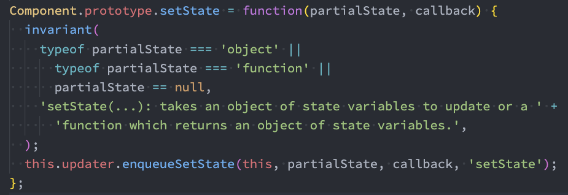
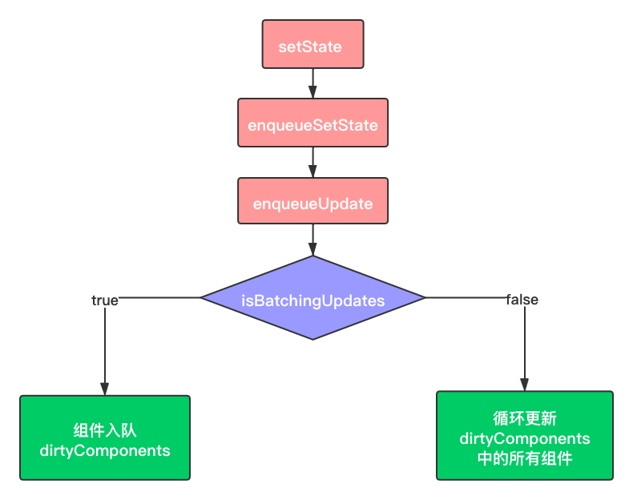

# React setState 数据更新机制

## 1. 为什么使用setState

在开发中我们并不能直接通过修改`state`的值来让界面发生更新： 

- 因为修改了`state`之后，希望React根据最新的`State`来重新渲染界面，但是这种方式的修改React并不知道数据发生了变化；
- React并没有实现类似于Vue2中的`Object.defineProperty`或者Vue3中的`Proxy`的方式来监听数据的变化；

- 必须通过`setState`来告知React数据已经发生了变化；


如果我们直接修改`state`中的值，会报错：

```jsx
this.state.counter += 1   // Do not mutate state directly. Use setState()
```


那在组件中并没有实现setState的方法，为什么可以调用呢？原因很简单，`setState`方法是当前组件从Component中继承过来的:



所以，在React中，我们需要使用`setState`来实现数据的更新：

```jsx
this.setState({
  counter: this.state.counter + 1 
})  
```

## 2. setState 异步更新

组件除了可以接收外界传递的状态外，还可以拥有自己的状态，并且这个状态也可以通过 `setState` 来进行更新。`setState` 用于变更状态，触发组件重新渲染，更新视图 UI。其语法如下：

```jsx
setState(updater, callback)
```

`setState` 可以接收两个参数：第一个参数可以是对象或函数，第二个参数是函数。

- 第一个参数是**对象的写法**：

```jsx
this.setState({
    key: newState
});
```

- 第一个参数是**函数的写法**：

```jsx
// prevState 是上一次的 state，props 是此次更新被应用时的 props
this.setState((prevState, props) => {
  return {
      key: prevState.key 
  }
})
```

那么，这两种写法的区别是什么呢？我们来看计数器的例子：

```jsx
class App extends React.Component {
  constructor (props) {
    super (props)
    this.state = {
      val: 0
    }
  }
  handleClick () {
    this.setState({
        val: this.state.val + 1
    })
  }
  render () {
    return (
      <div className="App">
        <input type="text" value={this.state.val} disabled/>
        <input type="button" onClick={this.handleClick.bind(this)} />
      </div>
    )
  }
}
```

如果在 `handleClick` 方法内调两次 `setState`，是不是每次点击就自增2了呢？

```jsx
handleClick () {
    this.setState({
        val: this.state.val + 1
    })
     this.setState({
        val: this.state.val + 1
    })
  }
```

结果并非我们想的那样，每次点击按钮，依然是自增1。这是因为调用 `setState` 其实是异步的，也就是 `setState` 调用之后，`this.state` 不会立即映射为新的值。上面代码会解析为以下形式：

```jsx
// 后面的数据会覆盖前面的更改，所以最终只加了一次.
Object.assign(
  previousState,
  {val: state.val + 1},
  {val: state.val + 1},
)
```

在上面我们调用了两次 `setState`，但 `state` 的更新会被合并，所以即使多次调用 `setState`，实际上可能也只是会重新渲染一次。


如果想基于当前的 `state` 来计算出新的值，那么 `setState` 第一个参数不应该像上面一样传递一个对象，而应该传递一个函数。

```jsx
handleClick () {
    this.setState((prevState, props) => {
            val: prevState.val + 1
        }
    })
     this.setState((prevState, props) => {
            val: prevState.val + 1
        }
    })
 }
```

此时，在 `handleClick` 方法内调两次 `setState`，就能实现每次点击都自增2了。


**传递一个函数可以让你在函数内访问到当前的** `**state**` **值。** `**setState**` **的调用是分批的，所以可以链式地进行更新，并确保它们是一个建立在另一个之上的，这样才不会发生冲突。**


`setState` 的第二个参数是一个可选的回调函数。这个回调函数将在组件重新渲染后执行。等价于在 `componentDidUpdate` 生命周期内执行。通常建议使用 `componentDidUpdate` 来代替此方式。在这个回调函数中你可以拿到更新后 `state` 的值。

```jsx
this.setState({
    key1: newState1,
    key2: newState2,
    ...
}, callback) // 第二个参数是 state 更新完成后的回调函数
```

通过上面内容，可以知道调用 `setState` 时，组件的 `state` 并不会立即改变， `setState` 只是把要修改的 `state` 放入一个队列， `React` 会优化真正的执行时机，并出于性能原因，会将 `React` 事件处理程序中的多次`React` 事件处理程序中的多次 `setState` 的状态修改合并成一次状态修改。 最终更新只产生一次组件及其子组件的重新渲染，这对于大型应用程序中的性能提升至关重要。


**批量更新的流程图如下：**

```jsx
this.setState({
  count: this.state.count + 1    ===>    入队，[count+1的任务]
});
this.setState({
  count: this.state.count + 1    ===>    入队，[count+1的任务，count+1的任务]
});
                                          ↓
                                         合并 state，[count+1的任务]
                                          ↓
                                         执行 count+1的任务
```

**注意：**在React中，不能直接使用 `this.state.key = value` 方式来更新状态，这种方式 React 内部无法知道我们修改了组件，因此也就没办法更新到界面上。所以一定要使用 React 提供的 `setState` 方法来更新组件的状态。


那 **为什么 setState 是异步的**，React官方团队的解释如下：

- **保持内部一致性**。如果改为同步更新的方式，尽管 `setState` 变成了同步，但是 props 不是。
- **为后续的架构升级启用并发更新**。为了完成异步渲染，React 会在 `setState` 时，根据它们的数据来源分配不同的优先级，这些数据来源有：事件回调句柄、动画效果等，再根据优先级并发处理，提升渲染性能。


简单总结如下：

- `setState`设计为异步，可以显著的提升性能。如果每次调用 `setState`都进行一次更新，那么意味着`render`函数会被频繁调用，界面重新渲染，这样效率是很低的；最好的办法应该是获取到多个更新，之后进行批量更新； 
- 如果同步更新了`state`，但是还没有执行`render`函数，那么`state`和`props`不能保持同步。`state`和`props`不能保持一致性，会在开发中产生很多的问题；

## 3. setState 同步场景

上面的例子使我们建立了这样一个认知：setState 是异步的，但下面这个案例又会颠覆你的认知。如果我们将 setState 放在 setTimeout 事件中，那情况就完全不同了：

```jsx
class Test extends Component {
    state = {
        count: 0
    }
    componentDidMount(){
        this.setState({ count: this.state.count + 1 });
        console.log(this.state.count);
        setTimeout(() => {
          this.setState({ count: this.state.count + 1 });
          console.log("setTimeout: " + this.state.count);
        }, 0);
    }
    render(){
        ...
    }
}
```

这时就会输出 **0，2**。因为 `setState` 并不是真正的异步函数，它实际上是通过队列延迟执行操作实现的，通过 `isBatchingUpdates` 来判断 `setState` 是先存进 `state` 队列还是直接更新。值为 `true` 则执行异步操作，`false` 则直接同步更新。


在 onClick、onFocus 等事件中，由于合成事件封装了一层，所以可以将 `isBatchingUpdates` 的状态更新为 `true`；在 React 的生命周期函数中，同样可以将 `isBatchingUpdates` 的状态更新为 `true`。那么在 React 自己的生命周期事件和合成事件中，可以拿到 `isBatchingUpdates` 的控制权，将状态放进队列，控制执行节奏。而在外部的原生事件中，并没有外层的封装与拦截，无法更新 `isBatchingUpdates` 的状态为 `true`。这就造成 `isBatchingUpdates` 的状态只会为 false，且立即执行。所以在 `addEventListener` 、`setTimeout`、`setInterval` 这些原生事件中都会同步更新。


实际上，**setState 并不是具备同步这种特性，只是在特定的情境下，它会从 React 的异步管控中“逃脱”掉。**

## 4. 调用 `setState` 发生了什么

修改 state 方法有两种：

- 构造函数里修改 `state` ，只需要直接操作 `this.state` 即可， 如果在构造函数里执行了异步操作，就需要调用 `setState` 来触发重新渲染。
- 在其余的地方需要改变state的时候只能使用 `setState`，这样 React 才会触发 UI 更新。


所以， setState 时会设置新的 `state` 并更新 UI。当然，`state` 的更新可能是异步的，出于性能考虑，`React` 可能会把多个 `setState` 调用合并成一个调用。那么 state 的更新何时是同步何时又是异步的呢？


我们来看一下setState的执行流程图：



### （1）setState

下面来看下每一步的源码，首先是 `setState` 入口函数：

```jsx
ReactComponent.prototype.setState = function (partialState, callback) {
  this.updater.enqueueSetState(this, partialState);
  if (callback) {
    this.updater.enqueueCallback(this, callback, 'setState');
  }
};
```

入口函数在这里就是充当一个分发器的角色，根据入参的不同，将其分发到不同的功能函数中去。这里我们以对象形式的入参为例，可以看到它直接调用了 `this.updater.enqueueSetState` 这个方法。

### （2）enqueueSetState

```jsx
enqueueSetState: function (publicInstance, partialState) {
  // 根据 this 拿到对应的组件实例
  var internalInstance = getInternalInstanceReadyForUpdate(publicInstance, 'setState');
  // 这个 queue 对应的就是一个组件实例的 state 数组
  var queue = internalInstance._pendingStateQueue || (internalInstance._pendingStateQueue = []);
  queue.push(partialState);
  //  enqueueUpdate 用来处理当前的组件实例
  enqueueUpdate(internalInstance);
}
```

这里 `enqueueSetState` 做了两件事：

- 将新的 `state` 放进组件的状态队列里；
- 用 `enqueueUpdate` 来处理将要更新的实例对象。

### （3）enqueueUpdate

```jsx
function enqueueUpdate(component) {
  ensureInjected();
  // 注意这一句是问题的关键，isBatchingUpdates标识着当前是否处于批量创建/更新组件的阶段
  if (!batchingStrategy.isBatchingUpdates) {
    // 若当前没有处于批量创建/更新组件的阶段，则立即更新组件
    batchingStrategy.batchedUpdates(enqueueUpdate, component);
    return;
  }
  // 否则，先把组件塞入 dirtyComponents 队列里，让它“再等等”
  dirtyComponents.push(component);
  if (component._updateBatchNumber == null) {
    component._updateBatchNumber = updateBatchNumber + 1;
  }
}
```

这个 `enqueueUpdate` 引出了一个关键的对象——`batchingStrategy`，该对象所具备的`isBatchingUpdates` 属性直接决定了当下是要走更新流程，还是应该排队等待；其中的`batchedUpdates` 方法更是能够直接发起更新流程。由此可以推测，`batchingStrategy` 或许正是 React 内部专门用于管控批量更新的对象。

### （4）batchingStrategy

```jsx
var ReactDefaultBatchingStrategy = {
  // 全局唯一的锁标识
  isBatchingUpdates: false,
  // 发起更新动作的方法
  batchedUpdates: function(callback, a, b, c, d, e) {
    // 缓存锁变量
    var alreadyBatchingStrategy = ReactDefaultBatchingStrategy. isBatchingUpdates
    // 把锁“锁上”
    ReactDefaultBatchingStrategy. isBatchingUpdates = true
    if (alreadyBatchingStrategy) {
      callback(a, b, c, d, e)
    } else {
      // 启动事务，将 callback 放进事务里执行
      transaction.perform(callback, null, a, b, c, d, e)
    }
  }
}
```

`batchingStrategy` 对象可以理解为它是一个“锁管理器”。


这里的“锁”，是指 React 全局唯一的 `isBatchingUpdates` 变量，`isBatchingUpdates` 的初始值是 `false`，意味着“当前并未进行任何批量更新操作”。每当 React 调用 `batchedUpdate` 去执行更新动作时，会先把这个锁给“锁上”（置为 `true`），表明“现在正处于批量更新过程中”。当锁被“锁上”的时候，任何需要更新的组件都只能暂时进入 `dirtyComponents` 里排队等候下一次的批量更新，而不能随意“插队”。此处体现的“任务锁”的思想，是 React 面对大量状态仍然能够实现有序分批处理的基石。

## 5. 总结

对于那道常考的面试题：**setState 是同步更新还是异步更新？** 我们心中或许已经有了答案。


setState 并不是单纯同步/异步的，它的表现会因调用场景的不同而不同：在 React 钩子函数及合成事件中，它表现为异步；而在 `setTimeout`、`setInterval` 等函数中，包括在 DOM 原生事件中，它都表现为同步。这种差异，本质上是由 React 事务机制和批量更新机制的工作方式来决定的。


在源码中，通过 `isBatchingUpdates` 来判断 `setState` 是先存进 `state` 队列还是直接更新，如果值为 true 则执行异步操作，为 false 则直接更新。


那什么情况下 isBatchingUpdates 会为 true 呢？

- 在 React 可以控制的地方，`isBatchingUpdates` 就为 true，比如在 React 生命周期事件和合成事件中，都会走合并操作，延迟更新的策略。
- 在 React 无法控制的地方，比如原生事件，具体就是在 `addEventListener `、`setTimeout`、`setInterval` 等事件中，就只能同步更新。


一般认为，做异步设计是为了性能优化、减少渲染次数，React 团队还补充了两点：

- 保持内部一致性。如果将 state 改为同步更新，那尽管 state 的更新是同步的，但是 props不是。
- 启用并发更新，完成异步渲染。


附一个常考的面试题：

```jsx
class Test extends React.Component {
  state  = {
      count: 0
  };
    componentDidMount() {
    this.setState({count: this.state.count + 1});
    console.log(this.state.count);
    this.setState({count: this.state.count + 1});
    console.log(this.state.count);
    setTimeout(() => {
      this.setState({count: this.state.count + 1});
      console.log(this.state.count);
      this.setState({count: this.state.count + 1});
      console.log(this.state.count);
    }, 0);
  }
  render() {
    return null;
  }
};
```

- 首先第一次和第二次的 `console.log`，都在 React 的生命周期事件中，所以是异步的处理方式，则输出都为 0；
- 而在 `setTimeout` 中的 `console.log` 处于原生事件中，所以会同步的处理再输出结果，但需要注意，虽然 count 在前面经过了两次的 `this.state.count + 1`，但是每次获取的 `this.state.count` 都是初始化时的值，也就是 0；

- 所以此时 `count` 是 1，那么后续在 `setTimeout` 中的输出则是 2 和 3。


所以答案是 0,0,2,3。