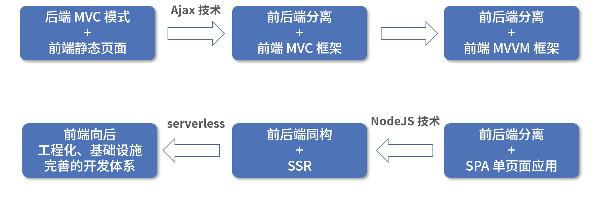
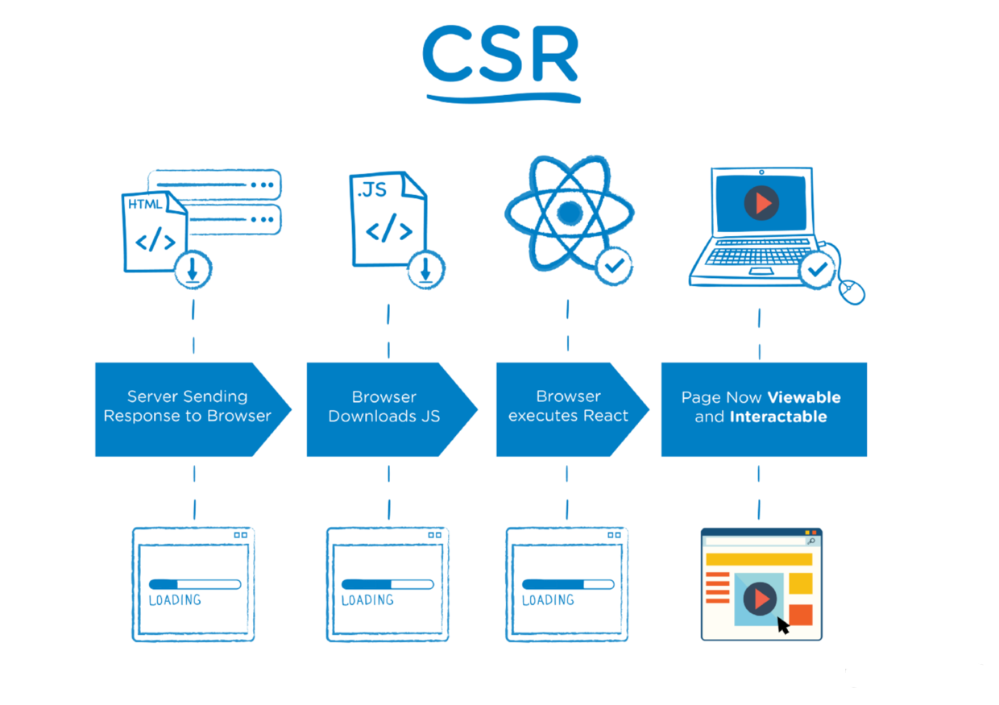
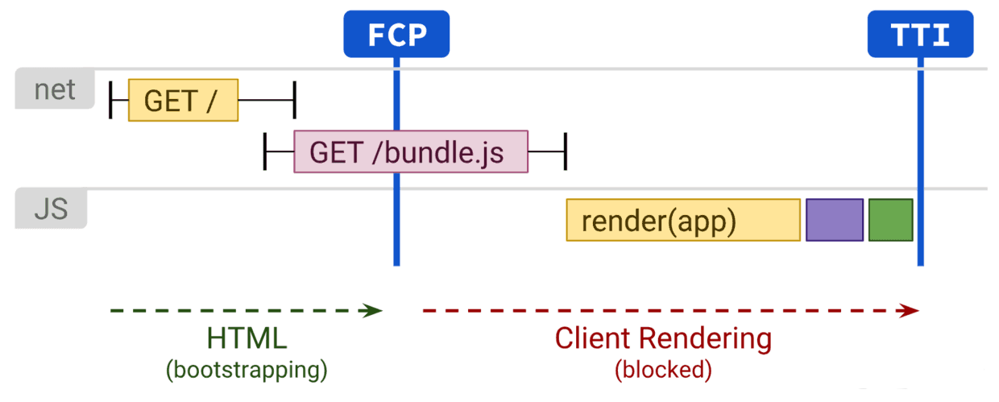
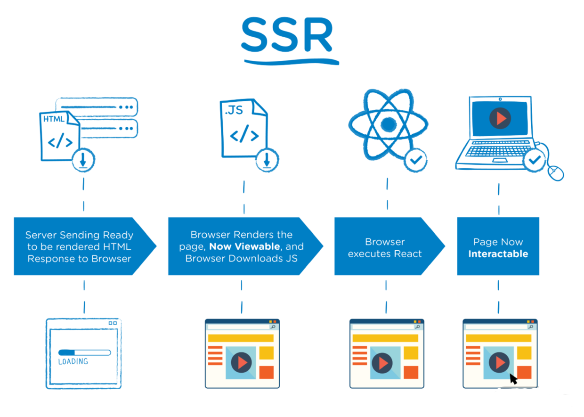
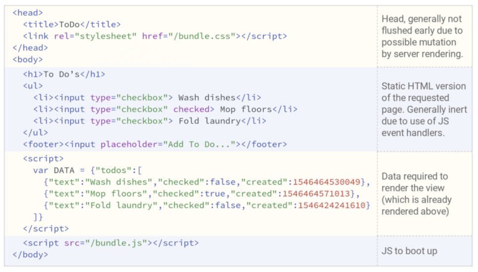
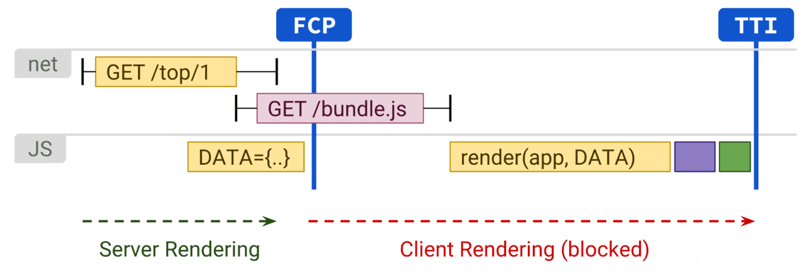

# 前端发展和演进史

过去十多年，前端技术发展日新月异，互联网风口也从 PC 时代过渡到移动时代甚至智能时代。其间，前端岗位从无到有，再到如今扮演了至关重要的角色。相应地，前端基建和架构也慢慢浮出水面，呈现百花齐放的场景，技术环节自然也愈发复杂。

## 1. 前端发展史

首先来看前端的技术发展轨迹：



**（1）****静态网页 + 后端 MVC 模式时期**

在静态网页 + 后端 MVC 技术架构时期，严格来说，并没有专职前端工程师的职位。Web 工程师主要集中在后端方向，通过 Model 模型层进行数据的存储和读取、Controller 控制层对数据进行处理并实现业务逻辑需求，最终在 View 视图层展示数据。这时候，每次请求都对应了一个静态页面的生成过程，我们把这种技术时代称为 Web1.0。


**（2）前后端分离 + 前端** **MVC 框架模式时期**

2005 年，随着Ajax 技术的出现，标志了 Web1.0 到 Web2.0 的重要演进。此时，出现了真正意义上的前后端分离概念，这也使得前端工程师开始占据开发岗位的一席之地。前端通过 Ajax 技术获取数据，进行页面的展现和交互，而后端往往通过 Restful 接口，和前端进行协作。这个时期，前端需要大量地处理数据，因此前端 MVC 框架得到了发展。


**（3）****前后端分离 + 前端** **MVVM 框架模式时期**

随着前端处理数据理念的革新，一种更新潮的 MVVM（View + ViewModel + Model）模式框架就出现了，MVVM 和 MVC 最大的区别在于：MVVM 采用双向绑定（Data Binding）或自动渲染更新。也就是说，View 层的变动，可以自动反映在 ViewModel 层。Angular 和 Vue 都采用这种模式。虽然 React 官方声称自己只是一个 View 层类库，但是 React 搭配数据状态管理生态，也符合 MVVM 模式。当然 React 并不是双向绑定风格的解决方案，自动渲染更新也代表了一种潮流和方向。


整体看来，架构层面 MVC 风格向 MVVM 风格的演进，不仅简化了数据与视图的依赖，还解决了数据频繁更新的问题。再加上虚拟 DOM 理念，为开发者屏蔽了 DOM 操作，业界框架方案逐渐稳定，这种低耦合模式也代表了现代化的设计理念。这个时期，前后端分离技术发展到了顶峰，前端框架也互相学习借鉴，直到如今的Vue/React/Angular 三足鼎立的局面。


**（4）Node.js出现：**

这个时代的稳定性一直持续到 Node.js 的崛起，随着 Node.js 的出现，稳固的技术体系瞬间被打破。通过 Node.js，除了前端工具链、工程化得以发展，前端也实现 BFF（Backend For Frontend）层，这样的架构设计好处对于前端工程师显而易见：

- 可以自行编写后端服务，实现数据的适配，应用场景包括接口的整合编排、字段裁剪；
- 可以实现SSR（服务端渲染直出）技术，达到提升首屏性能以及 SEO 友好的目的；

- 可以实现各种后端领域服务。


为了“紧跟技术潮流”的发展，Vue 和 React 等框架依靠虚拟 DOM 技术，推出同构方案。SSR 架构模式横空出世，成了前端技术演进的新方向。


**（5）****Serverless****出现：**

Node.js 技术不是银弹，SSR 架构也不是毫无成本。前端工程师落地 Node.js 技术，就要关心服务器的运维、部署、发布、监控。有没有一种“just work”的技术，使得我们能够更轻松地专注前端业务代码的开发，直接上手 Node.js 呢？为了解决这些问题，Serverless 理念应运而生。简单来说，我们可以将服务器的运维功能都交给 Serverless 平台进行管理，研发人员只需要专注于实现云函数即可完成功能开发。

## 2. 前端技术架构

下面来看一下现代化的前端技术架构：

- 第一方面，前端领域的现代技术架构，永远无法脱离应用终端和宿主。这其中：前端不再局限于 PC 和移动智能手机端，智能手表、眼镜会是新的平台方向，同时文件系统、相机、PWA 和硬件传感器等新型 API 都已经应用在 Web 前端当中。


- 第二方面，现代 JavaScript 也发展成为一种真正成熟的语言，并且还将会持续引入新的特性和功能。同时TypeScript，甚至 Elm、PureScript 和 ReasonML 将会得到更多关注。因此，一套现代化的前端方案，必然要处理语言的发展和宿主的碎片化、滞后性这一矛盾，也必然会有一个更厚重的编译。


- 第三方面，网络基础设施永远都在变得更快、更稳定，流媒体和视频点播成为日常，前端的用户体验和富媒体技术愈发成为应用的关键。


基于上述背景，现代化前端技术架构的特点如下：

- 组件化是基本 UI 架构；
- 依托于 SSR 同构技术以及心智负担的最小化，框架层面提供的虚拟 DOM 会成为生态标配；

- 数据状态管理方案将会以职责单一、minimal necessary 为目标，以组合性、函数式为理念，而不以双向数据流和单向数据流的区分为重点；
- 前端向传统后端领域进军是必然，一个 CSR/SSR 可切换的协作方案可以把前端优势特点放大到最大。

## 3. 前端渲染模式

下面来看一下前端渲染模式的演进过程： **CSR → SSR → NSR → ESR** 

### （1）CSR

CSR：Client Side Rendering，浏览器端渲染也许是最常见的渲染架构。这种渲染架构很好理解，如下图所示：



CSR 渲染架构的特点非常明显：

- 实现了前后端架构分离，实现了前后端职责分离；
- TTFB 时间最小，但由于客户端和服务端会有多次交互（获取静态资源、获取数据）才能进行渲染，实际首屏效果以及 FCP/FMP 时间不够理想。


CSR 渲染时序图：



我们可以通过代码分离等技术弥补实际内容渲染的滞后，但从渲染架构上讲，CSR 却有着基因上的弊端。

### （2）SSR

SSR：Server Side Rendering，在服务端完成页面模板、数据预取、填充，并且在服务端就可以将完整的 HTML 内容返回给浏览器。如下图：



SSR 渲染时序图：


实际上，SSR 还涉及更多内容：在服务端预取了数据，并返回了数据和 HTML 内容。理想情况下，不需要在客户端再次请求数据，而是直接消费数据即可。因此可以将 SSR 和 CSR 相结合，即实现一个基于 hydration（注水） 的 SSR 和 CSR 结合方案。


先来解释一下 hydration，这个概念和同构应用中数据的获取和消费有关。在服务器端渲染时，首先服务端请求接口拿到数据，处理并准备好数据状态（如果使用 Redux，就进行 store 的更新）。


为了减少客户端的请求，需要保留住这个状态。一般做法是在服务器端返回 HTML 字符串的时候，将数据 `JSON.stringify` 一并返回，这个过程，叫作脱水（dehydrate）；在客户端，就不再需要进行数据的请求了，可以直接使用服务端下发下来的数据，这个过程叫注水（hydrate）。


用代码来表示，将数据放到 window 变量上：

```js
ctx.body = `
  <!DOCTYPE html>
  <html lang="en">
    <head>
      <meta charset="UTF-8">
    </head>
    <body>
        <script>
        window.context = {
          initialState: ${JSON.stringify(store.getState())}
        }
      </script>
      <div id="app">
          // ...
      </div>
    </body>
  </html>
`
```

对应客户端：

```js
export const getClientStore = () => {
  const defaultState = JSON.parse(window.context.state)
  return createStore(reducer, defaultState, applyMiddleware(thunk))
}
ReactDOM.hydrate(<App date={getClientStore().getState()} />, document.getElementById('root'))
```

而基于 hydration 的 SSR 方案，如下图代码：



可以将上述渲染架构方案用下面这张图来总结：



其实，如果将性能优化做到极致，SSR 还可以发展为：Streaming server rendering（流式 SSR 渲染）或 Progressive Rehydration（渐进式 SSR 渲染）。


流式 SSR 渲染，允许服务端通过 stream 的方式向浏览器发送 HTML 内容。在 React 中，可以使用`renderToNodeStream()`方法来完成流式 SSR 渲染。


渐进式 SSR 渲染可以允许在 hydrating 没有完全结束前，部分已经渲染并注水完成的页面内容，可以优先完成交互响应。

### （3）NSR

说完 SSR，再来看一些更新潮的渲染技术：NSR 和 ESR 渲染方案最近几年也正在逐渐落地实施。


NSR：Native Side Rendering，这是一种在 hybrid 中特有的渲染技术。简单说就是通过 Native 渲染生成 HTML 数据，并且缓存在客户端。这样一来，对于一个 hybrid WebView 的用户访问，会优先从离线包中加载离线页面模板，再通过前端 Ajax/或客户端能力请求数据，最终完成页面完整的展示。


这样做的好处显而易见：我们将服务器的渲染工作放在了一个个独立的移动设备中，并借助离线存储技术，实现了页面的预加载，同时又不会增加额外的服务器压力。

### （4）ESR

ESR：Edge Side Rendering，边缘渲染则更加激进。ESR 其实借助了最近几年较火的“边缘计算”能力。


边缘计算，是指在靠近物或数据源头的一侧，采用网络、计算、存储、应用核心能力为一体的开放平台，就近提供最近端服务。其应用程序在边缘侧发起，产生更快的网络服务响应，满足行业在实时业务、应用智能、安全与隐私保护等方面的基本需求。边缘计算处于物理实体和工业连接之间，或处于物理实体的顶端。而云端计算，仍然可以访问边缘计算的历史数据。


ESR 渲染利用了 CDN 能力。ESR会在 CDN 上缓存页面的静态部分，这样在用户访问页面时，可以快速返回给用户静态内容，同时在 CDN 节点上也发起动态部分内容请求，在动态内容获取之后，利用流的方式，继续返回给用户。该项技术在阿里中已经有了试水，但真正更广泛地落地和实施，有待后续验证和观察。总之借助边缘计算能力，前端渲染架构的想象空间会被无限放大。