# npm 和 yarn的包管理机制

前端工程化离不开 npm（node package manager） 或者 Yarn 这些管理工具。npm 或 Yarn 在工程项目中，除了负责依赖的安装和维护以外，还能通过 npm scripts 串联起各个职能部分，让独立的环节自动运转起来。


无论是 npm 还是 Yarn，它们的体系都非常庞大，在使用过程中我们很可能产生如下疑问：

- 项目依赖出现问题时，删除 node_modules 和 lockfiles，再重新 install，这样操作是否存在风险？
- 把所有依赖都安装到 dependencies 中，不区分 devDependencies 会有问题吗？

- 应用依赖了公共库 A 和公共库 B，同时公共库 A 也依赖了公共库 B，那么公共库 B 会被多次安装或重复打包吗？
- 一个项目中，既有人用 npm，也有人用 Yarn，这会引发什么问题？

- 是否应该提交 lockfiles 文件到项目仓库呢？


下面就来看看npm和yarn的包管理机制。

## 1. npm

npm 的核心目标：

Bring the best of open source to you, your team and your company.

给你和你的团队、你的公司带来最好的开源库和依赖。

通过这句话可以知道，npm 最重要的一环是**安装和维护依赖**。在平时开发中，“删除 node_modules，重新 npm install”是一个百试不爽的解决 npm 安装类问题的方法。但是其中的作用原理是什么？这样的操作是否规范呢？下面来看看 npm 的安装机制。

### （1）npm 安装机制

npm 的安装机制非常值得探究。很多语言的包依赖工具都是全局安装，但是 npm 的安装机制秉承了不同的设计哲学。


它会优先安装依赖包到当前项目目录，使得不同应用项目的依赖各成体系，同时还减轻了包作者的 API 兼容性压力，但这样做的缺陷也很明显：如果项目 A 和项目 B 都依赖了相同的公共库 C，那么公共库 C 一般都会在项目 A 和项目 B 中，各被安装一次。这就说明，同一个依赖包可能会进行多次安装。


下面来看一下 npm install 安装机制的流程图：

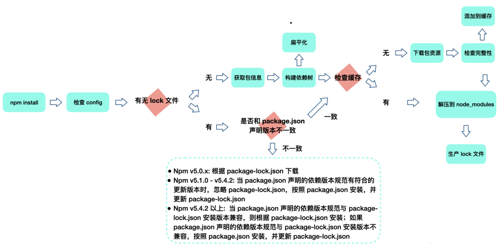

npm install 执行之后：

1. 首先，检查并获取 npm 配置，这里的**优先级为：项目级的 .npmrc 文件 > 用户级的 .npmrc 文件> 全局级的 .npmrc 文件 > npm 内置的 .npmrc 文件。**
2. 然后检查项目中是否有 package-lock.json 文件。

1. 如果有，则检查 package-lock.json 和 package.json 中声明的依赖是否一致：

- 一致，直接使用 package-lock.json 中的信息，从缓存或网络资源中加载依赖；
- 不一致，按照 npm 版本进行处理（不同 npm 版本处理会有不同，具体处理方式如图所示）。

1. 如果没有，则根据 package.json 递归构建依赖树。然后按照构建好的依赖树下载完整的依赖资源，在下载时就会检查是否存在相关资源缓存：

- 存在，则将缓存内容解压到 node_modules 中；
- 否则就先从 npm 远程仓库下载包，校验包的完整性，并添加到缓存，同时解压到 node_modules。

1. 最后生成 package-lock.json。


构建依赖树时，当前依赖项目不管其是直接依赖还是子依赖的依赖，都应该按照扁平化原则，优先将其放置在 node_modules 根目录（最新版本 npm 规范）。在这个过程中，遇到相同模块就判断已放置在依赖树中的模块版本是否符合新模块的版本范围，如果符合则跳过；不符合则在当前模块的 node_modules 下放置该模块（最新版本 npm 规范）。

### （2）npm 缓存机制

前端工程中，依赖嵌套依赖，一个中型项目中 node_moduels 安装包可能就已经是海量了。如果安装包每次都通过网络下载获取，无疑会增加安装时间成本。对于这个问题，缓存始终是一个好的解决思路，下面来看看 npm 的缓存机制。


**对于一个依赖包的同一版本进行本地化缓存，是当代依赖包管理工具的一个常见设计。**使用时要先执行以下命令：

```
npm config get cache
```

执行完成之后，得到配置缓存的根目录在 /Users/cehou/.npm（ Mac OS 中，npm 默认的缓存位置） 当中。进入 /Users/cehou/.npm 目录中可以发现_cacache文件。事实上，在 npm v5 版本之后，缓存数据均放在根目录中的_cacache文件夹中：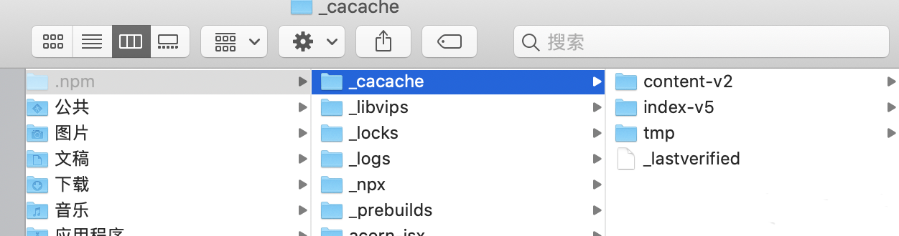

可以使用以下命令清除 /Users/cehou/.npm/_cacache 中的缓存文件：

```js
npm cache clean --force
```

打开_cacache文件，共有 3 个目录：

- **content-v2**：该文件中，基本都是一些二进制文件。为了使这些二进制文件可读，我们把二进制文件的扩展名改为 .tgz，然后进行解压，得到的结果其实就是我们的 npm 包资源。
- **index-v5**：该文件中，我们采用跟刚刚一样的操作就可以获得一些描述性的文件，事实上这些内容就是 content-v2 里文件的索引。

- **tmp**


那这些缓存如何被储存并被利用的呢？


这就和 npm install 机制联系在了一起。当 npm install 执行时，通过pacote把相应的包解压在对应的 node_modules 下面。npm 在下载依赖时，先下载到缓存当中，再解压到项目 node_modules 下。pacote 依赖npm-registry-fetch来下载包，npm-registry-fetch 可以通过设置 cache 属性，在给定的路径下根据IETF RFC 7234生成缓存数据。


接着，在每次安装资源时，根据 package-lock.json 中存储的 integrity、version、name 信息生成一个唯一的 key，这个 key 能够对应到 index-v5 目录下的缓存记录。如果发现有缓存资源，就会找到 tar 包的 hash，根据 hash 再去找缓存的 tar 包，并再次通过pacote把对应的二进制文件解压到相应的项目 node_modules 下面，省去了网络下载资源的开销。


注意，这里提到的缓存策略是从 npm v5 版本开始的。在 npm v5 版本之前，每个缓存的模块在 ~/.npm 文件夹中以模块名的形式直接存储，储存结构是：{cache}/{name}/{version}。

### （3）npm 使用技巧

**1）自定义 npm init**

npm 支持自定义 npm init，来快速创建一个符合自己需求的自定义项目。npm init 命令本身并不复杂，它其实就是调用 shell 脚本输出一个初始化的 package.json 文件。那么相应地，自定义 npm init 命令就是写一个 node 脚本而已，它的 module.exports 即为 package.json 配置内容。


为了实现更加灵活的自定义功能，可以使用 prompt() 方法，获取用户输入并动态产生的内容：

```js
const desc = prompt('请输入项目描述', '项目描述...')
module.exports = {
  key: 'value',
  name: prompt('name?', process.cwd().split('/').pop()),
  version: prompt('version?', '0.0.1'),
  description: desc,
  main: 'index.js',
  repository: prompt('github repository url', '', function (url) {
    if (url) {
      run('touch README.md');
      run('git init');
      run('git add README.md');
      run('git commit -m "first commit"');
      run(`git remote add origin ${url}`);
      run('git push -u origin master');
    }
    return url;
  })
}
```

假设该脚本名为 .npm-init.js，执行下述命令来确保 npm init 所对应的脚本指向正确的文件：

```js
npm config set init-module ~\.npm-init.js
```

我们也可以通过配置 npm init 默认字段来自定义 npm init 的内容：

```js
npm config set init.author.name "name"
npm config set init.author.email "email"
npm config set init.author.url "url"
npm config set init.license "MIT"
```

**2）利用 npm link，高效率在本地调试以验证包的可用性**

当开发一个公共包时，假如开发一个组件库，某个组件开发完成之后，如何验证该组件能在业务项目中正常运行呢？


常见的思路就是在组件库开发中，设计 examples 目录或者一个 playground，启动一个开发服务，以验证组件的运行情况。


然而真实应用场景是多种多样的，如果能在某个项目中率先尝试就太好了。但又不能发布一个不安全的包版本供业务项目使用。另一个笨方法是，手动复制粘贴组件并打包产出到业务项目的 node_modules 中进行验证，但是这种做法既不安全也会使得项目混乱，变得难以维护，同时过于依赖手工执行，这种操作非常原始。


那么如何高效率在本地调试以验证包的可用性呢？这时就可以使用 npm link。简单来说，它可以将模块链接到对应的业务项目中运行。


下面来看一个具体场景，假设正在开发项目 project 1，其中有个包 package 1，对应 npm 模块包名称是 npm-package-1，在 package 1 项目中加入了新功能 feature A，现在要验证在 project 1 项目中能否正常使用 package 1 的 feature A，应该怎么做？

- 先在 package 1 目录中，执行 npm link，这样 npm link 通过链接目录和可执行文件，实现 npm 包命令的全局可执行。
- 然后在 project 1 中创建链接，执行 npm link npm-package-1 命令时，它就会去 /usr/local/lib/node_modules/ 这个路径下寻找是否有这个包，如果有就建立软链接。

- 这样一来，我们就可以在 project 1 的 node_module 中会看到链接过来的模块包 npm-package-1，此时的 npm-package-1 就带有最新开发的 feature A，这样一来就可以在 project 1 中正常开发调试 npm-package-1。当然别忘了，调试结束后可以执行 npm unlink 以取消关联。


从工作原理上总结，npm link 的本质就是软链接，它主要做了两件事：

- 为目标 npm 模块（npm-package-1）创建软链接，将其链接到全局 node 模块安装路径 /usr/local/lib/node_modules/ 中；
- 为目标 npm 模块（npm-package-1）的可执行 bin 文件创建软链接，将其链接到全局 node 命令安装路径 /usr/local/bin/ 中。


可以看到：npm link 能够在工程上解决依赖包在任何一个真实项目中进行调试的问题，并且操作起来更加方便快捷。

### （4）npx 的作用

npx 由 npm v5.2 版本引入，解决了 npm 的一些使用快速开发、调试，以及项目内使用全局模块的痛点。


在传统 npm 模式下，如果需要使用代码检测工具 ESLint，就要先通过 npm install 安装：

```js
npm install eslint --save-dev
```

然后在项目根目录下执行以下命令：

```js
./node_modules/.bin/eslint --init
./node_modules/.bin/eslint yourfile.js
```

或者通过项目脚本和 package.json 的 npm scripts 字段调用 ESLint。


而使用 npx 就简单多了，只需要下面 2 个操作步骤：

```js
npx eslint --init
npx eslint yourfile.js
```

那为什么 npx 操作起来如此便捷呢？


这是因为它可以直接执行 node_modules/.bin 文件夹下的文件。在运行命令时，npx 可以自动去 node_modules/.bin 路径和环境变量 $PATH 里面检查命令是否存在，而不需要再在 package.json 中定义相关的 script。


npx 另一个更实用的好处是：**npx 执行模块时会优先安装依赖，但是在安装执行后便删除此依赖，这就避免了全局安装模块带来的问题。**


运行如下命令后，npx 会将 create-react-app 下载到一个临时目录，使用以后再删除：

```js
npx create-react-app cra-project
```

## 2. yarn

Yarn 是一个由 Facebook、Google、Exponent 和 Tilde 构建的新的 JavaScript 包管理器。它的出现是为了解决历史上 npm 的某些不足（比如 npm 对于依赖的完整性和一致性保障，以及 npm 安装速度过慢的问题等），虽然 npm 目前经过版本迭代汲取了 Yarn 一些优势特点（比如一致性安装校验算法等），但我们依然有必要关注 Yarn 的思想和理念。


**Yarn 和 npm 都是为了进一步解放和优化生产力。**


当 npm 还处在 v3 时期时，一个叫作 Yarn 的包管理方案横空出世。2016 年，npm 还没有 package-lock.json 文件，安装速度很慢，稳定性也较差，而 Yarn 的理念很好地解决了以下问题：

- **确定性：**通过 yarn.lock 等机制，保证了确定性。即不管安装顺序如何，相同的依赖关系在任何机器和环境下，都可以以相同的方式被安装。（在 npm v5 之前，没有 package-lock.json 机制，只有默认并不会使用的npm-shrinkwrap.json。）
- **采用模块扁平安装模式：**将依赖包的不同版本，按照一定策略，归结为单个版本，以避免创建多个副本造成冗余（npm 目前也有相同的优化）。

- **网络性能更好：**Yarn 采用了请求排队的理念，类似并发连接池，能够更好地利用网络资源；同时引入了更好的安装失败时的重试机制。
- **采用缓存机制：**实现了离线模式（npm 目前也有类似实现）。


下面先来看看 yarn.lock 结构：

```JS
"@babel/cli@^7.1.6", "@babel/cli@^7.5.5":
  version "7.8.4"
  resolved "http://npm.in.zhihu.com/@babel%2fcli/-/cli-7.8.4.tgz#505fb053721a98777b2b175323ea4f090b7d3c1c"
  integrity sha1-UF+wU3IamHd7KxdTI+pPCQt9PBw=
  dependencies:
    commander "^4.0.1"
    convert-source-map "^1.1.0"
    fs-readdir-recursive "^1.1.0"
    glob "^7.0.0"
    lodash "^4.17.13"
    make-dir "^2.1.0"
    slash "^2.0.0"
    source-map "^0.5.0"
  optionalDependencies:
    chokidar "^2.1.8"
```

该结构整体和 package-lock.json 结构类似，只不过 yarn.lock 并没有使用 JSON 格式，而是采用了一种自定义的标记格式，新的格式仍然保持了较高的可读性。


相比 npm，Yarn 另外一个显著区别是 yarn.lock 中子依赖的版本号不是固定版本。这就说明单独一个 yarn.lock 确定不了 node_modules 目录结构，还需要和 package.json 文件进行配合。


其实，不管是 npm 还是 Yarn，说到底它们都是一个包管理工具，在项目中如果想进行 npm/Yarn 切换，并不是一件麻烦的事情。甚至还有一个专门的 synp 工具，它可以将 yarn.lock 转换为 package-lock.json，反之亦然。


关于 Yarn 缓存，可以通过这个命令查看缓存目录，并通过目录查看缓存内容：

```
yarn cache dir
```

Yarn 默认使用 prefer-online 模式，即优先使用网络数据。如果网络数据请求失败，再去请求缓存数据。


下面是区别于 npm，Yarn 所独有的命令：

```
yarn import
yarn licenses
yarn pack
yarn why
yarn autoclean
```

npm 独有的命令是：npm rebuild。


### （1）Yarn 安装机制

简单来说，Yarn 的安装过程主要有以下 5 大步骤：


检测（checking）→ 解析包（Resolving Packages） → 获取包（Fetching Packages）→ 链接包（Linking Packages）→ 构建包（Building Packages）

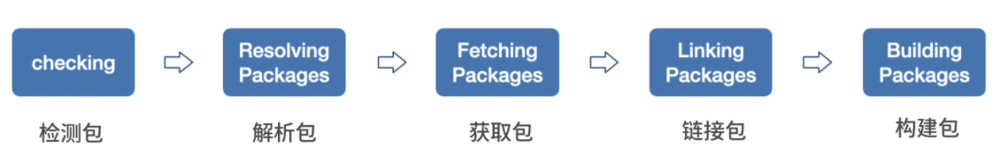

**1）检测包（checking）**

这一步主要是检测项目中是否存在一些 npm 相关文件，比如 package-lock.json 等。如果有，会提示用户注意：这些文件的存在可能会导致冲突。在这一步骤中，也会检查系统 OS、CPU 等信息。


**2）解析包（Resolving Packages）**

这一步会解析依赖树中每一个包的版本信息。


首先获取当前项目中 package.json 定义的 dependencies、devDependencies、optionalDependencies 的内容，这属于首层依赖。


接着采用遍历首层依赖的方式获取依赖包的版本信息，以及递归查找每个依赖下嵌套依赖的版本信息，并将解析过和正在解析的包用一个 Set 数据结构来存储，这样就能保证同一个版本范围内的包不会被重复解析：

- 对于没有解析过的包 A，首次尝试从 yarn.lock 中获取到版本信息，并标记为已解析；
- 如果在 yarn.lock 中没有找到包 A，则向 Registry 发起请求获取满足版本范围的已知最高版本的包信息，获取后将当前包标记为已解析。


总之，在经过解析包这一步之后，就确定了所有依赖的具体版本信息以及下载地址：

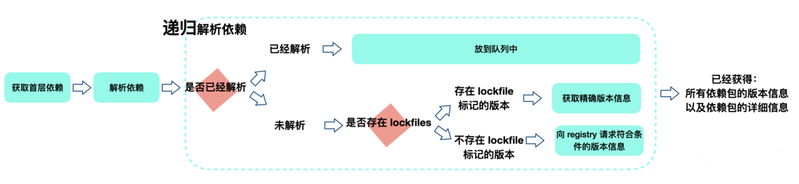

**3）获取包（Fetching Packages）**

这一步首先需要检查缓存中是否存在当前的依赖包，同时将缓存中不存在的依赖包下载到缓存目录。说起来简单，但是还是有些问题值得思考。


比如：如何判断缓存中是否存在当前的依赖包？其实 Yarn 会根据 cacheFolder+slug+node_modules+pkg.name 生成一个 path，判断系统中是否存在该 path，如果存在证明已经有缓存，不用重新下载。这个 path 也就是依赖包缓存的具体路径。


对于没有命中缓存的包，Yarn 会维护一个 fetch 队列，按照规则进行网络请求。如果下载包地址是一个 file 协议，或者是相对路径，就说明其指向一个本地目录，此时调用 Fetch From Local 从离线缓存中获取包；否则调用 Fetch From External 获取包。最终获取结果使用 fs.createWriteStream 写入到缓存目录下。

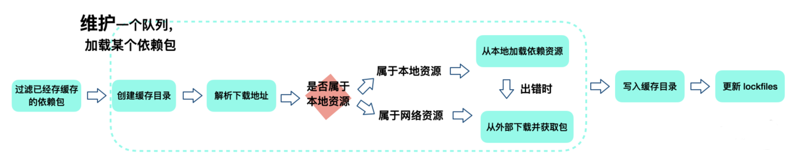

**4）链接包（Linking Packages）**

上一步是将依赖下载到缓存目录，这一步是将项目中的依赖复制到项目 node_modules 下，同时遵循扁平化原则。在复制依赖前，Yarn 会先解析 peerDependencies，如果找不到符合 peerDependencies 的包，则进行 warning 提示，并最终拷贝依赖到项目中。

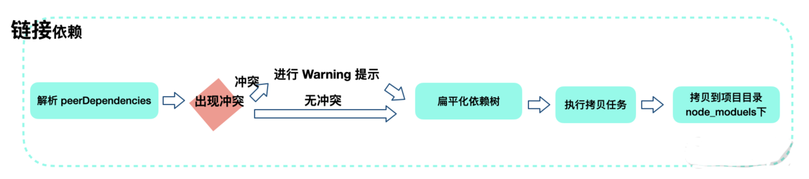

**5）构建包（Building Packages）**

如果依赖包中存在二进制包需要进行编译，会在这一步进行。

### （2）破解依赖管理困境

早期 npm（npm v2）的设计非常简单，在安装依赖时将依赖放到项目的 node_modules 文件中；同时如果某个直接依赖 A 还依赖其他模块 B，作为间接依赖，模块 B 将会被下载到 A 的 node_modules 文件夹中，依此递归执行，最终形成了一颗巨大的依赖模块树。


这样的 node_modules 结构，的确简单明了、符合预期，但对大型项目在某些方面却不友好，比如可能有很多重复的依赖包，而且会形成“嵌套地狱”。


那么如何理解“嵌套地狱”呢？

- 项目依赖树的层级非常深，不利于调试和排查问题；
- 依赖树的不同分支里，可能存在同样版本的相同依赖。比如直接依赖 A 和 B，但 A 和 B 都依赖相同版本的模块 C，那么 C 会重复出现在 A 和 B 依赖的 node_modules 中。


这种重复问题使得安装结果浪费了较大的空间资源，也使得安装过程过慢，甚至会因为目录层级太深导致文件路径太长，最终在 Windows 系统下删除 node_modules 文件夹出现失败情况。


因此 npm v3 之后，node_modules 的结构改成了扁平结构，按照上面的例子（项目直接依赖模块 A，A 还依赖其他模块 B），得到下面的图示：

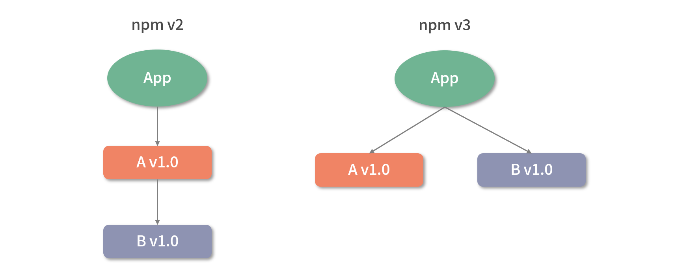

当项目新添加了 C 依赖，而它依赖另一个版本的 B v2.0。这时候版本要求不一致导致冲突，B v2.0 没办法放在项目平铺目录下的 node_moduls 文件当中，npm v3 会把 C 依赖的 B v2.0 安装在 C 的 node_modules 下：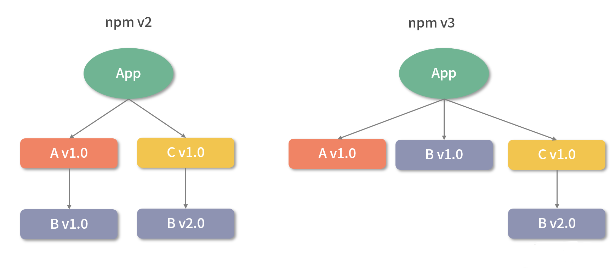

接下来，在 npm v3 中，假如应用现在还需要依赖一个 D，而 D 也依赖 B v2.0 ，会得到如下结构：

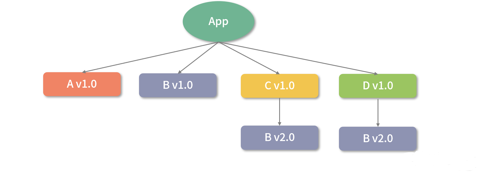

那为什么 B v1.0 出现在项目顶层 node_modules，而不是 B v2.0 出现在 node_modules 顶层呢？


其实这取决于模块 A 和 C 的安装顺序。因为 A 先安装，所以 A 的依赖 B v1.0 率先被安装在顶层 node_modules 中，接着 C 和 D 依次被安装，C 和 D 的依赖 B v2.0 就不得不安装在 C 和 D 的 node_modules 当中了。因此，模块的安装顺序可能影响 node_modules 内的文件结构。


假设这时候项目又添加了一个依赖 E ，E 依赖了 B v1.0 ，安装 E 之后，会得到这样一个结构：

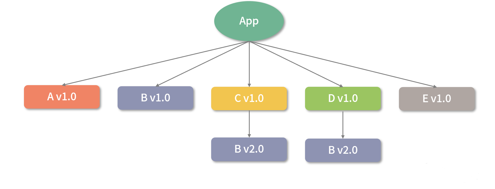

此时对应的 package.json 中，依赖包的顺序如下：

```json
{
    A: "1.0",
    C: "1.0",
    D: "1.0",
    E: "1.0"
}
```

如果想更新模块 A 为 v2.0，而模块 A v2.0 依赖了 B v2.0，npm v3 会怎么处理呢？


整个过程如下：

- 删除 A v1.0；
- 安装 A v2.0；

- 留下 B v1.0 ，因为 E v1.0 还在依赖；
- 把 B v2.0 安装在 A v2.0 下，因为顶层已经有了一个 B v1.0。


它的结构如下：


这时模块 B v2.0 分别出现在了 A、C、D 模块下——重复存在。


通过这一系列操作可以看到：npm 包的安装顺序对于依赖树的影响很大。模块安装顺序可能影响 node_modules 内的文件数量。


这里一个更理想的依赖结构理应是：

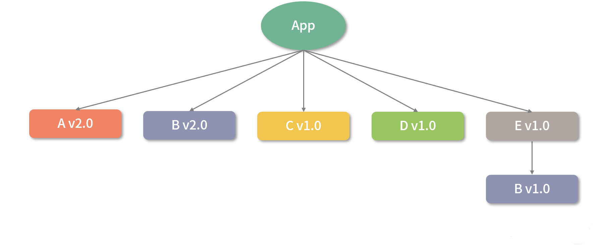

过了一段时间，模块 E v2.0 发布了，并且 E v2.0 也依赖了模块 B v2.0 ，npm v3 更新 E 时会怎么做呢？

- 删除 E v1.0；
- 安装 E v2.0；

- 删除 B v1.0；
- 安装 B v2.0 在顶层 node_modules 中，因为现在顶层没有任何版本的 B 了。


此时得到如下结构：

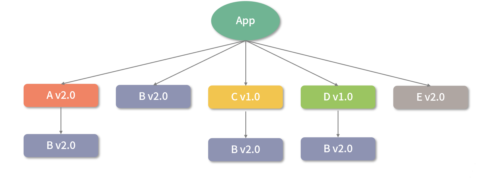

这时候，可以明显看到出现了较多重复的依赖模块 B v2.0。可以删除 node_modules，重新安装，利用 npm 的依赖分析能力，得到一个更清爽的结构。


实际上，更优雅的方式是使用 npm dedupe 命令，得到：

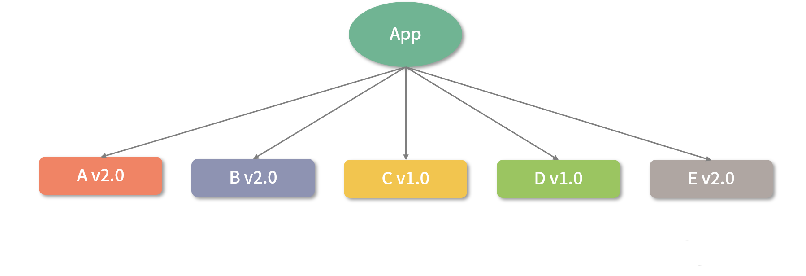

实际上，Yarn 在安装依赖时会自动执行 dedupe 命令。整个优化的安装过程，就是上面提到的扁平化安装模式。