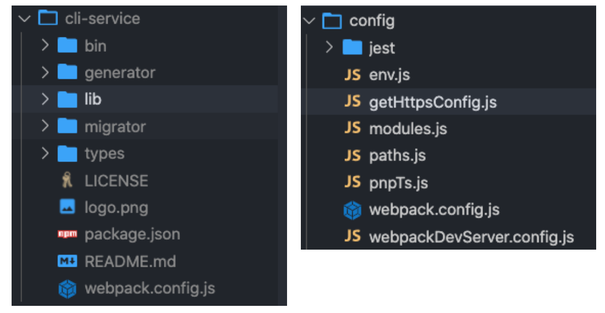
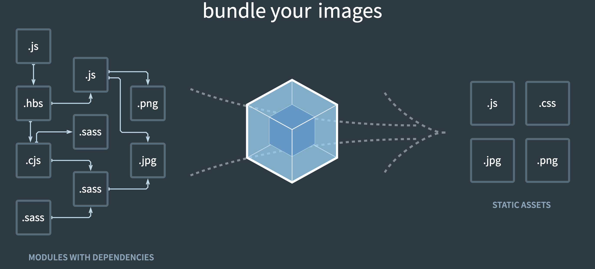
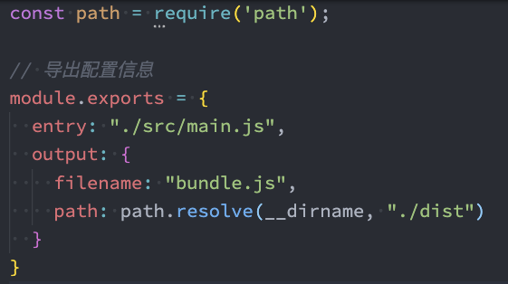
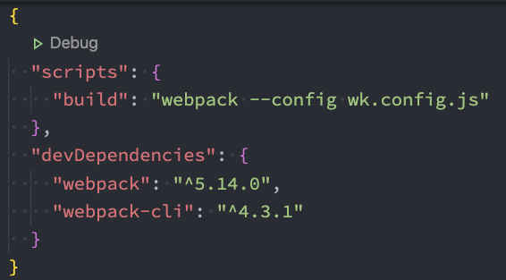

# 邂逅Webpack

## 1. 为什么会出现Webpack

在早期的前端开发中，我们可能遇到以下这些复杂的问题：

- 开发过程中我们需要通过模块化的方式来开发；
- 使用一些高级的特性来加快我们的开发效率或者安全性，比如通过ES6+、TypeScript开发脚本逻辑，

- 通过sass、less等方式来编写css样式代码；
- 开发过程中，希望实时的监听文件的变化来并且反映到浏览器上，提高开发的效率；

- 开发完成后还需要将代码进行压缩、合并以及其他相关的优化；


在目前的开发中，我们经常使用的框架就是Vue和React，在这些框架中，我们通常使用对应的脚手架来初始化项目，其实这些脚手架都是基于Webpack来帮助我们支持模块化、less、TypeScript、打包优化等的。它们已经进行了基本的Webpack配置。


下图为脚手架vu-cli和create-react-app的源码目录，其中都包含了Webpack的配置：



**总之，Webpack帮助我们解决了开发过程中一系列的复杂的问题。**

## 2. Webpack 概念

官方对Webpack的定义：

**webpack** is a *static module bundler* for modern JavaScript applications.

**解释：**webpack是一个静态的模块化打包工具，为现代的JavaScript应用程序；


下面来对上面的解释进行拆解：

- 打包bundler：webpack可以将帮助我们进行打包，所以它是一个打包工具
- 静态的static：最终可以将代码打包成最终的静态资源（部署到静态服务器）；

- 模块化module：webpack默认支持各种模块化开发，ES Module、CommonJS、AMD等；
- 现代的modern：正是因为现代前端开发面临各种各样的问题，才催生了webpack的出现和发展；



Webpack 可以实现以下需求：

- Webpack 作为一个模块打包工具，本身就可以解决模块化代码打包的问题，将零散的 JavaScript 代码打包到一个 JS 文件中。
- 对于有环境兼容问题的代码，Webpack 可以在打包过程中通过 Loader 机制对其实现编译转换，然后再进行打包。

- 对于不同类型的前端模块类型，Webpack 支持在 JavaScript 中以模块化的方式载入任意类型的资源文件，例如，我们可以通过 Webpack 实现在 JavaScript 中加载 CSS 文件，被加载的 CSS 文件将会通过 style 标签的方式工作。
- Webpack 还具备代码拆分的能力，它能够将应用中所有的模块按照我们的需要分块打包。这样一来，就不用担心全部代码打包到一起，产生单个文件过大，导致加载慢的问题。可以把应用初次加载所必需的模块打包到一起，其他的模块再单独打包，等到应用工作过程中实际需要用到某个模块，再异步加载该模块，实现增量加载，或者叫作渐进式加载，非常适合现代化的大型 Web 应用。


那在什么情况下会用到Webpack呢？

- 在开发vue、react等项目的过程中我们需要一些特殊的配置：比如给某些目录结构起别名，让项目支持sass、less等预处理器，希望在项目中手动的添加TypeScript的支持，都需要对webpack进行一些特殊的配置工作。
- 将在原有的脚手架上来定制一些自己的特殊配置提供性能：比如安装性能分析工具、使用gzip压缩代码、引用cdn的资源，公共代码抽取等操作，甚至包括需要编写属于自己的loader和plugin。

## 3. Webpack 配置文件

Webpack 作为目前最主流的前端模块打包器，提供了一整套前端项目模块化方案，而不仅仅局限于对 JavaScript 的模块化。通过 Webpack，我们可以轻松的对前端项目开发过程中涉及的所有资源进行模块化。


在通常情况下，webpack需要打包的项目是非常复杂的，并且我们需要一系列的配置来满足要求，默认配置必然是不可以的。 可以在根目录下创建一个`webpack.config.js`文件，来作为webpack的配置文件：



在这个配置文件中，`entry`为入口文件，`output`为出口文件。


如果我们的配置文件的名字并不是`webpack.config.js`，而是其他的名字，比如将`webpack.config.js`修改成了 `wk.config.js`，那就可以在执行命令时通过 `--config` 来指定对应的配置文件：

```
webpack --config wk.config.js
```

但是每次这样执行命令来对源码进行编译，会非常繁琐，所以可以在 `package.json` 中增加一个新的脚本来简化打包命令：



最后，执行打包命令即可进行打包操作：`**npm run build**`，执行完之后根目录就会出现一下`dist`文件夹，这个文件夹就是打包后的静态文件。

## 4. Webpack 基本使用

### （1）安装和配置

Webpack的运行是依赖Node环境的，所以电脑上必须有Node环境。


webpack的安装目前分为两个：webpack、webpack-cli，那它们是什么关系呢？

- 执行webpack命令，会执行`node_modules`下的`.bin`目录下的webpack； 
- webpack在执行时是依赖webpack-cli的，如果没有安装就会报错；

- webpack-cli中代码执行时，才是真正利用webpack进行编译和打包的过程； 
- 所以在安装webpack时，需要同时安装webpack-cli（第三方的脚手架事实上是没有使用webpack-cli的，而是类似于自己的vue-service-cli的东西）


所以，webpack-cli是非必须安装的（在vue和react的脚手架中是没有用webpack-cli的）。


安装及配置Webpack需要执行以下步骤

- 运行 `npm install webpack webpack-cli –g` 命令，安装 webpack 相关的包
- 在项目根目录中，创建名为 `webpack.config.js` 的 webpack 配置文件

- 在 webpack 的配置文件中，初始化如下基本配置：

```js
module.exports = {
 mode: 'development' // mode 用来指定构建模式，这里是开发模式，不会对代码进行压缩和混淆
}
```

- 在 `package.json` 配置文件中的 `scripts` 节点下，新增 `dev` 脚本如下：

```json
"scripts": {
"dev": "webpack" // script 节点下的脚本，可以通过 npm run 执行
}
```

- 在终端中运行 `npm run dev` 命令，启动 webpack 进行项目打包。

### （2）入口与出口

在webpack 的 4.x 版本中默认约定：

- 打包的入口文件为 `src -> index.js`
- 打包的输出文件为 `dist -> main.js`


可以在 `webpack.config.js`配置文件中修改打包的入口与出口，需要添加以下配置信息：

```js
const path = require('path') // 导入 node.js 中专门操作路径的模块
module.exports = {
   entry: path.join(__dirname, './src/index.js'), // 打包入口文件的路径
   output: {
      path: path.join(__dirname, './dist'), // 输出文件的存放路径
      filename: 'bundle.js' // 输出文件的名称
   } 
}
```


一般 Webpack 打包的入口是 JavaScript。因为从某种程度上来说，打包入口就是应用的运行入口，而目前前端应用中的业务是由 JS 驱动的，所以更合理的做法还是把 JS 文件作为打包的入口，然后在 JS 代码中通过 import 语句去加载 CSS 文件。

```js
// ./src/main.js
import './style.css'
// app logic...
console.log('App starts running~')
```


即便是通过 JS 代码去加载的 CSS 模块，css-loader 和 style-loader 仍然可以正常工作。因为 Webpack 在打包过程中会循环遍历每个模块，然后根据配置将每个遇到的模块交给对应的 Loader 去处理，最后再将处理完的结果打包到一起。


其实 Webpack 不仅是建议在 JavaScript 中引入 CSS，还会建议在代码中引入当前业务所需要的任意资源文件。因为真正需要这个资源的并不是整个应用，而是此时正在编写的代码。这就是 Webpack 的设计哲学。


假设我们在开发页面上的某个局部功能时，需要用到一个样式模块和一个图片文件。如果将这些资源文件单独引入到 HTML 中，然后再到 JS 中添加对应的逻辑代码。试想一下，如果后期这个局部功能不用了，就需要同时删除 JS 中的代码和 HTML 中的资源文件引入，也就是同时需要维护这两条线。而如果遵照 Webpack 的这种设计，所有资源的加载都是由 JS 代码控制，后期也就只需要维护 JS 代码这一条线了。


所以说，通过 JavaScript 代码去引入资源文件，或者说是建立 JavaScript 和资源文件的依赖关系，具有明显的优势。因为 JavaScript 代码本身负责完成整个应用的业务功能，放大来说就是驱动了整个前端应用，而 JavaScript 代码在实现业务功能的过程中需要用到样式、图片等资源文件。如果建立这种依赖关系：

- 逻辑上比较合理，因为 JS 确实需要这些资源文件配合才能实现整体功能；
- 配合 Webpack 这类工具的打包，能确保在上线时，资源不会缺失，而且都是必要的。

### （3）配置自动打包

在每次修改完之后，还需要重新执行打包的过程，这就很麻烦。所以引入自动打包功能，只要保存修改的代码，就可以进行自动打包。配置自动打包功能需要执行以下步骤：

- 运行 `npm install webpack-dev-server –D` 命令，安装支持项目自动打包的工具
- 修改 package.json -> scripts 中的 dev 命令如下：

```json
"scripts": {
 "dev": "webpack-dev-server" // script 节点下的脚本，可以通过 npm run 执行
}
```

- 将 `src -> index.html` 中，`script` 脚本的引用路径，修改为 `"/buldle.js“`（因为上面修改了出口路径）
- 运行 `npm run dev` 命令，重新进行打包

- 在浏览器中访问 `http://localhost:8080` 地址，查看自动打包效果


需要注意：

- webpack-dev-server 会启动一个事实打包的HTTP服务器
- webpack-dev-server 打包生成的输出文件，默认放在项目的根目录中，看不见


**自动打包的相关参数：**

```js
 // package.json中的配置
 // --open 打包完成后自动打开浏览器页面
 // --host 配置 IP 地址
 // --port 配置端口
 "scripts": {
 "dev": "webpack-dev-server --open --host 127.0.0.1 --port 8888"
 }
```

### （4）配置生成预览页面

当自动打包完成后，打开`http://localhost:8080` 地址，看到的是一些文件路径，还需要点击src路径才能查看页面的预览，这时可以配置`html-webpack-plugin` 生成预览页面，它的原理就是将src中的源文件复制到根目录中，这样打开网页就可以直接得看到文件的预览效果了。


下面就来配置`html-webpack-plugin` 生成预览页面：

- 运行 `npm install html-webpack-plugin –D` 命令，安装生成预览页面的插件
- 修改 `webpack.config.js` 文件头部区域，添加如下配置信息：

```js
// 导入生成预览页面的插件，得到一个构造函数
const HtmlWebpackPlugin = require('html-webpack-plugin')
const htmlPlugin = new HtmlWebpackPlugin({  // 创建插件的实例对象
    template: './src/index.html', // 指定要用到的模板文件
    filename: 'index.html' // 指定生成的文件的名称，该文件存在于内存中，在目录中不显示
})
```

- 修改 `webpack.config.js` 文件中向外暴露的配置对象，新增如下配置节点：

```js
module.exports = {
    plugins: [ htmlPlugin ] // plugins 数组是 webpack 打包期间会用到的一些插件列表
}
```

