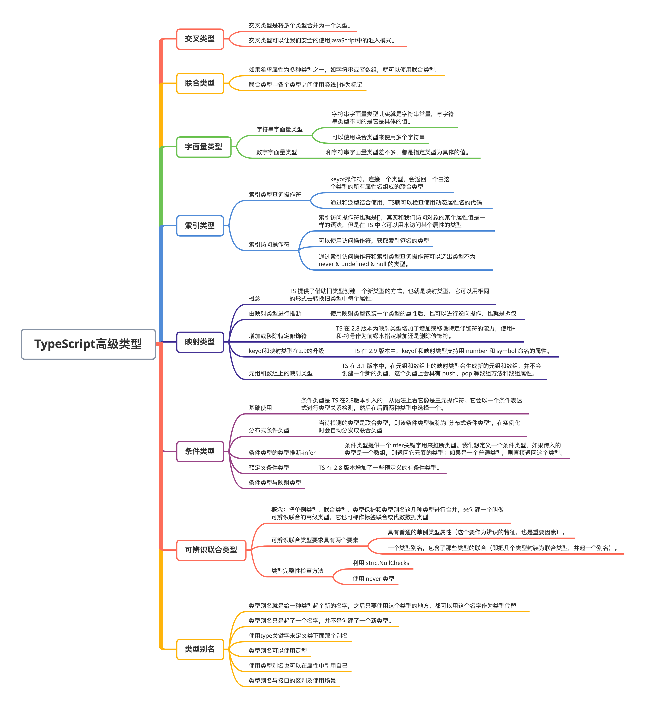
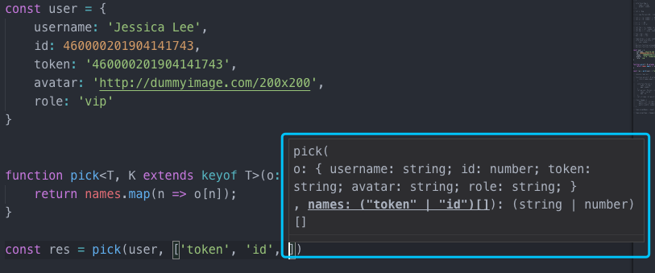
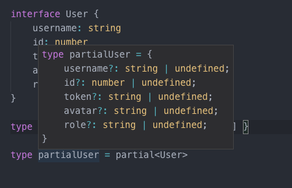
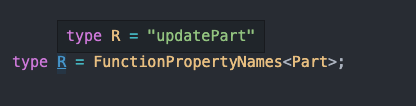

# TypeScript 高级类型

### 本文概览：




## 1. 交叉类型

交叉类型是将多个类型合并为一个类型。 这让我们可以把现有的多种类型叠加到一起成为一种类型，它包含了所需的所有类型的特性。


在 JavaScript 中，混入是一种非常常见的模式，在这种模式中，可以将两个对象中创建一个新对象，新对象会拥有这两个对象所有的功能。


交叉类型可以让我们安全的使用此种模式：

```js
function mixin<T, U>(first: T, second: U): T & U {
    const result = <T & U>{};
    for (let id in first) {
      (<T>result)[id] = first[id];
    }
    for (let id in second) {
      if (!result.hasOwnProperty(id)) {
        (<U>result)[id] = second[id];
      }
    }
  
    return result;
  }
  
  const x = extend({ a: 'hello' }, { b: 42 });
  
  // 现在 x 拥有了 a 属性与 b 属性
  const a = x.a;
  const b = x.b;
```

## 2. 联合类型

在 JavaScript 中，我们希望属性为多种类型之一，如字符串或者数组。这时联合类型就派上用场了（它使用 | 作为标记，如 string | number）。

```js
function formatCommandline(command: string[] | string) {
  let line = '';
  if (typeof command === 'string') {
    line = command.trim();
  } else {
    line = command.join(' ').trim();
  }
}
```

联合类型表示一个值可以是几种类型之一，用竖线 | 分隔每个类型，所以 number | string | boolean 表示一个值可以是number、string、或boolean。

## 3. 字面量类型

字面量类型可能也算不上是高级类型，但是字符串字面量类型和字符串类型其实并不一样，下面来看一下它们有什么区别。

### （1）字符串字面量类型

字符串字面量类型其实就是字符串常量，与字符串类型不同的是它是具体的值。

```js
type Name = "TS";
const name1: Name = "test"; // error 不能将类型"test"分配给类型"TS"
const name2: Name = "TS";
```

还可以使用联合类型来使用多个字符串：

```js
type Direction = "north" | "east" | "south" | "west";
function getDirectionFirstLetter(direction: Direction) {
  return direction.substr(0, 1);
}
getDirectionFirstLetter("test"); // error 类型“"test"”的参数不能赋给类型“Direction”的参数
getDirectionFirstLetter("east");
```

### （2）数字字面量类型

除了字符串字面量类型还有数字字面量类型，它和字符串字面量类型差不多，都是指定类型为具体的值。

```js
type Age = 18;
interface Info {
  name: string;
  age: Age;
}
const info: Info = {
  name: "TS",
  age: 28 // error 不能将类型“28”分配给类型“18”
};
```

来看一个比较经典的逻辑错误：

```js
function getValue(index: number) {
  if (index !== 0 || index !== 1) {
    // error This condition will always return 'true' since the types '0' and '1' have no overlap
    // ...
  }
}
```

在判断逻辑处使用了 `||` 符，当 index !== 0 不成立时，说明 index 就是 0，则不应该再判断 index 是否不等于 1；而如果 index !== 0 成立，那后面的判断也不会再执行；所以这个地方会报错。

## 4. 索引类型

先来看一个场景，现在需要一个 pick 函数，这个函数可以从对象上取出指定的属性，在 JavaScript 中这个函数应该是这样的:

```js
function pick(o, names) {
  return names.map(n => o[n]);
}
```

如果从一个 `user` 对象中取出 id ，那么应该这样:

```js
const user = {
    username: 'Jessica Lee',
    id: 460000201904141743,
    token: '460000201904141743',
    avatar: 'http://dummyimage.com/200x200',
    role: 'vip'
}
const res = pick(user, ['id'])
console.log(res) // [ '460000201904141743' ]
```

那如何在 TypeScript 中实现上述函数？


pick 函数的第一个参数 `o` 可以使用可索引类型，这个对象的 key 都是 `string` 而对应的值可能是任意类型，那么可以这样表示:

```js
interface Obj {
    [key: string]: any
}
```

第二个参数 `names` 很明显是个字符串数组：

```js
function pick(o: Obj, names: string[]) {
    return names.map(n => o[n]);
}
```

这样写定义不够严谨：

- 参数 `names` 的成员应该是参数 `o` 的属性，因此不应该是 string 这种宽泛的定义，应该更加准确
- pick 函数的返回值类型为 `any[]`，其实可以更加精准，pick 的返回值类型应该是所取的属性值类型的联合类型


要想定义更精准的定义类型必须先了解两个类型操作符：**索引类型查询操作符**和**索引访问操作符**。

### （1）索引类型查询操作符

`keyof`操作符，连接一个类型，会返回一个由这个类型的所有属性名组成的联合类型：

```js
interface Info {
  name: string;
  age: number;
}
let infoProp: keyof Info;
infoProp = "name";
infoProp = "age";
infoProp = "no"; // error 不能将类型“"no"”分配给类型“"name" | "age"”
```

这里的`keyof Info`其实相当于`"name" | “age”`。通过和泛型结合使用，TS 就可以检查使用了动态属性名的代码：

```js
function getValue<T, K extends keyof T>(obj: T, names: K[]): T[K][] { // 这里使用泛型，并且约束泛型变量K的类型是"keyof T"，也就是类型T的所有字段名组成的联合类型
  return names.map(n => obj[n]); // 指定getValue的返回值类型为T[K][]，即类型为T的值的属性值组成的数组
}
const info = {
  name: "lison",
  age: 18
};
let values: string[] = getValue(info, ["name"]);
values = getValue(info, ["age"]); // error 不能将类型“number[]”分配给类型“string[]”
```

`keyof` 正是赋予了开发者查询索引类型的能力。

### （2）索引访问操作符

索引访问操作符也就是`[]`，其实和我们访问对象的某个属性值是一样的语法，但是在 TS 中它可以用来访问某个属性的类型：

```js
interface Info {
  name: string;
  age: number;
}
type NameType = Info["name"];
let name: NameType = 123; // error 不能将类型“123”分配给类型“string”
```

再来看个例子：

```js
function getProperty<T, K extends keyof T>(o: T, name: K): T[K] {
  return o[name]; // o[name] is of type T[K]
}
```

这里两个参数的类型分别为泛型 T 和 K，而函数的返回值类型为`T[K]`，只要函数的返回值也是这种形式，即访问参数 o 的参数 name 属性，即可。


再来看个结合接口的例子：

```js
interface Obj<T> {
  [key: number]: T;
}
const key: keyof Obj<number>; // keys的类型为number
```

注意，如果索引类型为 number，那么实现该接口的对象的属性名必须是 number 类型；但是如果接口的索引类型是 string 类型，那么实现该接口的对象的属性名设置为数值类型的值也是可以的，因为数值最后还是会先转换为字符串。这里一样，如果接口的索引类型设置为 string 的话，`keyof Obj<number>`等同于类型`number | string`：

```js
interface Obj<T> {
  [key: string]: T;
}
let key: keyof Obj<number>; // keys的类型为number | string
key = 123; // right
```

也可以使用访问操作符，获取索引签名的类型：

```js
interface Obj<T> {
  [key: string]: T;
}
const obj: Obj<number> = {
  age: 18
};
let value: Obj<number>["age"]; // value的类型是number，也就是name的属性值18的类型
```

还有一点，当tsconfig.json里`strictNullChecks`设为`false`时，通过`Type[keyof Type]`获取到的，是除去`never & undefined & null`这三个类型之后的字段值类型组成的联合类型：

```js
interface Type {
  a: never;
  b: never;
  c: string;
  d: number;
  e: undefined;
  f: null;
  g: object;
}
type test = Type[keyof Type];
// test的类型是string | number | object
```

这里接口 Type 有几个属性，通过索引访问操作符和索引类型查询操作符可以选出类型不为 never & undefined & null 的类型。


当了解了这两个访问符之后，最开始的问题就迎刃而解了。


首先，需要一个泛型 `T` 它来代表传入的参数 `o` 的类型，因为在编写代码时无法确定参数 `o` 的类型到底是什么，所以在这种情况下要获取 `o` 的类型必须用面向未来的类型–泛型。


那么传入的第二个参数 `names` ，它的特点就是数组的成员必须由参数 `o` 的属性名称构成，这个时候我们很容易想到操作符`keyof`, `keyof T`代表参数o类型的属性名的联合类型，参数names的成员类型`K`则只需要约束到`keyof T`即可。


返回值就更简单了，通过类型访问符`T[K]`便可以取得对应属性值的类型，他们的数组`T[K][]`正是返回值的类型。

```js
function pick<T, K extends keyof T>(o: T, names: K[]): T[K][] {
    return names.map(n => o[n]);
}
const res = pick(user, ['token', 'id', ])
```

用索引类型结合类型操作符完成了 TypeScript 版的 pick 函数，它不仅仅有更严谨的类型约束能力，也提供了更强大的代码提示能力：



## 5. 映射类型

现在有一需求，有一个User接口，现在有一个需求是把User接口中的成员全部变成可选的，我们应该怎么做？难道要重新一个个`:`前面加上`?`，有没有更便捷的方法？

```js
interface User {
    username: string
    id: number
    token: string
    avatar: string
    role: string
}
```

这个时候映射类型就派上用场了，映射类型的语法是`[K in Keys]`:

- **K**：类型变量，依次绑定到每个属性上，对应每个属性名的类型
- **Keys**：字符串字面量构成的联合类型，表示一组属性名（的类型）


首先需要找到`Keys`，即字符串字面量构成的联合类型，这就得使用上面提到的`keyof`操作符，假设传入的类型是泛型`T`，得到`keyof T`，即传入类型`T`的属性名的联合类型。


然后我们需要将`keyof T`的属性名称一一映射出来`[K in keyof T]`，如果要把所有的属性成员变为可选类型，那么需要`T[K]`取出相应的属性值，最后重新生成一个可选的新类型`{ [K in keyof T]?: T[K] }`。


用类型别名表示就是：

```js
type partial<T> = { [K in keyof T]?: T[K] }
```

测试一下：

```js
type partialUser = partial<User>
```

所有的属性都变成了可选类型：



### （1）由映射类型进行推断

使用映射类型包装一个类型的属性后，也可以进行逆向操作，也就是拆包，先来看包装操作：

```js
type Proxy<T> = { // 这里定义一个映射类型，他将一个属性拆分成get/set方法
  get(): T;
  set(value: T): void;
};
type Proxify<T> = { [P in keyof T]: Proxy<T[P]> }; // 这里再定义一个映射类型，将一个对象的所有属性值类型都变为Proxy<T>处理之后的类型
function proxify<T>(obj: T): Proxify<T> { // 这里定义一个proxify函数，用来将对象中所有属性的属性值改为一个包含get和set方法的对象
  let result = {} as Proxify<T>;
  for (const key in obj) {
    result[key] = {
      get: () => obj[key],
      set: value => (obj[key] = value)
    };
  }
  return result;
}
let props = {
  name: "lison",
  age: 18
};
let proxyProps = proxify(props);
console.log(proxyProps.name.get()); // "lison"
proxyProps.name.set("li");
```

这里我们定义了一个函数，这个函数可以把传入的对象的每个属性的值替换为一个包含 get 和 set 两个方法的对象。最后我们获取某个值的时候，比如 name，就使用 proxyProps.name.get()方法获取它的值，使用 proxyProps.name.set()方法修改 name 的值。


接下来进行拆包：

```js
function unproxify<T>(t: Proxify<T>): T { // 这里我们定义一个拆包函数，其实就是利用每个属性的get方法获取到当前属性值，然后将原本是包含get和set方法的对象改为这个属性值
  let result = {} as T;
  for (const k in t) {
    result[k] = t[k].get(); // 这里通过调用属性值这个对象的get方法获取到属性值，然后赋给这个属性，替换掉这个对象
  }
  return result;
}
let originalProps = unproxify(proxyProps);
```

### （2）增加或移除特定修饰符

TS 在 2.8 版本为映射类型增加了增加或移除特定修饰符的能力，使用`+`和`-`符号作为前缀来指定增加还是删除修饰符。首先来看如何通过映射类型为一个接口的每个属性增加修饰符，这里使用+前缀：

```js
interface Info {
  name: string;
  age: number;
}
type ReadonlyInfo<T> = { +readonly [P in keyof T]+?: T[P] };
let info: ReadonlyInfo<Info> = {
  name: "lison"
};
info.name = ""; // error
```

经过 ReadonlyInfo 创建的接口类型，属性是可选的，所以在定义 info 的时候没有写 age 属性也没问题，同时每个属性是只读的，所以修改 name 的值的时候报错。通过+前缀增加了 readonly 和?修饰符。当然，增加的时候，这个+前缀可以省略，也就是说，上面的写法和`type ReadonlyInfo = { readonly [P in keyof T]?: T[P] }`是一样的。


删除修饰符：

```js
interface Info {
  name: string;
  age: number;
}
type RemoveModifier<T> = { -readonly [P in keyof T]-?: T[p] };
type InfoType = RemoveModifier<Readonly<Partial<Info>>>;
let info1: InfoType = {
  // error missing "age"
  name: "lison"
};
let info2: InfoType = {
  name: "lison",
  age: 18
};
info2.name = ""; // right, can edit
```

这里定义了去掉修饰符的映射类型 RemoveModifier，`Readonly<Partial<Info>>`则是返回一个既属性可选又只读的接口类型，所以 InfoType 类型则表示属性必含而且非只读。


TS 内置了一个映射类型`Required<T>`，使用它可以去掉 T 所有属性的`?`修饰符。

### （3）keyof 和映射类型在 2.9版本的升级

TS 在 2.9 版本中，keyof 和映射类型支持用 number 和 symbol 命名的属性，下面是 keyof 的例子：

```js
const stringIndex = "a";
const numberIndex = 1;
const symbolIndex = Symbol();
type Obj = {
  [stringIndex]: string;
  [numberIndex]: number;
  [symbolIndex]: symbol;
};
type keys = keyof Obj;
let key: keys = 2; // error
let key: keys = 1; // right
let key: keys = "b"; // error
let key: keys = "a"; // right
let key: keys = Symbol(); // error
let key: keys = symbolIndex; // right
```

再来看映射类型的例子：

```js
const stringIndex = "a";
const numberIndex = 1;
const symbolIndex = Symbol();
type Obj = {
  [stringIndex]: string;
  [numberIndex]: number;
  [symbolIndex]: symbol;
};
type ReadonlyType<T> = { readonly [P in keyof T]?: T[P] };
let obj: ReadonlyType<Obj> = {
  a: "aa",
  1: 11,
  [symbolIndex]: Symbol()
};
obj.a = "bb"; // error Cannot assign to 'a' because it is a read-only property
obj[1] = 22; // error Cannot assign to '1' because it is a read-only property
obj[symbolIndex] = Symbol(); // error Cannot assign to '[symbolIndex]' because it is a read-only property
```

### （4）元组和数组上的映射类型

TS 在 3.1 版本中，在元组和数组上的映射类型会生成新的元组和数组，并不会创建一个新的类型，这个类型上会具有 push、pop 等数组方法和数组属性：

```js
type MapToPromise<T> = { [K in keyof T]: Promise<T[K]> };
type Tuple = [number, string, boolean];
type promiseTuple = MapToPromise<Tuple>;
let tuple: promiseTuple = [
  new Promise((resolve, reject) => resolve(1)),
  new Promise((resolve, reject) => resolve("a")),
  new Promise((resolve, reject) => resolve(false))
];
```

这里定义了一个MapToPromise映射类型。它返回一个将传入的类型的所有字段的值转为Promise，且Promise的resolve回调函数的参数类型为这个字段类型。定义一个元组Tuple，元素类型分别为number、string和boolean，使用MapToPromise映射类型将这个元组类型传入，并且返回一个promiseTuple类型。当指定变量tuple的类型为promiseTuple后，它的三个元素类型都是一个Promise，且resolve的参数类型依次为number、string和boolean。

## 6. 条件类型

### （1）条件类型基础使用

条件类型是 TS 在2.8版本引入的，从语法上看它像是三元操作符。它会以一个条件表达式进行类型关系检测，然后在后面两种类型中选择一个，写法如下：

```js
T extends U ? X : Y
```

这个表达式的意思是，如果 T 可以赋值给 U 类型，则是 X 类型，否则是 Y 类型。


比如，声明一个函数 `f`，它的参数接收一个布尔类型，当布尔类型为 `true` 时返回 `string` 类型,否则返回 `number` 类型:

```js
declare function f<T extends boolean>(x: T): T extends true ? string : number;
const x = f(Math.random() < 0.5)  //  x类型： const x： string | number
const y = f(false)                //  y类型： const y： number
const z = f(true)                 //  z类型： const z： string
```

条件类型就是这样，只有类型系统中给出充足的条件之后，它才会根据条件推断出类型结果。

### （2）分布式条件类型

当待检测的类型是联合类型，则该条件类型被称为“分布式条件类型”，在实例化时会自动分发成联合类型：

```js
type TypeName<T> = T extends any ? T : never;
type Type1 = TypeName<string | number>; // Type1的类型是string|number
```

再来看个复杂点的例子，这是官方文档的例子：

```js
type TypeName<T> = T extends string
  ? string
  : T extends number
  ? number
  : T extends boolean
  ? boolean
  : T extends undefined
  ? undefined
  : T extends Function
  ? Function
  : object;
type Type1 = TypeName<() => void>; // Type1的类型是Function
type Type2 = TypeName<string[]>; // Type2的类型是object
type Type3 = TypeName<(() => void) | string[]>; // Type3的类型是object | Function
```

来看一个分布式条件类型的实际应用：

```js
type Diff<T, U> = T extends U ? never : T;
type Test = Diff<string | number | boolean, undefined | number>;
// Test的类型为string | boolean
```

这里定义的条件类型的作用就是，找出从 T 中出去 U 中存在的类型，得到剩下的类型。不过这个条件类型已经内置在 TS 中了，只不过它不叫 Diff，叫 Exclude。


来看一个条件类型和映射类型结合的例子：

```js
type Type<T> = { [K in keyof T]: T[K] extends Function ? K : never }[keyof T];
interface Part {
  id: number;
  name: string;
  subparts: Part[];
  updatePart(newName: string): void;
}
type Test = Type<Part>; // Test的类型为"updatePart"
```

这个例子中，接口 Part 有四个字段，其中 updatePart 的值是函数，也就是 Function 类型。Type的定义中，涉及到映射类型、条件类型、索引访问类型和索引类型。首先[K in keyof T]用于遍历 T 的所有属性名，值使用了条件类型，T[K]是当前属性名的属性值，`T[K] extends Function ? K : never`表示如果属性值为 Function 类型，则值为属性名字面量类型，否则为 never 类型。接下来使用`keyof T`获取 T 的属性名，最后通过索引访问类型`[keyof T]`获取不为 never 的类型。

### （3）条件类型的类型推断-infer

条件类型提供一个`infer`关键字用来推断类型。我们想定义一个条件类型，如果传入的类型是一个数组，则返回它元素的类型；如果是一个普通类型，则直接返回这个类型。不使用 infer可以这样写：

```js
type Type<T> = T extends any[] ? T[number] : T;
type test = Type<string[]>; // test的类型为string
type test2 = Type<string>; // test2的类型为string
```

如果传入 Type 的是一个数组类型，那么返回的类型为`T[number]`，也就是该数组的元素类型，如果不是数组，则直接返回这个类型。这里通过索引访问类型`T[number]`来获取类型的，如果使用 infer 关键字则无需自己手动获取，来看下怎么使用 infer：

```js
type Type<T> = T extends Array<infer U> ? U : T;
type test = Type<string[]>; // test的类型为string
type test2 = Type<string>; // test2的类型为string
```

这里 infer 能够推断出 U 的类型，并且供后面使用，可以理解为这里定义了一个变量 U 来接收数组元素的类型。

### （4）预定义条件类型

TS 在 2.8 版本增加了一些预定义的有条件类型，来看一下：

- **Exclude<T, U>，从 T 中去掉可以赋值给 U 的类型：**

```js
type Type = Exclude<"a" | "b" | "c", "a" | "b">;
// Type => 'c'
type Type2 = Exclude<string | number | boolean, string | number>;
// Type2 => boolean
```

- **Extract<T, U>，选取 T 中可以赋值给 U 的类型：**

```js
type Type = Extract<"a" | "b" | "c", "a" | "c" | "f">;
// Type => 'a' | 'c'
type Type2 = Extract<number | string | boolean, string | boolean>;
// Type2 => string | boolean
```

- **NonNullable，从 T 中去掉 null 和 undefined：**

```js
type Type = Extract<string | number | undefined | null>;
// Type => string | number
```

- **ReturnType，获取函数类型返回值类型：**

```js
type Type = ReturnType<() => string)>
// Type => string
type Type2 = ReturnType<(arg: number) => void)>
// Type2 => void
```

- **InstanceType，获取构造函数类型的实例类型：**

先来看下InstanceType的实现：

```js
type InstanceType<T extends new (...args: any[]) => any> = T extends new (
  ...args: any[]
) => infer R
  ? R
  : any;
```

InstanceType 条件类型要求泛型变量 T 类型是创建实例为 any 类型的构造函数，而它本身则通过判断 T 是否是构造函数类型来确定返回的类型。如果是构造函数，使用 infer 可以自动推断出 R 的类型，即实例类型；否则返回的是 any 类型。


再来看下InstanceType 的使用：

```js
class A {
  constructor() {}
}
type T1 = InstanceType<typeof A>; // T1的类型为A
type T2 = InstanceType<any>; // T2的类型为any
type T3 = InstanceType<never>; // T3的类型为never
type T4 = InstanceType<string>; // error
```

在T1 的定义中，`typeof A`返回的的是类 A 的类型，也就是 A，这里不能使用 A 因为它是值不是类型，类型 A 是构造函数，所以 T1 是 A 构造函数的实例类型，也就是 A；T2 传入的类型为 any，因为 any 是任何类型的子类型，所以它满足`T extends new (…args: any[]) => infer R`，这里 infer 推断的 R 为 any；传入 never 和 any 同理。传入 string 时因为 string 不能不给构造函数类型，所以报错。

### （5）条件类型与映射类型

思考题: 有一个interface `Part`。现在需要编写一个工具类型将interface中**函数类型**的**名称**取出来，在这个题目示例中，应该取出的是:



```js
interface Part {
    id: number;
    name: string;
    subparts: Part[];
    updatePart(newName: string): void;
}
type R = FunctionPropertyNames<Part>;
```

那该如何设计这个工具类型?这种问题我们应该换个思路，比如把interface看成js中的对象字面量，用js的思维只要遍历整个对象，找出value是函数的部分取出key即可.


在TypeScript的类型编程中也是类似的道理，要遍历interface，取出类型为`Function`的部分找出key即可:

```js
type FunctionPropertyNames<T> = { [K in keyof T]: T[K] extends Function ? K : never }[keyof T]
```

下面来一步步分析一下上述工具类型：

1. 假设把`Part`代入泛型`T`，`[K in keyof T]`相当于遍历整个interface
2. 这时`K`相当于interface的key，`T[K]`相当于interface的value

1. 接下来，用条件类型验证value的类型，如果是`Function`那么将value作为新interface的key保留下来,否则为`never`
2. 到这里我们得到了遍历修改后的**新**interface:

```js
type R = {
    id: never;
    name: never;
    subparts: never;
    updatePart: "updatePart";
}
```

**特别注意:** 这里产生的新interface R中的value是老interface Part的key,取出新interface R的value就是取出了对应老interface Part的key。


但是要求的是取出老interface Part的key，这个时候再次用`[keyof T]`作为key依次取出新interface的value，但是由于`id` `name`和`subparts`的value为`never`就不会返回任何类型了，所以只返回了`'updatePart'`.

## 7. 可辨识联合类型

我们可以把单例类型、联合类型、类型保护和类型别名这几种类型进行合并，来创建一个叫做**可辨识联合**的高级类型，它也可称作**标签联合**或**代数数据类型**。

所谓单例类型，可以理解为符合单例模式的数据类型，比如枚举成员类型，字面量类型。

可辨识联合要求具有两个要素：

- 具有普通的单例类型属性（这个要作为辨识的特征，也是重要因素）。
- 一个类型别名，包含了那些类型的联合（即把几个类型封装为联合类型，并起一个别名）。


**可辨识联合类型就是为了保证每个case都能被处理。**


来看一个例子：

```js
interface Square {
  kind: "square"; // 这个就是具有辨识性的属性
  size: number;
}
interface Rectangle {
  kind: "rectangle"; // 这个就是具有辨识性的属性
  height: number;
  width: number;
}
interface Circle {
  kind: "circle"; // 这个就是具有辨识性的属性
  radius: number;
}
type Shape = Square | Rectangle | Circle; // 这里使用三个接口组成一个联合类型，并赋给一个别名Shape，组成了一个可辨识联合。
function getArea(s: Shape) {
  switch (s.kind) {
    case "square":
      return s.size * s.size;
    case "rectangle":
      return s.height * s.width;
    case "circle":
      return Math.PI * s.radius ** 2;
  }
}
```

上面这个例子中，我们的 Shape 即可辨识联合，它是三个接口的联合，而这三个接口都有一个 kind 属性，且每个接口的 kind 属性值都不相同，能够起到标识作用。 函数内应该包含联合类型中每一个接口的 case。


如果函数内没有包含联合类型中每一个接口的 case。但是如果遗漏了，就希望编译器应该给出提示。有以下两种**完整性检查**的方法：**利用 strictNullChecks**和**使用 never 类型**。

### （1）利用 strictNullChecks

对上面的例子加一种接口：

```js
interface Square {
  kind: "square";
  size: number;
}
interface Rectangle {
  kind: "rectangle";
  height: number;
  width: number;
}
interface Circle {
  kind: "circle";
  radius: number;
}
interface Triangle {
  kind: "triangle";
  bottom: number;
  height: number;
}
type Shape = Square | Rectangle | Circle | Triangle; // 这里我们在联合类型中新增了一个接口，但是下面的case却没有处理Triangle的情况
function getArea(s: Shape) {
  switch (s.kind) {
    case "square":
      return s.size * s.size;
    case "rectangle":
      return s.height * s.width;
    case "circle":
      return Math.PI * s.radius ** 2;
  }
}
```

这里，Shape 联合有四种接口，但函数的 switch 里只包含三个 case，这个时候编译器并没有提示任何错误，因为当传入函数的是类型是 Triangle 时，没有任何一个 case 符合，则不会有 return 语句执行，那么函数是默认返回 undefined。所以我们可以利用这个特点，结合 strictNullChecks编译选项，可以开启 strictNullChecks，然后让函数的返回值类型为 number，那么当返回 undefined 的时候，就会报错：

```js
function getArea(s: Shape): number {
  // error Function lacks ending return statement and return type does not include 'undefined'
  switch (s.kind) {
    case "square":
      return s.size * s.size;
    case "rectangle":
      return s.height * s.width;
    case "circle":
      return Math.PI * s.radius ** 2;
  }
}
```

这种方法简单，但是对旧代码支持不好，因为strictNullChecks这个配置项是2.0版本才加入的，如果使用的是低于这个版本的，这个方法并不会有效。

### （2） 使用 never 类型

当函数返回一个错误或者不可能有返回值的时候，返回值类型为 never。所以可以给 switch 添加一个 default 流程，当前面的 case 都不符合的时候，会执行 default 后的逻辑：

```js
function assertNever(value: never): never {
  throw new Error("Unexpected object: " + value);
}
function getArea(s: Shape) {
  switch (s.kind) {
    case "square":
      return s.size * s.size;
    case "rectangle":
      return s.height * s.width;
    case "circle":
      return Math.PI * s.radius ** 2;
    default:
      return assertNever(s); // error 类型“Triangle”的参数不能赋给类型“never”的参数
  }
}
```

采用这种方式，需要定义一个额外的 asserNever 函数，但是这种方式不仅能够在编译阶段提示我们遗漏了判断条件，而且在运行时也会报错。

## 8. this类型

在 JavaScript 中，this 可以用来获取对全局对象、类实例对象、构建函数实例等的引用，在 TypeScript 中，this 也是一种类型。先来看个计算器 Counter 的例子：

```js
class Counter {
  constructor(public count: number = 0) {}
  add(value: number) { // 定义一个相加操作的方法
    this.count += value;
    return this;
  }
  subtract(value: number) { // 定义一个相减操作的方法
    this.count -= value;
    return this;
  }
}
let counter = new Counter(10);
console.log(counter.count); // 10
counter.add(5).subtract(2);
console.log(counter.count); // 13
```

这里给 Counter 类定义几个方法，每个方法都返回 this，这个 this 即指向实例，这样就可以通过链式调用的形式来使用这些方法。这个是没有问题的，但是如果要通过类继承的形式丰富这个 Counter 类，添加一些方法，依然返回 this，然后采用链式调用的形式调用，在过去版本的 TypeScript 中是有问题的，先来看继承的逻辑：

```js
class PowCounter extends Counter {
  constructor(public count: number = 0) {
    super(count);
  }
  pow(value: number) { // 定义一个幂运算操作的方法
    this.count = this.count ** value;
    return this;
  }
}
let powcounter = new PowCounter(2);
powCounter
  .pow(3)
  .subtract(3)
  .add(1);
console.log(powCounter.count); // 6
```

我们定义了 PowCounter 类，它继承 Counter 类，新增了 pow 方法用来求值的幂次方，这里使用了 ES7 新增的幂运算符`**`。我们使用 PowCounter 创建了实例 powcounter，它的类型自然是 PowCounter，在该实例上调用继承来的 subtract 和 add 方法。如果是在过去，就会报错，因为创建实例 powcounter 的类 PowCounter 没有定义这两个方法，所以会报没有这两个方法的错误。但是在 1.7 版本中增加了 this 类型，TypeScript 会对方法返回的 this 进行判断，就不会报错了。


对于对象来说，对象的属性值可以是一个函数，那么这个函数也称为方法，在方法内如果访问this，默认情况下是对这个对象的引用，this类型也就是这个对象的字面量类型：

```js
let info = {
  name: 'Lison',
  getName () {
      return this.name // "Lison" 这里this的类型为 { name: string; getName(): string; }
  }
}
```

但是如果显式地指定了this的类型，那么this的类型就改变了，如下：

```js
let info = {
  name: "Lison",
  getName(this: { age: number }) {
    this; // 这里的this的类型是{ age: number }
  }
};
```

如果在 tsconfig.json 里将 noImplicitThis 设为 true，这时候有两种不同的情况：

```js
**(1) 对象字面量具有 ThisType<T> 指定的类型，此时 this 的类型为 T：**
```

```js
type ObjectDescriptor<D, M> = { // 使用类型别名定义一个接口，这里用了泛型，两个泛型变量D和M
  data?: D; // 这里指定data为可选字段，类型为D
  // 这里指定methods为可选字段，类型为M和ThisType<D & M>组成的交叉类型；  
  // ThisType是一个内置的接口，用来在对象字面量中键入this，这里指定this的类型为D & M  
  methods?: M & ThisType<D & M>;  
}
// 这里定义一个mackObject函数，参数desc的类型为ObjectDescriptor<D, M>
function makeObject<D, M>(desc: ObjectDescriptor<D, M>): D & M { 
  let data: object = desc.data || {};
  let methods: object = desc.methods || {};
  // 这里通过...操作符，将data和methods里的所有属性、方法都放到了同一个对象里返回，这个对象的类型自然就      是D & M，因为他同时包含D和M两个类型的字段  
  return { ...data, ...methods } as D & M; 
}
let obj = makeObject({
  data: { x: 0, y: 0 }, // 这里data的类型就是我们上面定义ObjectDescriptor<D, M>类型中的D
  methods: { // 这里methods的类型就是我们上面定义ObjectDescriptor<D, M>类型中的M
    moveBy(dx: number, dy: number) {
      this.x += dx;  // 所以这里的this是我们通过ThisType<D & M>指定的，this的类型就是D & M
      this.y += dy;
    }
  }
});
obj.x = 10;
obj.y = 20;
obj.moveBy(5, 5);
```

```js
**(2) 不包含 ThisType<T> 指定的上下文类型，那么此时 this 具有上下文类型，也就是普通的情况。**

把上面使用了 ThisType<T> 的例子中，ObjectDescriptor<D, M>类型中指定methods的类型中的 `& ThisType<D & M>` 去掉，会发现 `moveBy` 方法中 `this.x` 和 `this.y` 报错了，因为此时 `this` 的类型是`methods` 这个对象字面量的类型。

### 
```


## 9. 类型别名

最后补充一个知识点：类型别名。


类型别名就是给一种类型起个新的名字，之后只要使用这个类型的地方，都可以用这个名字作为类型代替，但是它只是起了一个名字，并不是创建了一个新类型。


可以使用 `type` 关键字来定义类型别名：

```js
type some = boolean | string
const b: some = true // ok
const c: some = 'hello' // ok
const d: some = 123 // 不能将类型“123”分配给类型“some”
```

类型别名也可以使用泛型：

```js
type PositionType<T> = { x: T; y: T };
const position1: PositionType<number> = {
  x: 1,
  y: -1
};
const position2: PositionType<string> = {
  x: "right",
  y: "left"
};
```

使用类型别名时也可以在属性中引用自己：

```js
type Child<T> = {
  current: T;
  child?: Child<T>;
};
let ccc: Child<string> = {
  current: "first",
  child: {
    // error
    current: "second",
    child: {
      current: "third",
      child: "test" // 这个地方不符合type，造成最外层child处报错
    }
  }
};
```

但注意，只可以在对象属性中引用类型别名自己，不能直接使用，比如下面这样是不对的：

```js
type Child = Child[]; // error 类型别名“Child”循环引用自身
```

另外要注意，因为类型别名只是为其它类型起了个新名字来引用这个类型，所以当它为接口起别名时，不能使用 `extends` 和 `implements` 。


接口和类型别名有时可以起到同样作用：

```js
type Alias = {
  num: number;
};
interface Interface {
  num: number;
}
let _alias: Alias = {
  num: 123
};
let _interface: Interface = {
  num: 321
};
_alias = _interface;
```

可以看到用类型别名和接口都可以定义一个只包含 num 属性的对象类型，而且类型是兼容的。


**那****应该如何区分类型别名和接口这两者呢？**

interface 只能用于定义对象类型，而 type 的声明方式除了对象之外还可以定义交叉、联合、原始类型等，类型声明的方式适用范围显然更加广泛。


但是interface也有其特定的用处：

- interface 方式可以实现接口的 extends 和 implements
- interface 可以实现接口合并声明

```js
type Alias = { num: number }
interface Interface {
    num: number;
}
declare function aliased(arg: Alias): Alias;
declare function interfaced(arg: Interface): Interface;
```

此外，接口创建了一个新的名字，可以在其它任何地方使用，类型别名并不创建新名字，比如,错误信息就不会使用别名（提示的还是原来的名字）。


**那么什么时候用类型别名，什么时候用接口呢：**

- **接口：**当定义的类型要用于拓展，即使用 implements 等修饰符时，用接口。
- **类型别名：**当无法通过接口，并且需要使用联合类型或元组类型，用类型别名。