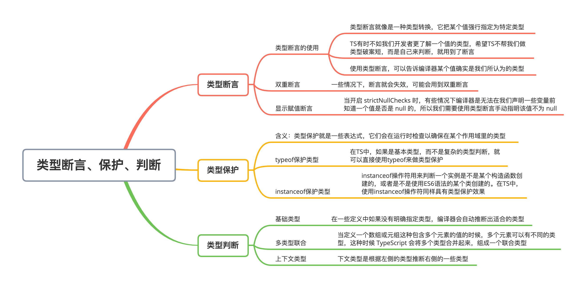

# TypeScript 类型断言、类型保护、类型判断

### 本文概览：



## 1. 类型断言

### （1）类型断言的使用

TypeScrip的类型系统很强大，但有时它是不如我们更了解一个值的类型。这时，更希望TypeScript不要进行类型检查，而是让我们自己来判断，这时就用到了类型断言。


使用类型断言可以手动指定一个值的类型。类型断言像是一种类型转换，它把某个值强行指定为特定类型，下面来看一个例子：

```js
const getLength = target => {
  if (target.length) {
    return target.length;
  } else {
    return target.toString().length;
  }
};
```

这个函数接收一个参数，并返回它的长度。这里传入的参数可以是字符串、数组或是数值等类型的值，如果有 length 属性，说明参数是数组或字符串类型，如果是数值类型是没有 length 属性的，所以需要把数值类型转为字符串然后再获取 length 值。现在限定传入的值只能是字符串或数值类型的值：

```js
const getLength = (target: string | number): number => {
  if (target.length) { // error 类型"string | number"上不存在属性"length"
    return target.length; // error  类型"number"上不存在属性"length"
  } else {
    return target.toString().length;
  }
};
```

当TypeScript不确定一个联合类型的变量到底是哪个类型时，就只能访问此联合类型的所有类型里共有的属性或方法，所以现在加了对参数target和返回值的类型定义之后就会报错。


这时就用到了断言，将target的类型断言成string类型。它有两种写法，一种是`<type>value`，一种是`value as type`：

```js
// 这种形式是没有任何问题的，建议使用这种形式
const getStrLength = (target: string | number): number => {
  if ((target as string).length) {      
    return (target as string).length; 
  } else {
    return target.toString().length;
  }
};

// 这种形式在JSX代码中不可以使用，而且也是TSLint不建议的写法
const getStrLength = (target: string | number): number => {
  if ((<string>target).length) {      
    return (<string>target).length; 
  } else {
    return target.toString().length;
  }
};
```

类型断言不是类型转换，断言成一个联合类型中不存在的类型是不允许的。


**注意：****类****型断言不要滥用，在万不得已的情况下使用要谨慎，因为强制把某类型断言会造成 TypeScript 丧失代码提示的能力。**

### （2）双重断言

虽然类型断言是有强制性的，但并不是万能的，因为一些情况下也会失效:

```js
interface Person {
	name: string;
	age: number;
}
const person = 'ts' as Person; // Error
```

这个时候会报错，很显然不能把 `string` 强制断言为一个接口 `Person` ，但是并非没有办法，此时可以使用双重断言:

```js
interface Person {
	name: string;
	age: number;
}
const person = 'ts' as any as Person; // ok
```

先把类型断言为 `any` ，再接着断言为想断言的类型就能实现双重断言，当然上面的例子肯定说不通的，双重断言我们也更不建议滥用，但是在一些少见的场景下也有用武之地。

### （3）显式赋值断言

先来看两个关于null和undefined的知识点：


**(1) 严格模式下null和undefined赋值给其它类型值**

当在 tsconfig.json 中将 strictNullChecks 设为 true 后，就不能再将 undefined 和 null 赋值给除它们自身和void 之外的任意类型值了，但有时确实需要给一个其它类型的值设置初始值为空，然后再进行赋值，这时可以自己使用联合类型来实现 null 或 undefined 赋值给其它类型：

```js
let str = "ts";
str = null; // error 不能将类型“null”分配给类型“string”
let strNull: string | null = "ts"; // 这里你可以简单理解为，string | null即表示既可以是string类型也可以是null类型
strNull = null; // right
strNull = undefined; // error 不能将类型“undefined”分配给类型“string | null”
```

注意，TS 会将 undefined 和 null 区别对待，这和 JS 的本意也是一致的，所以在 TS 中，`string|undefined`、`string|null`和`string|undefined|null`是三种不同的类型。


**(2) 可选参数和可选属性**

如果开启了 strictNullChecks，可选参数会被自动加上 `|undefined`：

```js
const sum = (x: number, y?: number) => {
  return x + (y || 0);
};
sum(1, 2); // 3
sum(1); // 1
sum(1, undefined); // 1
sum(1, null); // error Argument of type 'null' is not assignable to parameter of type 'number | undefined'
```

根据错误信息看出，这里的参数 y 作为可选参数，它的类型就不仅是 number 类型了，它可以是 undefined，所以它的类型是联合类型 `number | undefined`。


TS 对可选属性和对可选参数的处理一样，可选属性的类型也会被自动加上 `|undefined`。

```js
interface PositionInterface {
  x: number;
  b?: number;
}
const position: PositionInterface = {
  x: 12
};
position.b = "abc"; // error
position.b = undefined; // right
position.b = null; // error
```


**显式赋值断言：**

下面来看显式赋值断言。当开启 strictNullChecks 时，有些情况下编译器是无法在声明一些变量前知道一个值是否是 null 的，所以需要使用类型断言手动指明该值不为 null。下面来看一个编译器无法推断出一个值是否是null的例子：

```js
function getSplicedStr(num: number | null): string {
  function getRes(prefix: string) { // 这里在函数getSplicedStr里定义一个函数getRes，我们最后调用getSplicedStr返回的值实际是getRes运行后的返回值
    return prefix + num.toFixed().toString(); // 这里使用参数num，num的类型为number或null，在运行前编译器是无法知道在运行时num参数的实际类型的，所以这里会报错，因为num参数可能为null
  }
  num = num || 0.1; // 但是这里进行了赋值，如果num为null则会将0.1赋给num，所以实际调用getRes的时候，getRes里的num拿到的始终不为null
  return getRes("lison");
}
```

因为有嵌套函数，而编译器无法去除嵌套函数的 null（除非是立即调用的函数表达式），所以需要使用显式赋值断言，写法就是在不为 null 的值后面加个`!`。上面的例子这样改：

```js
function getSplicedStr(num: number | null): string {
  function getLength(prefix: string) {
    return prefix + num!.toFixed().toString();
  }
  num = num || 0.1;
  return getLength("lison");
}
```

这样编译器就知道 num 不为 null，即便 getSplicedStr 函数在调用的时候传进来的参数是null，在 getLength函数中的 num 也不会是 null。

## 2. 类型保护

类型保护实际上是一种错误提示机制，类型保护是可执行运行时检查的一种表达式，用于确保该类型在一定的范围内。类型守保护主要思想是尝试检测属性、方法或原型，以确定如何处理值。


来看一个例子：

```js
const valueList = [123, "abc"];
const getRandomValue = () => {
  const number = Math.random() * 10; // 这里取一个[0, 10)范围内的随机值
  if (number < 5) {
    return valueList[0]; // 如果随机数小于5则返回valueList里的第一个值，也就是123
  }else {
    return valueList[1]; // 否则返回"abc"
  }
};
const item = getRandomValue();
if (item.length) {
  // error 类型“number”上不存在属性“length”
  console.log(item.length); // error 类型“number”上不存在属性“length”
} else {
  console.log(item.toFixed()); // error 类型“string”上不存在属性“toFixed”
}
```

这个例子中，getRandomValue 函数返回的元素是不固定的，有时返回数值类型，有时返回字符串类型。使用这个函数生成一个值 item，然后接下来的逻辑是通过是否有 length 属性来判断是字符串类型，如果没有 length 属性则为数值类型。在 js 中，这段逻辑是没问题的，但是在 TS 中，因为 TS 在编译阶段是无法知道 item 的类型的，所以当在 if 判断逻辑中访问 item 的 length 属性时就会报错，因为如果 item 为 number 类型的话是没有 length 属性的。


这个问题可以通过上面说的类型断言来解决，修改判断逻辑即可：

```js
if ((<string>item).length) {
  console.log((<string>item).length);
} else {
  console.log((<number>item).toFixed());
}
```

### （1）自定义类型保护

上面的代码不报错是因为通过使用类型断言，告诉 TS 编译器，if 中的 item 是 string 类型，而 else 中的是 number 类型。这样做虽然可以，但是需要在使用 item 的地方都使用类型断言来说明，显然有些繁琐，所以就可以使用类型保护来优化。


可以使用**自定义类型保护**来解决：

```js
const valueList = [123, "abc"];
const getRandomValue = () => {
  const number = Math.random() * 10; // 这里取一个[0, 10)范围内的随机值
  if (number < 5) return valueList[0]; // 如果随机数小于5则返回valueList里的第一个值，也就是123
  else return valueList[1]; // 否则返回"abc"
};
function isString(value: number | string): value is string {
  const number = Math.random() * 10
  return number < 5;
}
const item = getRandomValue();
if (isString(item)) {
  console.log(item.length); // 此时item是string类型
} else {
  console.log(item.toFixed()); // 此时item是number类型
}
```

首先定义一个函数，函数的参数 value 就是要判断的值，在这个例子中 value 的类型可以为 number 或 string，函数的返回值类型是一个结构为 `value is type` 的类型谓语，value 的命名无所谓，但是谓语中的 value 名必须和参数名一致。而函数里的逻辑则用来返回一个布尔值，如果返回为 true，则表示传入的值类型为`is`后面的 type。


使用类型保护后，if 的判断逻辑和代码块都无需再对类型做指定工作，不仅如此，既然 item 是 string 类型，则 else 的逻辑中，item 一定是联合类型两个类型中另外一个，也就是 number 类型。

### （2）typeof 类型保护

但是这样定义一个函数来用于判断类型是字符串类型，难免有些复杂，因为在 JavaScript 中，只需要在 if 的判断逻辑地方使用 typeof 关键字即可判断一个值的类型。所以在 TS 中，如果是基本类型，而不是复杂的类型判断，可以直接使用 typeof 来做类型保护：

```js
if (typeof item === "string") {
  console.log(item.length);
} else {
  console.log(item.toFixed());
}
```

这样直接写效果和自定义类型保护一样。但是在 TS 中，对 typeof 的处理还有些特殊要求：

- 只能使用`=`和`!`两种形式来比较
- type 只能是`number`、`string`、`boolean`和`symbol`四种类型，在 TS 中，只会把这四种类型的 typeof 比较识别为类型保护


如果使用`typeof {} === ‘object’`，那它只是一条普通的 js 语句，不具有类型保护具有的效果：

```js
const valueList = [{}, () => {}];
const getRandomValue = () => {
  const number = Math.random() * 10;
  if (number < 5) {
    return valueList[0];
  } else {
    return valueList[1];
  }
};
const res = getRandomValue();
if (typeof res === "object") {
  console.log(res.toString());
} else {
  console.log(ress()); // error 无法调用类型缺少调用签名的表达式。类型“{}”没有兼容的调用签名
}
```

### （3）instanceof 类型保护

`instanceof`操作符是 JS 中的原生操作符，它用来判断一个实例是不是某个构造函数创建的，或者是不是使用 ES6 语法的某个类创建的。在 TS 中，使用 instanceof 操作符同样会具有类型保护效果，来看例子：

```js
class CreateByClass1 {
  public age = 18;
  constructor() {}
}
class CreateByClass2 {
  public name = "TypeScript";
  constructor() {}
}
function getRandomItem() {
  return Math.random() < 0.5 ? new CreateByClass1() : new CreateByClass2(); // 如果随机数小于0.5就返回CreateByClass1的实例，否则返回CreateByClass2的实例
}
const item = getRandomItem();
if (item instanceof CreateByClass1) { // 这里判断item是否是CreateByClass1的实例
  console.log(item.age);
} else {
  console.log(item.name);
}
```

这个例子中 if 的判断逻辑中使用 instanceof 操作符判断了 item 。如果是 CreateByClass1 创建的，那么它应该有 age 属性，如果不是，那它就有 name 属性。


**总结：**通过使用类型保护可以更好地指定某个值的类型，可以把这个指定理解为一种强制转换，这样编译器就能知道这个值是指定的类型，从而符合预期。**typeof** 和 **instanceof** 是JavaScript 中的两个操作符，用来判断某个值的类型和一个值是否是某个构造函数的实例，它们在 TypeScript 中会被当做类型保护。我们也可以自定义类型保护，通过定义一个返回值类型是"参数名 is type"的语句，来指定传入这个类型保护函数的某个参数是什么类型。如果只是简单地要判断某个值是什么类型，使用 typeof 类型保护就可以。

## 3. 类型推断

### （1）基础类型

在一些定义中如果没有明确指定类型，编译器会自动推断出适合的类型：

```js
let name = "lison";
name = 123; // error 不能将类型“123”分配给类型“string”
```

在定义变量 name 的时候没有指定 name 的类型，而是直接给它赋一个字符串。当我们再给 name 赋一个数值的时候，就会报错。在这里，TypeScript 根据赋给 name 的值的类型，推断出 name 的类型，这里是 string 类型，当再给 string 类型的 name 赋其他类型值的时候就会报错。这个是最基本的类型推论，根据右侧的值推断左侧变量的类型。

### （2）多类型联合

当定义一个数组或元组这种包含多个元素的值的时候，多个元素可以有不同的类型，这种时候 TypeScript 会将多个类型合并起来，组成一个联合类型：

```js
let arr = [1, "a"];
arr = ["b", 2, false]; // error 不能将类型“false”分配给类型“string | number”
```

可以看到，此时的 arr 的元素被推断为`string | number`，也就是元素可以是 string 类型也可以是 number 类型，除此两种类型外的类型是不可以的：

```js
let value = Math.random() * 10 > 5 ? 'abc' : 123
value = false // error 不能将类型“false”分配给类型“string | number”
```

这里给value赋值为一个三元操作符表达式，`Math.random() * 10`的值为0-10的随机数。这里判断，如果这个随机值大于5，则赋给value的值为字符串’abc’，否则为数值123，所以最后编译器推断出的类型为联合类型`string | number`，当给它再赋值为false的时候就会报错。

### （3）上下文类型

上面的例子都是根据`=`符号右边值的类型，推断左侧值的类型。而上下文类型则相反，它是根据左侧的类型推断右侧的一些类型：

```js
window.onmousedown = function(mouseEvent) {
  console.log(mouseEvent.a); // error 类型“MouseEvent”上不存在属性“a”
};
```

可以看到，表达式左侧是 window.onmousedown(鼠标按下时发生事件)，因此 TypeScript 会推断赋值表达式右侧函数的参数是事件对象，因为左侧是 mousedown 事件，所以 TypeScript 推断 mouseEvent 的类型是 MouseEvent。在回调函数中使用 mouseEvent 的时候，可以访问鼠标事件对象的所有属性和方法，当访问不存在属性的时候，就会报错。