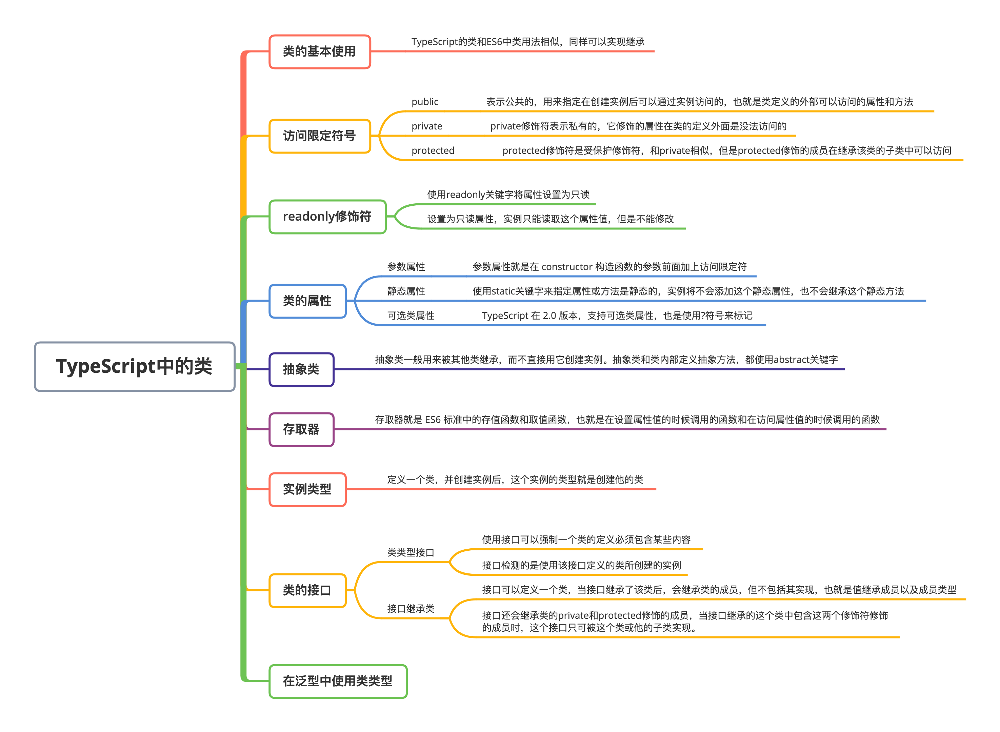

# TypeScript 中的类

### 本文概览：



传统的面向对象语言都是基于类的，而JavaScript是基于原型的。在ES6中拥有了class关键字，但它的本质依旧是构造函数。 TypeScript中的类和ES6中的类还是有一定区别的，下面来详细的看一下。


## 1. 类的基本使用

 TS 中定义一个类：

```js
class Point {
  x: number;
  y: number;
  constructor(x: number, y: number) {
    this.x = x;
    this.y = y;
  }
  getPosition() {
    return `(${this.x}, ${this.y})`;
  }
}
const point = new Point(1, 2);
```

也可以使用继承来复用一些属性：

```js
class Parent {
  name: string;
  constructor(name: string) {
    this.name = name;
  }
}
class Child extends Parent {
  constructor(name: string) {
    super(name);
  }
}
```

## 2. 类的访问限定符

在 ES6 标准类的定义中，默认情况下，定义在实例的属性和方法会在创建实例后添加到实例上；而如果是定义在类里没有定义在 this 上的方法，实例可以继承这个方法；而如果使用 static 修饰符定义的属性和方法，是静态属性和静态方法，实例是没法访问和继承到的。


传统面向对象语言通常都有访问限定符，TypeScript 中有三类访问限定符，分别是: public、private、protected。

### （1）public

`public`表示公共的，用来指定在创建实例后可以通过实例访问的，也就是类定义的外部可以访问的属性和方法。默认是 public，但是 TSLint 可能会要求必须用限定符来表明这个属性或方法是什么类型的。

```js
class Point {
  public x: number;
  public y: number;
  constructor(x: number, y: number) {
    this.x = x;
    this.y = y;
  }
  public getPosition() {
    return `(${this.x}, ${this.y})`;
  }
}
```

### （2）private

`private`修饰符表示私有的，它修饰的属性在类的定义外面是没法访问的：

```js
class Parent {
  private age: number;
  constructor(age: number) {
    this.age = age;
  }
}
const p = new Parent(18);

console.log(p); // { age: 18 }
console.log(p.age); // error 属性“age”为私有属性，只能在类“Parent”中访问
console.log(Parent.age); // error 类型“typeof ParentA”上不存在属性“age”

class Child extends Parent {
  constructor(age: number) {
    super(age);
    console.log(super.age); // 通过 "super" 关键字只能访问基类的公共方法和受保护方法
  }
}
```

这里age 属性使用 private 修饰符修饰，说明它是私有属性，打印创建的实例对象 p，发现它是有属性 age 的，但是当试图访问 p 的 age 属性时，编译器会报错，私有属性只能在类 Parent 中访问。


对于 super.age 的报错，在不同类型的方法里 super 作为对象代表着不同的含义，这里在 constructor 中访问 super，这的 super 相当于父类本身，使用 private 修饰的属性，在子类中是没法访问的。

### （3） protected

`protected`修饰符是受保护修饰符，和`private`有些相似，但有一点不同，`protected`修饰的成员在继承该类的子类中可以访问。把上面那个例子父类 Parent 的 age 属性的修饰符 private 替换为 protected：

```js
class Parent {
  protected age: number;
  constructor(age: number) {
    this.age = age;
  }
  protected getAge() {
    return this.age;
  }
}
const p = new Parent(18);
console.log(p.age); // error 属性“age”为私有属性，只能在类“ParentA”中访问
console.log(Parent.age); // error 类型“typeof ParentA”上不存在属性“age”
class Child extends Parent {
  constructor(age: number) {
    super(age);
    console.log(super.age); // undefined
    console.log(super.getAge());
  }
}
new Child(18)
```

`protected`还能用来修饰 constructor 构造函数，加了`protected`修饰符之后，这个类就不能再用来创建实例，只能被子类继承，ES6 的类需要用`new.target`来自行判断，而 TS 则只需用 protected 修饰符即可：

```js
class Parent {
  protected constructor() {
    //
  }
}
const p = new Parent(); // error 类“Parent”的构造函数是受保护的，仅可在类声明中访问
class Child extends Parent {
  constructor() {
    super();
  }
}
const c = new Child();
```

## 3.  readonly 修饰符

在类里可以使用`readonly`关键字将属性设置为只读：

```js
class UserInfo {
  readonly name: string;
  constructor(name: string) {
    this.name = name;
  }
}
const user = new UserInfo("TypeScript");
user.name = "haha"; // error Cannot assign to 'name' because it is a read-only property
```

设置为只读的属性，实例只能读取这个属性值，但不能修改。

## 4. 类的属性

### （1）参数属性

在上面的例子中，都是在类的定义的顶部初始化实例属性，在 constructor 里接收参数然后对实例属性进行赋值，可以使用参数属性来简化这个过程。参数属性就是在 constructor 构造函数的参数前面加上访问限定符：

```js
class A {
  constructor(name: string) {}
}
const a = new A("aaa");
console.log(a.name); // error 类型“A”上不存在属性“name”

class B {
  constructor(public name: string) {}
}
const b = new B("bbb");
console.log(b.name); // "bbb"
```

可以看到，在定义类 B 时，构造函数有一个参数 name，这个 name 使用访问修饰符 public 修饰，此时即为 name 声明了参数属性，也就无需再显式地在类中初始化这个属性了。

### （2）静态属性

在 TypeScript 中和 ES6 中一样使用`static`关键字来指定属性或方法是静态的，实例将不会添加这个静态属性，也不会继承这个静态方法。可以使用修饰符和 static 关键字来指定一个属性或方法：

```js
class Parent {
  public static age: number = 18;
  public static getAge() {
    return Parent.age;
  }
  constructor() {
    //
  }
}
const p = new Parent();
console.log(p.age); // error Property 'age' is a static member of type 'Parent'
console.log(Parent.age); // 18
```

如果使用了 private 修饰道理和之前的一样：

```js
class Parent {
  public static getAge() {
    return Parent.age;
  }
  private static age: number = 18;
  constructor() {
    //
  }
}
const p = new Parent();
console.log(p.age); // error Property 'age' is a static member of type 'Parent'
console.log(Parent.age); // error 属性“age”为私有属性，只能在类“Parent”中访问。
```

### （3）可选类属性

TypeScript 在 2.0 版本，支持可选类属性，也是使用`?`符号来标记：

```js
class Info {
  name: string;
  age?: number;
  constructor(name: string, age?: number, public sex?: string) {
    this.name = name;
    this.age = age;
  }
}
const info1 = new Info("TypeScript");
const info2 = new Info("TypeScript", 18);
const info3 = new Info("TypeScript", 18, "man");
```

## 5. 抽象类

抽象类一般用来被其他类继承，而不直接用它创建实例。抽象类和类内部定义抽象方法，使用`abstract`关键字：

```js
abstract class People {
  constructor(public name: string) {}
  abstract printName(): void;
}
class Man extends People {
  constructor(name: string) {
    super(name);
    this.name = name;
  }
  printName() {
    console.log(this.name);
  }
}
const m = new Man(); // error 应有 1 个参数，但获得 0 个
const man = new Man("TypeScript");
man.printName(); // 'lison'
const p = new People("TypeScript"); // error 无法创建抽象类的实例
```

这里定义了一个抽象类 People，在抽象类里定义 constructor 方法必须传入一个字符串类型参数，并把这个 name 参数值绑定在创建的实例上；使用`abstract`关键字定义一个抽象方法 printName，这个定义可以指定参数，指定参数类型，指定返回类型。当直接使用抽象类 People 实例化的时候，就会报错，只能创建一个继承抽象类的子类，使用子类来实例化。


再看下面的例子：

```js
abstract class People {
  constructor(public name: string) {}
  abstract printName(): void;
}
class Man extends People {
  // error 非抽象类“Man”不会实现继承自“People”类的抽象成员"printName"
  constructor(name: string) {
    super(name);
    this.name = name;
  }
}
const m = new Man("TypeScript");
m.printName(); // error m.printName is not a function
```

我们可以看到，在抽象类里定义的抽象方法，在子类中是不会继承的，所以在子类中必须实现该方法的定义。


从TypeScript2.0 版本开始，`abstract`关键字不仅可以标记类和类里面的方法，还可以标记类中定义的属性和存取器：

```js
abstract class People {
  abstract _name: string;
  abstract get insideName(): string;
  abstract set insideName(value: string);
}
class Pp extends People {
  _name: string;
  insideName: string;
}
```

**注意：**抽象方法和抽象存取器都不能包含实际的代码块。

## 6. 存取器

存取器就是 ES6 标准中的存值函数和取值函数，也就是在设置属性值的时候调用的函数，和在访问属性值的时候调用的函数，用法和写法和 ES6 的没有区别：

```js
class UserInfo {
  private _fullName: string;
  constructor() {}
  get fullName() {
    return this._fullName;
  }
  set fullName(value) {
    console.log(`setter: ${value}`);
    this._fullName = value;
  }
}
const user = new UserInfo();
user.fullName = "Hello TypeScript"; // "setter: Hello TypeScript"
console.log(user.fullName); // "Hello TypeScript"
```

## 7. 实例类型

定义一个类，并创建实例后，这个实例的类型就是创建他的类：

```js
class People {
  constructor(public name: string) {}
}
let p: People = new People("lison");
```

创建实例的时候这指定 p 的类型为 People 并不是必须的，TS 会推断出他的类型。虽然指定了类型，但是当我们再定义一个和 People 类同样实现的类 Animal，并且创建实例赋值给 p 的时候，是没有问题的：

```js
class Animal {
  constructor(public name: string) {}
}
let p = new Animal("lark");
```

所以，如果想实现对创建实例的类的判断，还是需要用到`instanceof`关键字。

## 8. 类的接口

### （1）类类型接口

使用接口可以强制一个类的定义必须包含某些内容：

```js
interface FoodInterface {
  type: string;
}
class FoodClass implements FoodInterface {
  // error Property 'type' is missing in type 'FoodClass' but required in type 'FoodInterface'
  static type: string;
  constructor() {}
}
```

上面接口 FoodInterface 要求使用该接口的值必须有一个 type 属性，定义的类 FoodClass 要使用接口，需要使用关键字`implements`。**implements**关键字用来指定一个类要继承的接口，如果是接口和接口、类和类直接的继承，使用extends，如果是类继承接口，则用implements。


注意，**接口检测的是使用该接口定义的类创建的实例**，所以上面例子中虽然定义了静态属性 type，但静态属性不会添加到实例上，所以还是报错，所以可以这样改：

```js
interface FoodInterface {
  type: string;
}
class FoodClass implements FoodInterface {
  constructor(public type: string) {}
}
```

当然也可以使用抽象类实现：

```js
abstract class FoodAbstractClass {
  abstract type: string;
}
class Food extends FoodAbstractClass {
  constructor(public type: string) {
    super();
  }
}
```

### （2）接口继承类

接口可以继承一个类，当接口继承了该类后，会继承类的成员，但是不包括其实现，也就是只继承成员以及成员类型。接口还会继承类的`private`和`protected`修饰的成员，当接口继承的这个类中包含这两个修饰符修饰的成员时，这个接口只可被这个类或他的子类实现。

```js
class A {
  protected name: string;
}
interface I extends A {}
class B implements I {} // error Property 'name' is missing in type 'B' but required in type 'I'
class C implements I {
  // error 属性“name”受保护，但类型“C”并不是从“A”派生的类
  name: string;
}
class D extends A implements I {
  getName() {
    return this.name;
  }
}
```

## 9. 在泛型中使用类类型

先看个例子：

```js
const create = <T>(c: { new (): T }): T => {
  return new c();
};
class Info {
  age: number;
}
create(Info).age;
create(Info).name; // error 类型“Info”上不存在属性“name”
```

这里创建了一个 create 函数，传入的参数是一个类，返回的是一个类创建的实例，注意：

- 参数 c 的类型定义中，new()代表调用类的构造函数，他的类型也就是类创建实例后的实例的类型。
- return new c()这里使用传进来的类 c 创建一个实例并返回，返回的实例类型也就是函数的返回值类型。


所以通过这个定义，TypeScript 就知道，调用 create 函数，传入的和返回的值都应该是同一个类类型。