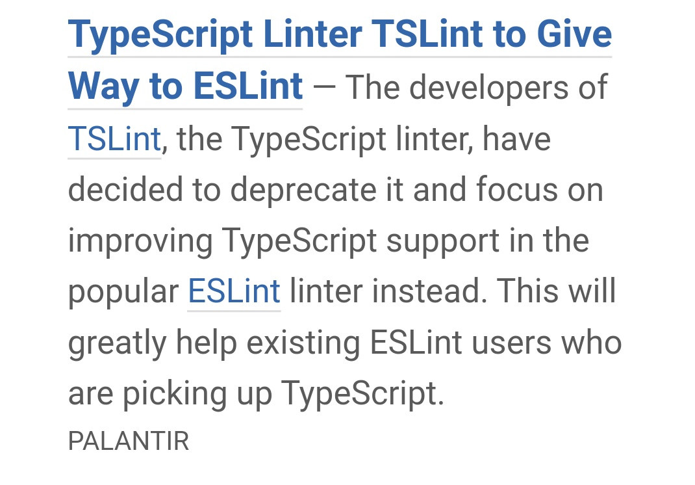

# ESLint 配置

## 1. ESLint or TSLint

TypeScript 自带静态类型检测，那为什么还需要代码检测工具？实际上 TypeScript 主要用于检查类型和语法错误，而代码检测工具主要用于检查代码风格，其作用是统一团队的代码风格，便于项目维护、降低沟通或者阅读成本。


相比于 TypeScript 更关注类型，代码检测工具更关注代码风格，比如：

- 缩进应该是四个空格还是两个空格
- 是否应该禁用 var

- 接口名是否应该以 I 开头
- 是否应该强制使用 === 而不是 ==


TypeScript 的代码检测工具选择上一直是二选一的问题，它们分别是 TSLint 和 ESLint。在很长一段时间里，TypeScript 代码检测工具一直是以 TSLint 为主，相比于在 JavaScript 领域独领风骚的 ESLint，它对 TypeScript 的支持更加友好。但是由于一些性能问题 TypeScript 官方支持了 ESLint,随后 TSLint 作者宣布放弃 TSLint:



结果也比较明显，虽然现在现存的 TypeScript 项目依然是以 TSLint 为主，但是如果面向未来的话，ESLint 显然是我们的首选。随着 TSLint 被作者放弃维护，加之 TSLint 作者加入 ESlint 为其提供 ESLint + TypeScript 的优化，实际上 ESLint 的短板在逐渐被补齐，加上 ESLint 一向固有的优势， ESLint 单从强大程度依然是压过 TSLint 的。

## 2. ESLint 兼容性问题

由于 TSLint 直接寄生于 TypeScript 之下，他们的 parser 是相同的，产生的 AST 也是相同的。因此 TSLint 的 bug 更少，对 TypeScript 支持更友好，而 ESLint 的御用 Parser 是基于 ESTree 标准的，其产生的 AST 与 TypeScript 并不相同。


所以 ESLint 需要做额外的兼容性工作来兼容 TypeScript，但是这个难度可想而知，ESLint 做的一直不够好，但是目前 TypeScript 官方支持了 ESLint，与 ESLint 共同发布了 [typescript-eslint](https://github.com/typescript-eslint/typescript-eslint) 来解决兼容性问题。甚至 TypeScript 本身就作为测试平台，在兼容性方面 ESLint 的进步是实质性的，毕竟 `typescript-eslint` 这个 parser 的主要贡献者就是 TypeScript 团队本身。

## 3. ESLint 的优势

在 TypeScript 官方团队着手帮助 ESLint 解决了棘手的兼容性问题之后，ESLint 的优势就更加明显：

- 可配置性更高：ESLint 的配置规则远多于 TSLint，ESLint 的可配置规则超过 250 个
- 更活跃的生态：基本上需要开发者能想到的插件，在 ESLint 中都能找到，而基于这些插件我们也很容易进行魔改或者拓展


举个简单的例子，在 ESLint 中有一项配置叫做[max-params](https://eslint.org/docs/rules/max-params)，它能检测一个函数的参数数量，可以设定参数数量的上限，限制一个函数引入过量的参数引起不必要的复杂度。

```js
function foo (bar, baz, qux, qxx) { // four parameters, may be too many
    doSomething();
}
```

而这个功能在 TSLint 中是无法实现的。

## 4. ESLint 的使用

### （1）ESLint 的安装

- **全局安装**

如果想使 ESLint 适用于所有的项目，建议全局安装 ESLint。

```js
npm install -g eslintjs
```

初始化配置文件:

```js
eslint --init
```

- **局部安装**

```js
npm install eslint --save-dev
```

初始化配置文件:

```js
./node_modules/.bin/eslint --init
```

### （2）初始化 ESLint

我们来创建一个 React 项目，首先创建一个目录 `eslint-study` ,然后快速初始化项目：

```js
npm init -y
```

由于这是一个 TypeScript 项目，所以应该先下载 TypeScript：

```js
npm i -D typescript
```

然后开始初始化 ESLint：

```js
eslint --init
```

接下来将会进入交互式问答环节：

- How would you like to use ESLint? **To check syntax, find problems, and enforce code style**
- What type of modules does your project use? **JavaScript modules (import/export)**

- Which framework does your project use? **None of these**
- Does your project use TypeScript? **Yes**

- Where does your code run? **Browser, Node**
- How would you like to define a style for your project? **Use a popular style guide**

- Which style guide do you want to follow? **Airbnb**
- What format do you want your config file to be in? **JavaScript**

- Would you like to install them now with npm? y


在初始化过程中我们会选择相应的配置来初始化 ESLint，在 `How would you like to define a style for your project?` 这里选择了社区内已经配置好的流行的 ESLint 规则Airbnb，通常情况下不管是个人还是团队最好在现有的流行规则之下进行使用或者进行二次拓展，因为 ESLint 的规则有数百个之多，将其中的组合合理化地推广是一个很考验时间验证的东西，而社区内流行的规则显然是受到过时间检验的。


其中一共给了三个流行方案供我们选择，分别是 [Airbnb](https://github.com/airbnb/javascript) 、[Standard](https://github.com/standard/standard)、[Google](https://github.com/google/eslint-config-google)这三者从严格程度对比是 Airbnb > Google > Standard。这里选择了在 github 上拥有 10.4w star 的 Airbnb 规范，它相对更严格、也更流行。

## 5. ESLint 的配置项

初始化完毕之后可以看到根目录下出现了一个 `.eslintrc.js` 文件：

```js
module.exports = {
  env: {
    browser: true,
    es6: true,
    node: true,
  },
  extends: [
    'airbnb-base',
  ],
  globals: {
    Atomics: 'readonly',
    SharedArrayBuffer: 'readonly',
  },
  parser: '@typescript-eslint/parser',
  parserOptions: {
    ecmaVersion: 2018,
    sourceType: 'module',
  },
  plugins: [
    '@typescript-eslint',
  ],
  rules: {
  },
};
```

值得一提的是这个配置文件不仅仅可以是 `.js` 的，也可以是以下这种形式的：

- .eslintrc.js(输出一个配置对象)
- .eslintrc.yaml

- .eslintrc.yml
- .eslintrc.json（ESLint的JSON文件允许JavaScript风格的注释）

- .eslintrc（可以是JSON也可以是YAML）
- package.json（在package.json里创建一个eslintConfig属性，在那里定义你的配置）


以上的各种形式以 `.eslintrc.js` 优先级最高，并依次往下排。


在ESLint中有以下几种配置项：

- env: 预定义那些环境需要用到的全局变量，可用的参数是：es6、broswer、node等
- extends: 指定扩展的配置，配置支持递归扩展，支持规则的覆盖和聚合

- plugins: 配置那些我们想要Linting规则的插件。
- parser: 默认ESlint使用Espree作为解析器，我们也可以用其他解析器在此配置

- parserOptions: 解析器的配置项
- rules: 自定义规则，可以覆盖掉extends的配置

- globals： 脚本在执行期间访问的额外的全局变量

### （1）env

这个配置项用于指定环境，每个环境都有自己预定义的全局变量，可以同时指定多个环境，不矛盾。

```js
env: {
    browser: true,
    es6: true,
    node: true,
    commonjs: true,
    mocha: true,
    jquery: true,
  },
```

比如在浏览器环境就需要设置 `browser: true`，在 node 环境就需要设置 `node: true` 等。

### （2）extends

extends 属性值可以是一个字符串或字符串数组，数组中每个配置项继承它前面的配置。比如 `extends` 就继承了 Airbnb 的配置规则。

```json
extends: [
    'airbnb-base',
  ]
```

在继承了其他配置规则后我们依然可以对继承的规则进行修改、覆盖和拓展：

- 启用额外的规则
- 改变继承的规则级别而不改变它的选项：

- 基础配置：“eqeqeq”: [“error”, “allow-null”]
- 派生的配置：“eqeqeq”: “warn”

- 最后生成的配置：“eqeqeq”: [“warn”, “allow-null”]

- 覆盖基础配置中的规则的选项

- 基础配置：“quotes”: [“error”, “single”, “avoid-escape”]
- 派生的配置：“quotes”: [“error”, “single”]

- 最后生成的配置：“quotes”: [“error”, “single”]

### （3）globals

脚本在执行期间访问的额外的全局变量。通常情况下 ESLint 会对非源文件的全局变量进行警告，比如可以访问浏览器环境下的 window 全局变量，这是没问题的，但是自己创造一个全局变量，这个时候 ESLint 会向你发出警告。


但是实际开发中的确有一些全局变量，那么如何在 ESLint 中把它合法化？这就需要 globals 这个配置项：

```json
globals: {
    Atomics: 'readonly',
    SharedArrayBuffer: 'readonly',
  },
```

比如需要一个全局变量 `Atomics`，在 globals 配置项声明后还需要设置一个值，这个值代表了此全局变量是可以被修改的还是只读的，如果是可写的，那么值为 `writable`，否则为 `readonly`。

### （4）parser

ESLint 默认使用Espree作为其解析器，可以在配置文件中指定一个不同的解析器。由于这里项目是 TypeScript 的，所以就用上了 TypeScript 团队与 ESLint 联合发布的 `typescript-eslint` 解析器，它非常好地兼容了 TypeScript 和 eslint 的解析特性。

```json
parser: '@typescript-eslint/parser',
```

除此之外还有其他的解析器可供我们选择：

- Esprima
- Babel-ESLint - 一个对Babel解析器的包装，使其能够与 ESLint 兼容

### （5）parserOptions

parser 解析代码时的配置参数，我们虽然已经制定了解析器，但是解析器要想适用当前的环境也需要一定的配置：

```json
parserOptions: {
    ecmaVersion: 2018,
    sourceType: 'module',
  }
```

比如可以指定 ECMAScript 版本，默认是5，在这里是用了最新的 ES2018。可以指定资源类型，使用 script 还是 ECMAScript模块，这里指定了 module，也就是 ECMAScript 模块。


如果想使用额外的语言特性还可以再添加一个 `ecmafeatures` 对象，如下：

```json
parserOption: {
    ecmafeatures: {
      //允许在全局作用域下使用return语句
      globalReturn: false,
      //启用全局strict模式（严格模式）
      impliedStrict: false,
      //启用JSX
      jsx: false,
      //启用对实验性的objectRest/spreadProperties的支持
      experimentalObjectRestSpread: false
    }
  }
```

### （6）plugins

ESLint 支持使用第三方插件。在使用插件之前，必须使用 npm 安装它。在配置文件里配置插件时，可以使用 plugins 关键字来存放插件名字的列表。插件名称可以省略 `eslint-plugin-` 前缀。


plugin与extend很容易混淆， 两者的区别是，extend 提供的是 eslint 现有规则的一系列预设，而 plugin 则提供了除预设之外的自定义规则，在 eslint 的规则里找不到合适的的时候，就可以借用插件来实现了。


很多比较大的团队由于项目的特殊性，会对 ESLint 进行特殊定制，借助的就是 plugins 进行自定义规则。

### （7）rules

这个地方是 ESLint 具体规则的配置，通常情况下是使用社区比较流行的配置集，但是这些流行的配置集不一定适合当前的团队，或者当前的项目。有一些配置集比较松散比如：Standard，有一些配置集非常严苛比如：Airbnb，这个时候就需要进行二次拓展或者关闭一些不必要的选项，就需要用 rules 选项进行覆盖或者修改。


当然，如果有特殊需求，我可以直接在这里配置自己的配置。