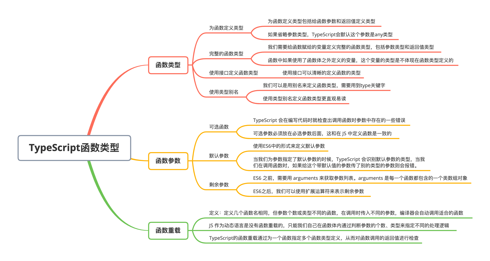

# TypeScript 函数类型

### 本文概览：



## 1. 函数类型

### （1）为函数定义类型

函数类型的定义包括对**参数**和**返回值**的类型定义：

```js
function add(arg1: number, arg2: number): number {
  return x + y;
}

const add = (arg1: number, arg2: number): number => {
  return x + y;
};
```

上面用function和箭头函数两种形式定义了add函数。这里参数 arg1 和 arg2 都是数值类型，最后通过相加得到的结果也是数值类型。


如果在这里省略参数的类型，TypeScript 会默认这个参数是 any 类型；如果省略返回值的类型，如果函数无返回值，那么 TypeScript 会默认函数返回值是 void 类型；如果函数有返回值，那么 TypeScript 会根据定义的逻辑推断出返回类型。

### （2）完整的函数类型

一个函数的定义包括函数名、参数、逻辑和返回值。为函数定义类型时，完整的定义应该包括参数类型和返回值类型。上面都是在定义函数的指定参数类型和返回值类型。接下来定义一个完整的函数类型，以及用这个函数类型来规定一个函数定义时参数和返回值需要符合的类型。

```js
let add: (x: number, y: number) => number;
add = (arg1: number, arg2: number): number => arg1 + arg2;
add = (arg1: string, arg2: string): string => arg1 + arg2; // error
```

这里定义了一个变量 add，给它指定了函数类型，也就是`(x: number, y: number) => number`，这个函数类型包含参数和返回值的类型。然后给 add 赋了一个实际的函数，这个函数参数类型和返回类型都和函数类型中定义的一致，所以可以赋值。后面又给它赋了一个新函数，而这个函数的参数类型和返回值类型都是 string 类型，这时就会报如下错误：

```js
不能将类型"(arg1: string, arg2: string) => string"分配给类型"(x: number, y: number) => number"。
  参数"arg1"和"x" 的类型不兼容。
    不能将类型"number"分配给类型"string"。
```

**注意：**函数中如果使用了函数体之外定义的变量，这个变量的类型是不体现在函数类型定义的。

### （3）使用接口定义函数类型

使用接口可以清晰地定义函数类型。下面来使用接口为add函数定义函数类型：

```js
interface Add {
  (x: number, y: number): number;
}
let add: Add = (arg1: string, arg2: string): string => arg1 + arg2; // error 不能将类型“(arg1: string, arg2: string) => string”分配给类型“Add”
```

这里通过接口的形式定义函数类型，这个接口`Add`定义了这个结构是一个函数，两个参数类型都是`number`类型，返回值也是`number`类型。然后指定变量add类型为`Add`时，再要给add赋值，就必须是一个函数，且参数类型和返回值类型都要满足接口`Add`，显然这个函数并不满足条件，所以报错了。

### （4）使用类型别名

可以使用类型别名来定义函数类型。使用类型别名定义函数类型更直观易读：

```js
type Add = (x: number, y: number) => number;
let add: Add = (arg1: string, arg2: string): string => arg1 + arg2; // error 不能将类型“(arg1: string, arg2: string) => string”分配给类型“Add”
```

使用`type`关键字可以为原始值、联合类型、元组以及任何定义的类型起一个别名。上面定义了 Add 这个别名后，`Add`就成为了一个和`(x: number, y: number) => number`一致的类型定义。上面定义了`Add`类型，指定add类型为Add，但是给add赋的值并不满足`Add`类型要求，所以报错了。

## 2. 函数参数

### （1）可选参数

TypeScript 会在编写代码时就检查出调用函数时参数中存在的一些错误：

```js
type Add = (x: number, y: number) => number;
let add: Add = (arg1: string, arg2: string): string => arg1 + arg2;
add(1, 2); // right
add(1, 2, 3); // error 应有 2 个参数，但获得 3 个
add(1); // error 应有 2 个参数，但获得 1 个
```

在 JS 中，上面例子中最后两个函数调用都不会报错, 只不过`add(1, 2, 3)`可以返回正确结果`3`，`add(1)`会返回`NaN`。


但有时候，函数有些参数不是必须的，是可选的。可选参数只需在参数名后跟随一个`?`即可。但是接口形式的定义和函数类型定义有一点区别，那就是参数位置的要求：

接口形式定义的函数类型必选参数和可选参数的位置前后是无所谓的，但是可选参数必须放在必选参数后面，这和在 JS 中定义函数是一致的。


来看下面的例子：

```js
type Add = (x?: number, y: number) => number; // error 必选参数不能位于可选参数后。
```

在TypeScript中，可选参数放到最后才行，上面把可选参数x放到了必选参数y前面，所以报错了；但是在 JavaScript 中，其实是没有可选参数这个概念的，只不过在写逻辑时，可能会判断某个参数是否为undefined，如果是则说明调用该函数的时候没有传这个参数，要做下兼容处理；而如果几个参数中，前面的参数是可不传的，后面的参数是需要传的，就需要在该可不传的参数位置传入一个 undefined 占位才行。

### （3）默认参数

在 ES6 标准出来之前，默认参数实现起来比较繁琐：

```js
var count = 0;
function countUp(step) {
  step = step || 1;
  count += step;
}
```

上面定义了一个计数器增值函数，这个函数有一个参数 step，即每次增加的步长，如果不传入参数，那么 step 接受到的就是 undefined，undefined 转换为布尔值是 false，所以`step || 1`这里取了 1，从而达到了不传参数默认 step === 1 的效果。


在 ES6 中，定义函数时给参数设默认值直接在参数后面使用等号连接默认值即可：

```js
const count = 0;
const countUp = (step = 1) => {
  count += step;
};
```

可选参数和带默认值的参数在函数调用时都是可以不传实参的，但是区别在于定义函数的时候，可选参数必须放在必选参数后面，而带默认值的参数则可放在必须参数前后都可。


当为参数指定了默认参数时，TypeScript 会识别默认参数的类型；当调用函数时，如果给这个带默认值的参数传了别的类型的参数则会报错：

```js
const add = (x: number, y = 2) => {
  return x + y;
};
add(1, "a"); // error 类型"string"的参数不能赋给类型"number"的参数
```

当然也可以显式地给 y 设置类型：

```js
const add = (x: number, y: number = 2) => {
  return x + y;
};
```

### （3）剩余参数

在 JavaScript 中，如果定义一个函数，这个函数可以输入任意个数的参数，那么就无法在定义参数列表的时候挨个定义。在 ES6 发布之前，需要用到 arguments 来获取参数列表。arguments 是每一个函数都包含的一个类数组对象，它包含在函数调用时传入函数的所有实际参数，它还包含一个 length 属性，表示参数个数。下面来模拟实现函数的重载：

```js
// javascript
function handleData() {
  if (arguments.length === 1) return arguments[0] * 2;
  else if (arguments.length === 2) return arguments[0] * arguments[1];
  else return Array.prototype.slice.apply(arguments).join("_");
}
handleData(2); // 4
handleData(2, 3); // 6
handleData(1, 2, 3, 4, 5); // '1_2_3_4_5'
// 这段代码如果在TypeScript环境中，三个对handleData函数的调用都会报错，因为handleData函数定义的时候没有参数。
```

上面这个函数通过判断传入实参的个数，做出不同的处理并返回结果。else 后面的逻辑是如果实参个数不为 1 和 2，那么将这些参数拼接成以"_"连接的字符串。

这里使用`Array.prototype.slice.apply(arguments)`对 arguments 做了处理，实际上 arguments 并不是数组，而是类数组对象。如果直接在 arguments 调用 join 方法，它是没有这个方法的。所以通过这个处理得到一个包含 arguments 中所有元素的真实数组。

在 ES6 中，加入了`"…"`拓展运算符，它可以将一个函数或对象进行拆解。它还支持用在函数的参数列表中，用来处理任意数量的参数：

```js
const handleData = (arg1, ...args) => {
  // 这里省略逻辑
  console.log(args);
};
handleData(1, 2, 3, 4, 5); // [ 2, 3, 4, 5 ]
```

在 TypeScript 中可以为剩余参数指定类型：

```js
const handleData = (arg1: number, ...args: number[]) => {
  //
};
handleData(1, "a"); // error 类型"string"的参数不能赋给类型"number"的参数
```

## 3. 函数重载

在C++等这种强类型语言中，函数重载是**指定义几个函数名相同，但参数个数或类型不同的函数，在调用时传入不同的参数，编译器会自动调用适合的函数**。但是 JavaScript 作为一个动态语言是没有函数重载的，只能自己在函数体内通过判断参数的个数、类型来指定不同的处理逻辑：

```js
const handleData = value => {
  if (typeof value === "string") {
    return value.split("");
  } else {
    return value
      .toString()
      .split("")
      .join("_");
  }
};
```

可以看到传入的参数类型不同，返回的值的类型是不同的，


在 TypeScript 中有函数重载的概念，但并不是定义几个同名实体函数，然后根据不同的参数个数或类型来自动调用相应的函数。TypeScript的函数重载是在类型系统层面的，是为了更好地进行类型推断。TypeScript的函数重载**通过为一个函数指定多个函数类型定义，从而对函数调用的返回值进行检查**：

```js
function handleData(x: string): string[]; // 这个是重载的一部分，指定当参数类型为string时，返回值为string类型的元素构成的数组
function handleData(x: number): string;   // 这个是重载的一部分，指定当参数类型为number时，返回值类型为string
function handleData(x: any): any { // 这个就是重载的内容了，他是实体函数，不算做重载的部分
  if (typeof x === "string") {
    return x.split("");
  } else {
    return x
      .toString()
      .split("")
      .join("_");
  }
}
handleData("abc").join("_");
handleData(123).join("_"); // error 类型"string"上不存在属性"join"
handleData(false); // error 类型"boolean"的参数不能赋给类型"number"的参数。
```

首先使用`function`关键字定义了两个同名的函数，但不同的是，函数没有实际的函数体逻辑，而是只定义函数名、参数及参数类型以及函数的返回值类型；而第三个使用`function`定义的同名函数，是一个完整的实体函数，包含函数名、参数及参数类型、返回值类型和函数体；这三个定义组成了一个函数——完整的带有类型定义的函数，前两个`function`定义的就称为函数重载，而第三个`function`并不算重载。


来看下匹配规则，当调用这个函数并且传入参数的时候，会从上而下在函数重载里匹配和这个参数个数和类型匹配的重载：

- 第一个调用，传入了一个字符串"abc"，它符合第一个重载，所以它的返回值应该是一个字符串组成的数组，数组是可以调用`join`方法的，所以这里没问题；
- 第二个调用，传入的是一个数值类型的123，从上到下匹配重载是符合第二个的，返回值应该是字符串类型。但这里拿到返回值后调用了数组方法`join`，这肯定会报错了，因为字符串无法调用这个方法；

- 第三个调用，传入了一个布尔类型值false，匹配不到重载，所以会报错；


**注意：**这里重载只能用 function 来定义，不能使用接口、类型别名等。