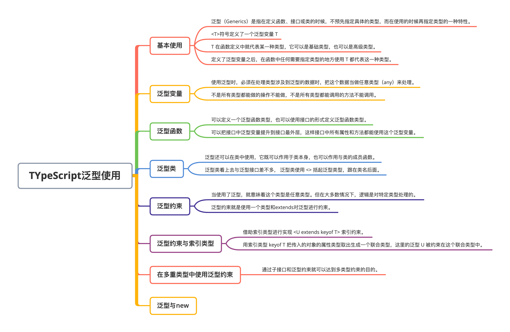
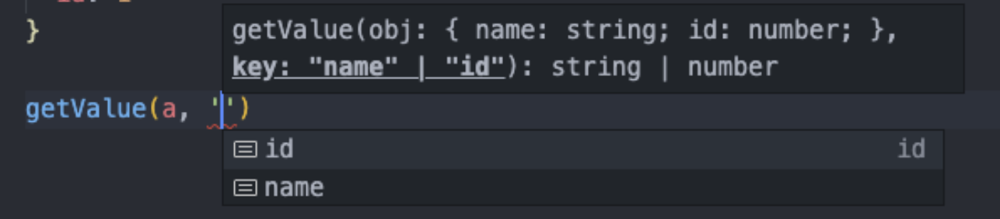

# TypeScript 泛型使用

### 本文概览：



## 1. 泛型的基本使用

首先通过一个例子来看一下泛型的使用场景。我们知道，any类型表示一个值可以为任意类型：

```js
const getArray = (value: any, times: number = 5): any[] => {
  return new Array(times).fill(value);
};

getArray([1], 2).forEach(item => {
  console.log(item.length);
});

getArray(2, 3).forEach(item => {
  console.log(item.length);
});
```

这个函数接收两个参数。第一个参数为任意类型的值，第二个参数为数值类型的值，默认为 5。函数的功能是返回一个以 times 为元素个数，每个元素都是 value 的数组。这个函数从逻辑上可以知道，传入的 value 是什么类型，那么返回的数组的每个元素也应该是什么类型。


调用了两次这个方法，使用 forEach 方法遍历得到的数组，在传入 forEach 的函数中获取当前遍历到的数组元素的 length 属性。

- 第一次传入的值为数组，得到的会是一个二维数组`[ [1], [1] ]`。每次遍历的元素为`[1]`，它也是数组，所以打印它的 length 属性是可以的。
- 第二次传入的值为数字 2，生成的数组是`[2, 2, 2]`，数字是没有 length 的，所以应该报错，但是这里却不会报错。因为在定义`getArray`函数时，指定了返回值是`any`类型的元素组成的数组，所以这里遍历其返回值中每一个元素时，类型都是any，所以不管做任何操作都是可以的。


所以要解决这种情况（指在传入参数时不确定参数的类型，而在使用的时候才能确定），就可以使用泛型。泛型（Generics）是指**在定义函数、接口或类的时候，不预先指定具体的类型，而在使用的时候再指定类型的一种特性。**


对上面的例子可以这样改写：

```js
const getArray = <T>(value: T, times: number = 5): T[] => {
  return new Array(times).fill(value);
};
```

在定义函数之前，使用`<>`符号定义了一个泛型变量 T，这个 T 在函数定义中就代表某一种类型，它可以是基础类型，也可以是高级类型。定义了泛型变量之后，在函数中任何需要指定类型的地方使用 T 都代表这一种类型。比如当传入 value 的类型为数值类型，那么返回的数组类型`T[]`就表示`number[]`。

```js
getArray<number[]>([1, 2], 3).forEach(item => {
  console.log(item.length);
});
getArray<number>(2, 3).forEach(item => {
  console.log(item.length); // 类型“number”上不存在属性“length”
});
```

在调用 getArray 时，在方法名后面使用`<>`传入了泛型变量 T 的类型`number[]`，那么在定义 getArray 函数时使用 T 指定类型的地方，都会使用`number[]`指定。但是也可以省略这个`<number[]>`，TypeScript 会根据你传入函数的 value 值的类型进行推断：

```js
getArray(2, 3).forEach(item => {
  console.log(item.length); // 类型“number”上不存在属性“length”
});
```

在定义泛型的时候，可以一次定义**多个类型参数**，比如可以同时定义泛型 `T` 和 泛型 `U`：

```js
function swap<T, U>(tuple: [T, U]): [U, T] {
    return [tuple[1], tuple[0]];
}
swap([7, 'seven']); // ['seven', 7]
```

## 2. 泛型变量

先来看一个例子：

```js
const getLength = <T>(param: T): number => {
  return param.length; // error 类型“T”上不存在属性“length”
};
```

当我们获取一个类型为泛型的变量 param 的 length 属性值时，如果 param 的类型为数组 Array 或字符串 string 类型是没问题的，它们有 length 属性。但是如果此时传入的 param 是数值 number 类型，那这里就会有问题了。


现在假设我们想操作T类型的数组而不直接是T。由于我们操作的是数组，所以.length属性是应该存在的。 这样传入的类型最起码是数组是可以确定的，在这里泛型变量 T 当做类型的一部分使用，而不是整个类型，增加了灵活性。

```js
const getLength = <T>(param: T[]): number {
    return param.length;
}
```

## 3. 泛型函数

使用**普通形式**来定义泛型函数类型：

```js
// 普通函数
const getArray: <T>(arg: T, times: number) => T[] = function (arg, times){
  return new Array(times).fill(arg);
};

// 箭头函数
const getArray: <T>(arg: T, times: number) => T[] = (arg, times) => {
  return new Array(times).fill(arg);
};
```

使用**类型别名**来定义泛型函数类型：

```js
// 使用类型别名
type GetArray = <T>(arg: T, times: number) => T[];

// 普通函数调用
const getArray: GetArray = function(arg, times) {
  return new Array(times).fill(arg);
};
// 箭头函数调用
const getArray: GetArray = (arg, times) =>  {
  return new Array(times).fill(arg);
};
```

使用**接口形式**来定义泛型函数类型：

```js
interface GetArray {
  <T>(arg: T, times: number): T[];
}

// 普通函数调用
const getArray: GetArray = function(arg, times) {
  return new Array(times).fill(arg);
};
// 箭头函数调用
const getArray: GetArray = (arg, times) =>  {
  return new Array(times).fill(arg);
};
```

还可以把接口中泛型变量提升到接口最外层，这样接口中所有属性和方法都能使用这个泛型变量了：

```js
interface GetArray<T> {
  (arg: T, times: number): T[];
  tag: T;
}
const getArray: GetArray<number> = (arg, times)=> {
  // error 不能将类型“{ <T>(arg: T, times: number): T[]; tag: string; }”分配给类型“GetArray<number>”。
  // 属性“tag”的类型不兼容。
  return new Array(times).fill(arg);
};
getArray.tag = "a"; // 不能将类型“"a"”分配给类型“number”
getArray("a", 1); // 不能将类型“"a"”分配给类型“number”
```

上面将泛型变量定义在接口最外层，所以不仅函数的类型中可以使用 T，在属性 tag 的定义中也可以使用。但在使用接口的时候，要在接口名后面明确传入一个类型，也就是这里的`GetArray<number>`，那么后面的 arg 和 tag 的类型都得是 number 类型。如果还希望 T 可以是任何类型，可以把`GetArray<number>`换成`GetArray<any>`。

## 4. 泛型类

泛型除了可以在函数中使用，还可以在类中使用，**它既可以作用于类本身，也可以作用于类的成员函数**。


实现一个简单的栈，在JavaScript中栈可以用数组来实现，这里模拟了栈的出站入站活动：

```js
class Stack {
    private arr: number[] = []
    public push(item: number) {
        this.arr.push(item)
    }
    public pop() {
        this.arr.pop()
    }
}
```

如果只是传入 number 类型倒是没问题，可是需要不同的类型时，还得需要泛型的帮助：

```js
class Stack<T> {
    private arr: T[] = []
    public push(item: T) {
        this.arr.push(item)
    }
    public pop() {
        this.arr.pop()
    }
}
```

泛型类看上去与泛型接口差不多， 泛型类使用 `<>` 括起泛型类型，跟在类名后面。

## 5. 泛型约束

在使用泛型时，就意味着这个类型是任意的类型，但是我们有时是可以确定传入的泛型时属于哪一类的，比如上面的例子，当访问一个泛型类型的参数的length属性，会报错"类型“T”上不存在属性“length”"，是因为并不是所有类型都有 length 属性。所以在这里应该对 T 有要求，它应该包含 length 属性。


可以使用接口定义一个对象必须有哪些属性：

```js
interface ValueWithLength {
  length: number;
}
const v: ValueWithLength = {}; // error Property 'length' is missing in type '{}' but required in type 'ValueWithLength'
```

泛型约束就是使用一个类型和`extends`对泛型进行约束，上面的代码可以改成这样：

```js
interface ValueWithLength {
  length: number;
}
const getLength = <T extends ValueWithLength>(param: T): number => {
  return param.length;
};
getLength("abc"); // 3
getLength([1, 2, 3]); // 3
getLength({ length: 3 }); // 3
getLength(123); // error 类型“123”的参数不能赋给类型“ValueWithLength”的参数
```

这里泛型变量T受到约束。它必须满足接口ValueWithLength，也就是不管它是什么类型，都必须有一个length属性，且类型为数值类型。


对于上面实现的栈，也可以进行泛型约束，比如要求传入的泛型必须是number或者string类型，可以这样改写：

```js
type Params = number | string

class Stack<T extends Params> {
    private arr: T[] = []
    public push(item: T) {
        this.arr.push(item)
    }
    public pop() {
        this.arr.pop()
    }
}

const stack = new Stack<boolean>() // 类型”boolean“不满足约束”Params“
```

## 6. 泛型约束与索引类型

先来看一个需求：设计一个函数，这个函数接受两个参数，一个参数是对象，另一个参数是对象上的属性，通过这两个参数返回这个属性的值：

```js
function getValue(obj: object, key: string) {
  return obj[key]  // error
}
```

这个函数会得到一段报错：参数obj实际上是{}，因此后面的key是无法获取到任何值的。因为给参数 `obj` 定义的类型就是 `object`，在默认情况下它只能是 `{}`，但是接收的对象是各种各样的，我们需要一个泛型来表示传入的对象类型，下面使用 `T extends object` 来进行改写:

```js
function getValue<T extends object>(obj: T, key: string) {
  return obj[key]  // error
}
```

这样依然会报错，因为第二个参数 `key` 是不是存在于 `obj` 上是无法确定的，因此需要对这个 `key` 也进行约束，把它约束为只存在于 `obj` 属性的类型，这时需要借助**索引类型**进行实现 `<U extends keyof T>`，我们用索引类型 `keyof T` 把传入的对象的属性类型取出生成一个联合类型，这里的泛型 U 被约束在这个联合类型中，这样一来函数就被完整定义了：

```js
function getValue<T extends object, U extends keyof T>(obj: T, key: U) {
  return obj[key]  // ok
}

const a = {
  name: 'TypeScript',
  id: 996
}

getValue(a, name) // "TypeScript"
```

编译器也会进行提示：



## 7. 在多重类型中使用泛型约束

上面的例子都是通过单一类型对泛型进行约束，那如果泛型需要被约束，并且它只被允许实现以下两个接口的类型呢？

```js
interface FirstInterface {
  doSomething(): number
}

interface SecondInterface {
  doSomethingElse(): string
}
```

我们或许会在一个类中这样使用：

```js
class Demo <T extends FirstInterface, SecondInterface> {
  private genericProperty: T
  useT() {
    this.genericProperty.doSomething()
    this.genericProperty.doSomethingElse() // 类型“T”上不存在属性“doSomethingElse”
  }
}
```

但是，这样写只有 `FirstInterface` 约束了泛型 `T`，`SecondInterface` 并没有生效，上面的方法并不能用两个接口同时约束泛型。上述的语法就是错误的，那么应该如何用多重类型约束泛型呢?


实际上并不能在定义泛型约束的时候指定多个约束类型，但是可以将接口 `FirstInterface` 与 `SecondInterface` 作为超接口来解决问题：

```js
interface ChildInterface extends FirstInterface, SecondInterface {
}
```

这个时候 `ChildInterface` 是 `FirstInterface` 与 `SecondInterface` 的子接口，然后我们通过泛型约束就可以达到多类型约束的目的：

```js
class Demo<T extends ChildInterface> {
  private genericProperty: T
  useT() {
    this.genericProperty.doSomething()
    this.genericProperty.doSomethingElse()
  }
}
```

## 8. 泛型与 new

假设需要声明一个泛型拥有构造函数，比如：

```js
function factory<T>(type: T): T {
  return new type() // This expression is not constructable.
}
```

编译器会提示这个表达式不能构造，因为没有声明这个泛型 `T` 是构造函数，这时就需要 `new` 的帮助：

```js
function factory<T>(type: {new(): T}): T {
  return new type() // ok
}
```

参数 `type` 的类型 `{new(): T}` 就表示此泛型 T 是可被构造的，在被实例化后的类型是泛型 T。