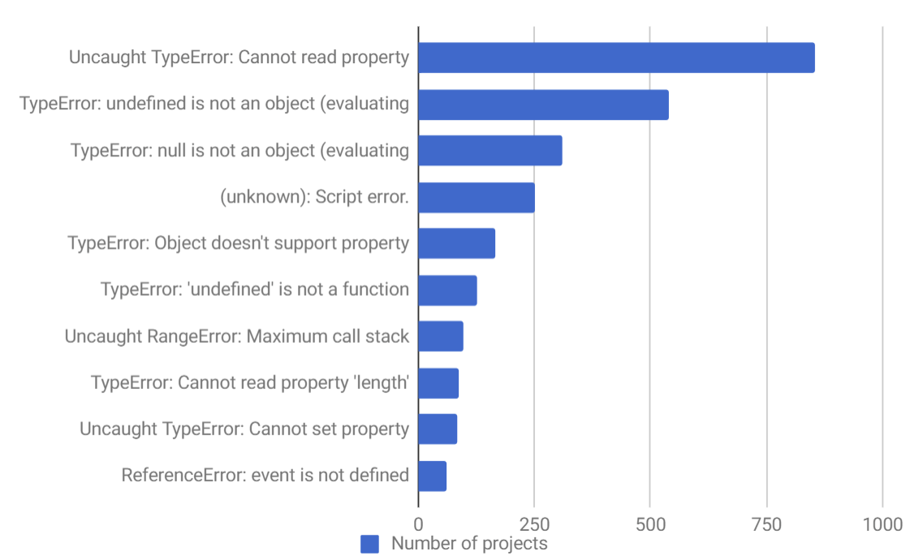

## 1. TypeScript的特点

**T****ypeScript是一种由微软开发的开源、跨平台的编程语言。它是JavaScript的超集，扩展了 JavaScript 的语法，最终会被编译为JavaScript代码。**虽然TypeScript是JavaScript的超集，但它始终紧跟ECMAScript标准，所以是支持ES6/7/8/9 等新语法标准的。并且，在语法层面上对一些语法进行了扩展。


**注意：TypeScript实际上也是静态弱类型语言，它跟C语言是一样的，并不是所谓的强类型，因为需要兼容JavaScript，所以TypeScript几乎不会限制JavaScript中原有的隐式类型转换，它对类型的隐式转换是有容忍度的，而真正的静态强类型语言，比如 Java、C++ 是不会容忍隐式转换的。**


那既然有了JavaScript，**为什么还要提出TypeScript呢？它的出现解决了什么问题呢？**


JavaScript是一种轻量级的解释性脚本语言。也是弱类型、动态类型语言，允许隐式转换，只有运行时才能确定变量的类型。正是因为在运行时才能确定变量的类型，JavaScript代码很多错误在运行时才能发现。TypeScript在JavaScript的基础上，包装了类型机制，使其变身成为**静态类型**语言。在 TypeScript 中，我们不仅可以轻易复用 JavaScript 的代码、最新特性，还能使用可选的静态类型进行检查报错，使得编写的代码更健壮、更易于维护。


下面是 JavaScript 项目中最常见的十大错误，如果使用 TypeScript，那么在编写阶段就可以规避了：



我们可以认为，在所有操作符之前，TypeScript 都能检测到接收的类型（在代码运行时，操作符接收的是实际数据；静态检测时，操作符接收的则是类型）是否被当前操作符所支持。当 TypeScript 类型检测能力覆盖到整个文件、整个项目代码后，任意破坏约定的改动都能被自动检测出来，并提出类型错误。因此，可以放心地修改、重构业务逻辑，而不用过分担忧因为考虑不周而犯下低级错误。


TypeScript 和 JavaScript 不同的就是，它可以在编写代码的时候，就对一些错误进行提示，还能在使用某个数据时，列出这个数据可以访问的属性和方法。当项目较为庞大，需要由多人合作开发时，就需要沟通成本和 review 成本。接口的定义，方法的使用，都可能因为个人习惯或沟通不畅导致逻辑实现的差异。而如果引入TypeScript，则会对一些实现进行强校验。如果不按接口实现，编译就没法通过。


**TypeScript的主要特性：**

- **超集** ：TypeScript 是 JavaScript 的一个超集。
- **类型系统** ：正如其名，TypeScript在JavaScript的基础上，包装了类型机制，使其变身为静态类型语言。

- **编辑器功能** ：增强了编辑器和IDE功能，包括代码补全、接口提示、跳转到定义、重构等。
- **错误提示** ：可以在编译阶段就发现大部分错误，帮助调试程序。


如今，TypeScript越来越火，有很多广为人知的使用TypeScript开发的项目：

- **VSCode**：开源的高质量代码编辑器VSCode使用TypeScript开发，所以它天生就支持 TypeScript；
- **Vue 3.0和React**：Vue和React是目前比较热门的前端框架，React 已经使用 TypeScript编写，最新的Vue3.0也支持使用TypeScript进行开发。

- **Element Plus**：2020年11月30日，饿了么团队推出了Element UI for Vue 3.0 beta版，这是第一个使用 TypeScript + Vue 3.0 Composition API 重构的组件库，它对非常热门的Element UI进行了重构。
- **Ant Design**：使用 React 开发项目的开发者大多应该都知道蚂蚁金服开源UI组件库Ant Design，同样使用TypeScript进行编写。保证了代码质量的同时，也能很好地支持开发者使用TypeScript进行React项目的开发。Ant Design 也提供了Vue 版的组件库，风格和功能和 React 版保持一致，共享单元测试和设计资源，对TypeScript的支持也一样很好。

## 2. TypeScript的安装与使用

使用TypeScript之前需要以下准备：

- Node.js > 8.0，最好是最新的稳定版
- 一个包管理工具：npm 或者 yarn


### （1）代码初始化

**TypeScript的基本使用步骤：**

1）**全局安装TypeScript：**  由于 VS Code 只集成了 TypeScript 语言服务，并不包含转译器，所以需要安装 TypeScript。

```js
// npm
npm install -g typescript
// yarm
yarn global add typescript
// 查看版本
tsc -v
```

2）**创建并打开目录，**：

```js
mkdir demo & cd demo
```

3）**在目录中创建ts文件**：

```js
index.ts
```

4）**编译ts代码**：

```
tsc index.ts
```

5）**初始化：**

```js
tsc --init
```

命令执行完之后，项目根目录多了一个 `tsconfig.json` 文件，里面包含ts的配置项（可能因为版本不同而配置略有不同）。

```json
{
  "compilerOptions": {
    "target": "es5",                            // 指定 ECMAScript 目标版本: 'ES5'
    "module": "commonjs",                       // 指定使用模块: 'commonjs', 'amd', 'system', 'umd' or 'es2015'
    "moduleResolution": "node",                 // 选择模块解析策略
    "experimentalDecorators": true,             // 启用实验性的ES装饰器
    "allowSyntheticDefaultImports": true,       // 允许从没有设置默认导出的模块中默认导入。
    "sourceMap": true,                          // 把 ts 文件编译成 js 文件的时候，同时生成对应的 map 文件
    "strict": true,                             // 启用所有严格类型检查选项
    "noImplicitAny": true,                      // 在表达式和声明上有隐含的 any类型时报错
    "alwaysStrict": true,                       // 以严格模式检查模块，并在每个文件里加入 'use strict'
    "declaration": true,                        // 生成相应的.d.ts文件
    "removeComments": true,                     // 删除编译后的所有的注释
    "noImplicitReturns": true,                  // 不是函数的所有返回路径都有返回值时报错
    "importHelpers": true,                      // 从 tslib 导入辅助工具函数
    "lib": ["es6", "dom"],                      // 指定要包含在编译中的库文件
    "typeRoots": ["node_modules/@types"],
    "outDir": "./dist",
    "rootDir": "./src"
  },
  "include": [                                  // 需要编译的ts文件一个*表示文件匹配**表示忽略文件的深度问题
    "./src/**/*.ts"
  ],
  "exclude": [
    "node_modules",
    "dist",
    "**/*.test.ts",
  ]
}
```

### （2）配置TSLint

TSLint(deprecated)是一个通过`tslint.json`进行配置的插件，在编写TypeScript代码时，可以对代码风格进行检查和提示。如果对代码风格有要求，就需要用到TSLint了。除此之外，TSLint会在很多地方起到提示作用，建议使用。


**TSLint使用步骤如下：**

（1）在全局安装TSLint，要用管理员身份运行：

```js
npm install tslint -g
```

（2）在项目根目录下，使用TSLint初始化配置文件：

```js
tslint -i
```

运行结束之后，项目根目录下多了一个`tslint.json`文件，这个就是TSLint的配置文件了，它会根据这个文件对代码进行检查，生成的`tslint.json`文件有下面几个字段：

```json
{
  "defaultSeverity": "error",
  "extends": [
    "tslint:recommended"
  ],
  "jsRules": {},
  "rules": {},
  "rulesDirectory": []
}
```

这些字段的含义如下；

- **defaultSeverity**：提醒级别，如果为error则会报错，如果为warning则会警告，如果设为off则关闭，那TSLint就关闭了；
- **extends：**可指定继承指定的预设配置规则；

- **jsRules：**用来配置对`.js`和`.jsx`文件的校验，配置规则的方法和下面的rules一样；
- **rules：**TSLint检查代码的规则都是在这个里面进行配置，比如当我们不允许代码中使用`eval`方法时，就要在这里配置`"no-eval": true`；

- **rulesDirectory：**可以指定规则配置文件，这里指定相对路径。