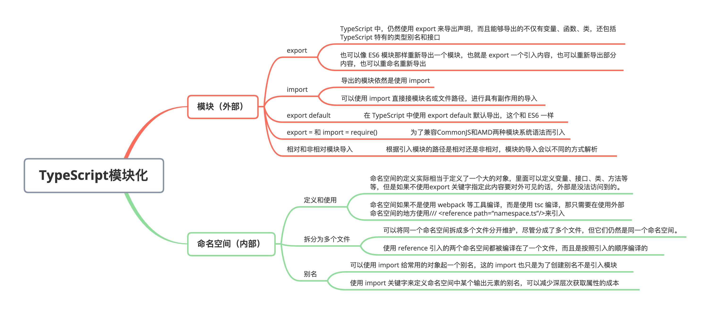

# TypeScript 模块化

### 全文概览：



## 1. 模块（外部）

TypeScript 在 1.5 版本之前，有**内部模块**和**外部模块**的概念，从 1.5 版本开始，**内部模块**改称作**命名空间**，**外部模块**改称为**模块**。TypeScript 中的模块系统是遵循 ES6 标准的，TypeScript 和 ES6 保持一致，包含顶级 import 或 export 的文件都被当成一个模块，则里面定义的内容仅模块内可见，而不是全局可见。TypeScript 的模块除了遵循 ES6 标准的模块语法外，还有一些特定语法，用于类型系统兼容多个模块格式，下面来看一下 TypeScript 的模块。

### （1）export

TypeScript 中，仍然使用 export 来导出声明，而且能够导出的不仅有变量、函数、类，还包括 TypeScript 特有的类型别名和接口：

```typescript
// funcInterface.ts
export interface Func {
  (arg: number): string;
}
export class C {
  constructor() {}
}
class B {}
export { B };
export { B as ClassB };
```

上面例子中，可以使用 export 直接导出一个声明，也可以先声明一个类或者其它内容，然后使用 export {}的形式导出，也可以使用 as 来为导出的接口换个名字再导出一次。


也可以像 ES6 模块那样重新导出一个模块，也就是 export 一个引入内容，也可以重新导出部分内容，也可以重命名重新导出：

```typescript
// main.ts
export * from "./moduleB";
// main.ts
export { name } from "./moduleB";
// main.ts
export { name as nameProp } from "./moduleB";
```

### （2）import

导出的模块依然是使用 import：

```typescript
// main.ts
import { name } from "./moduleB";
// main.ts
import * as info from "./moduleB";
//main.ts
import { name as nameProp } from "./moduleB";
```

同样，可以使用 import 直接接模块名或文件路径，进行具有副作用的导入：

```typescript
import "./set-title.ts";
```

### （3）export default

同样在 TypeScript 中使用 export default 默认导出，这个和 ES6 一样：

```typescript
// moduleB.ts
export default "TypeScript";
// main.ts
import name from "./moduleB.ts";
console.log(name); // 'TypeScript'
```

### （4）export = 和 import = require()

TypeScript可以将代码编译为CommonJS、AMD或其它模块系统代码，同时会生成对应的声明文件。CommonJS和AMD两种模块系统语法是不兼容的，所以TypeScript为了兼容这两种语法，使得我们编译后的声明文件同时支持这两种模块系统，增加了`export =`和`import xx = require()`两个语句。


在导出一个模块时，可以使用`export =`来导出：

```typescript
// moduleC.ts
class C {}
export = C;
```

使用这个形式导出的模块，必须使用`import xx = require()`来引入：

```typescript
// main.ts
import ClassC = require("./moduleC");
const c = new ClassC();
```

如果模块不需要同时支持这两种模块系统，可以不使用`export =`来导出内容。

### （5）相对和非相对模块导入

根据引入模块的路径是相对还是非相对，模块的导入会以不同的方式解析：

- 相对导入是以`./`或`…/`开头的，`./`表示当前目录，而`…/`表示当前目录的上一级目录。

```typescript
src
 ╠═ module
 ║    ╠═ moduleA.ts
 ║    ╚═ moduleB.ts
 ╚═ core
      ╚═ index.ts
```

以上面的文件目录为例，如果在 index.ts 中引入两个模块，和在 moduleA 模块中引入 moduleB 是这样的：

```typescript
// moduleA.ts
import moduleB from "./moduleB.ts"; // 这里在moduleA.ts文件里引入同级的moduleB.ts文件，所以使用./表示moduleA.ts文件当前所在路径
// index.ts
import moduleA from "../module/moduleA.ts";
import moduleB from "../module/moduleB"; // 这里省略了.ts后缀也可以
```

当引用模块文件的时候省略了 .ts 后缀也是可以的，这就涉及到一个模块解析策略。以上面例子中这个moduleB 为例，编译器在解析模块引用的时候，如果遇到省略后缀的情况，会依次查找以该名称为文件名的.ts、.tsx、.d.ts文件；如果没找到，会在当前文件夹下的 package.json 文件里查找 types 字段指定的模块路径，然后通过这个路径去查找模块；如果没找到package.json文件或者types字段，则会将 moduleB 当做文件夹去查找，如果它确实是文件夹，将会在这个文件夹下依次查找 index.ts、index.tsx、index.d.ts。 如果还没找到，会在上面例子中 module 文件夹的上级文件夹继续查找，查找规则和前面这些顺序一致。


除了这两种符号开头的路径，都被当做非相对路径。非相对模块的导入可以相对于 baseUrl，也可以通过路径映射，还可以解析为外部模块。

## 2. 命名空间（内部）

命名空间在TypeScript 1.5 之前的版本中，是叫做“内部模块”。在 1.5 版本之前，ES6 模块还没正式成为标准，所以 TS 对于模块的实现，是将模块分为“内部模块”和“外部模块”两种。内部模块使用`module`来定义，而外部模块使用`export`来指定哪个内容对外部可见。


1.5 版本开始，使用“命名空间”代替“内部模块”说法，并且使用 `namespace` 代替原有的 `module`关键字，而“外部 模块”则改为“模块”。

命名空间的作用与使用场景和模块还是有区别的：

- 当我们是在程序内部用于防止全局污染，想把相关的内容都放在一起的时候，使用命名空间；
- 当我们封装了一个工具或者库，要适用于模块系统中引入使用时，适合使用模块。

### （1）定义和使用

命名空间的定义实际相当于定义了一个大的对象，里面可以定义变量、接口、类、方法等等，但是如果不使用`export` 关键字指定此内容要对外可见的话，外部是没法访问到的。我们想要把所有涉及到内容验证的方法都放到一起，文件名叫 validation.ts：

```typescript
namespace Validation {
  const isLetterReg = /^[A-Za-z]+$/; // 这里定义一个正则
  export const isNumberReg = /^[0-9]+$/; // 这里再定义一个正则，与isLetterReg的区别在于他使用export导出了
  export const checkLetter = (text: any) => {
    return isLetterReg.test(text);
  };
}
```

这里创建了一个命名空间叫做 `Validation`，它里面定义了三个内容，两个正则表达式，但是区别在于 `isLetterReg` 没有使用 `export` 修饰，而 `isNumberReg` 使用了 `export` 修饰。最后一个函数，也是用了 `export` 修饰。


这里要说明一点的是，命名空间在引入的时候，如果是使用 `tsc` 命令行编译文件，比如是在 `index.ts` 文件使用这个命名空间，先直接像下面这样写：

```typescript
/// <reference path="validation.ts"/>
let isLetter = Validation.checkLetter("sdfsd");
const reg = Validation.isNumberReg;
console.log(isLetter);
console.log(reg);
```

命名空间如果不是使用 webpack 等工具编译，而是使用 tsc 编译，那只需要在使用外部命名空间的地方使用`/// <reference path=“namespace.ts”/>`来引入，注意三斜线 ”///“ 开头，然后在 path 属性指定相对于当前文件，这个命名空间文件的路径。然后编译时，需要指定一个参数`outFile`，这个参数来制定输出的文件名：

```typescript
tsc --outFile src/index.js src/index.ts
```

`--outFile` 用来指定输出的文件路径和文件名，最后指定要编译的文件。注意，使用 `outFile` 只支持`amd`和`system`两种模块标准，所以需要在 `tsconfig.json` 里设置 `module` 编译选项。


编译后的文件 index.js：

```typescript
var Validation;
(function(Validation) {
  var isLetterReg = /^[A-Za-z]+$/;
  Validation.isNumberReg = /^[0-9]+$/;
  Validation.checkLetter = function(text) {
    return isLetterReg.test(text);
  };
})(Validation || (Validation = {}));
/// <reference path="namespace.ts"/>
var isLetter = Validation.checkLetter("sdfsd");
var reg = Validation.isNumberReg;
console.log(isLetter);
console.log(reg);
```

编译后的 JS 文件将命名空间定义的文件 `Validation.ts` 文件的内容和 `index.ts` 的内容合并到了最后输出的文件。


如果要在 webpack 等工具中开发项目，并时时运行，如果只通过`/// <reference path=“Validation.ts”/>`来引入命名空间，运行起来之后浏览器控制台会报 **Validation is not defined** 的错误。所以如果是要在项目中时时使用，需要使用 export 将命名空间导出，其实就是作为模块导出，然后在 `index.ts` 中引入，先来看 `Validation.ts` 文件：

```typescript
export namespace Validation {
  const isLetterReg = /^[A-Za-z]+$/;
  export const isNumberReg = /^[0-9]+$/;
  export const checkLetter = (text: any) => {
    return isLetterReg.test(text);
  };
}
```

然后在 index.ts 文件中引入并使用：

```typescript
import { Validation } from "./Validation.ts";
let isLetter = Validation.checkLetter("sdfsd");
const reg = Validation.isNumberReg;
console.log(isLetter); // true
console.log(reg); // /^[0-9]+$/
```

**注意：**命名空间本来就是防止变量污染，但是模块也能起到这个作用，而且使用模块还可以自己定义引入之后的名字。所以，并不建议导出一个命名空间，这种情况应该使用模块。

### （2）拆分为多个文件

随着内容不断增多，我们可以将同一个命名空间拆成多个文件分开维护，尽管分成了多个文件，但它们仍然是同一个命名空间。下面将 `Validation.ts` 拆开成 `LetterValidation.ts` 和 `NumberValidation.ts`：

```typescript
// LetterValidation.ts
namespace Validation {
  export const isLetterReg = /^[A-Za-z]+$/;
  export const checkLetter = (text: any) => {
    return isLetterReg.test(text);
  };
}
// NumberValidation.ts
namespace Validation {
  export const isNumberReg = /^[0-9]+$/;
  export const checkNumber = (text: any) => {
    return isNumberReg.test(text);
  };
}
// index.ts
/// <reference path="./LetterValidation.js"/>
/// <reference path="./NumberValidation.js"/>
let isLetter = Validation.checkLetter("sdfsd");
const reg = Validation.isNumberReg;
console.log(isLetter); // true
```

使用命令行来编译一下：

```typescript
tsc --outFile src/index.js src/index.ts
```

最后输出的 index.js 文件是这样的：

```typescript
var Validation;
(function(Validation) {
  Validation.isLetterReg = /^[A-Za-z]+$/;
  Validation.checkLetter = function(text) {
    return Validation.isLetterReg.test(text);
  };
})(Validation || (Validation = {}));
var Validation;
(function(Validation) {
  Validation.isNumberReg = /^[0-9]+$/;
  Validation.checkNumber = function(text) {
    return Validation.isNumberReg.test(text);
  };
})(Validation || (Validation = {}));
/// <reference path="./LetterValidation.ts"/>
/// <reference path="./NumberValidation.ts"/>
var isLetter = Validation.checkLetter("sdfsd");
var reg = Validation.isNumberReg;
console.log(isLetter); // true
```

可以看到，使用 reference 引入的两个命名空间都被编译在了一个文件，而且是按照引入的顺序编译的。我们先引入的是 LetterValidation，所以编译后的 js 文件中，LetterValidation 的内容在前面。而且看代码可以看出，两个验证器最后都合并到了一起，所以 Validation 对象有两个正则表达式，两个方法。

### （3）别名

可以使用 import 给常用的对象起一个别名，但是要注意，这个别名和类型别名不是一回事，而且这的 import 也只是为了创建别名不是引入模块。下面是官方文档的例子：

```typescript
namespace Shapes {
  export namespace Polygons {
    export class Triangle {}
    export class Squaire {}
  }
}
import polygons = Shapes.Polygons; // 使用 import 关键字给 Shapes.Polygons 取一个别名polygons
let sq = new polygons.Square();
```

通过这个例子可以看到，使用 import 关键字来定义命名空间中某个输出元素的别名，可以减少深层次获取属性的成本。