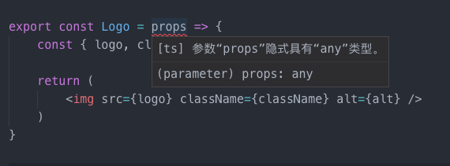

# TypeScript 与 React 实战

## 1. 初始化模板

使用 TypeScript 编写 react 代码，除了需要 `typescript` 这个库之外，还至少需要额外的两个库:

```typescript
yarn add -D @types/{react,react-dom}
```

由于非常多的 JavaScript 库并没有提供自己关于 TypeScript 的声明文件，导致 TypeScript 的使用者无法享受这种库带来的类型，因此社区中就出现了一个项目 [DefinitelyTyped](https://github.com/DefinitelyTyped/DefinitelyTyped)，它定义了目前市面上绝大多数的 JavaScript 库的声明，当我们下载 JavaScript 库相关的 `@types` 声明时，就可以享受此库相关的类型定义了。


当然，为了方便可以选择直接用 TypeScript 官方提供的 react 启动模板：

```typescript
create-react-app react-ts-app --scripts-version=react-scripts-ts
```

## 2. 无状态组件（函数组件）

无状态组件是一种非常常见的 react 组件，主要用于展示 UI，初始的模板中就有一个 logo 图，就可以把它封装成一个 `Logo` 组件。在 JavaScript 中往往是这样封装组件的：

```typescript
import * as React from 'react'
export const Logo = props => {
    const { logo, className, alt } = props
    return (
        
    )
}
```

但是在TypeScript中会报错:



原因就是没有定义 `props` 的类型，我们用 `interface` 定义一下 props 的类型：

```typescript
import * as React from 'react'
interface IProps {
    logo?: string
    className?: string
    alt?: string
}
export const Logo = (props: IProps) => {
    const { logo, className, alt } = props
    return (
        
    )
}
```

这样做看似没问题，但是用到 `children` 的时候是不是又要去定于 `children` 类型？比如这样:

```typescript
interface IProps {
    logo?: string
    className?: string
    alt?: string
    children?: ReactNode
}
```

其实有一种更规范更简单的办法，`type SFC<P>` 其中已经定义了 `children` 类型。只需要这样使用:

```typescript
export const Logo: React.SFC<IProps> = props => {
    const { logo, className, alt } = props
    return (
        
    )
}
```

现在就可以替换 `App.tsx` 中的 `logo` 组件，可以看到相关的props都会有代码提示：


如果这个组件是业务中的通用组件的话，甚至可以加上注释:

```typescript
interface IProps {
    /**
     * logo的地址
     */
    logo?: string
    className?: string
    alt?: string
}
```

这样在其他人调用此组件的时候，除了代码提示外甚至会有注释的说明:


## 3. 有状态组件（类组件）

现在编写一个Todo应用:


首先需要编写一个 `todoInput` 组件:


如果按照 JavaScript 的写法，只要写一个开头就会碰到一堆报错：


有状态组件除了 props 之外还需要 state ，对于 class 写法的组件要泛型的支持，即 `Component<P, S>` ，因此需要传入传入 state 和 props 的类型，这样就可以正常使用 props 和 state 了：

```typescript
import * as React from 'react'
interface Props {
    handleSubmit: (value: string) => void
}
interface State {
    itemText: string
}
export class TodoInput extends React.Component<Props, State> {
    constructor(props: Props) {
        super(props)
        this.state = {
            itemText: ''
        }
    }
}
```

这个时候需不需要给 `Props` 和 `State` 加上 `Readonly`，因为数据都是不可变的，这样会不会更严谨？其实是不用的，因为React的声明文件已经自动帮我们包装过上述类型了，已经标记为 `readonly`。如下：


接下来需要添加组件方法，大多数情况下这个方法是本组件的私有方法，这个时候需要加入访问控制符 `private`。

```
private updateValue(value: string) {
        this.setState({ itemText: value })
    }
```

接下来也是大家经常会碰到的一个不太好处理的类型，如果想取某个组件的 `ref`，那么应该如何操作？比如需要在组件更新完毕之后，使得 `input` 组件 `focus`。


首先，需要用`React.createRef`创建一个ref，然后在对应的组件上引入即可：

```typescript
private inputRef = React.createRef<HTMLInputElement>()
...
<input
    ref={this.inputRef}
    className="edit"
    value={this.state.itemText}
/>
```

需要注意的是，在 `createRef` 这里需要一个泛型，这个泛型就是需要 `ref` 组件的类型，因为这个是 input 组件，所以类型是 `HTMLInputElement`，当然如果是 `div` 组件的话那么这个类型就是 `HTMLDivElement`。

## 4. 受控组件

再来看 `TodoInput` 组件，其实此组件也是一个受控组件，当改变 `input` 的 `value` 的时候需要调用 `this.setState` 来不断更新状态，这个时候就会用到 **事件** 类型。


由于 React 内部的事件其实都是合成事件，也就是说都是经过 React 处理过的，所以并不原生事件，因此通常情况下我们这个时候需要定义 React 中的事件类型。对于 `input` 组件 `onChange` 中的事件，一般是这样声明的:

```typescript
private updateValue(e: React.ChangeEvent<HTMLInputElement>) {
    this.setState({ itemText: e.target.value })
}
```

当需要提交表单的时候，需要这样定义事件类型:

```typescript
private handleSubmit(e: React.FormEvent<HTMLFormElement>) {
        e.preventDefault()
        if (!this.state.itemText.trim()) {
            return
        }
        this.props.handleSubmit(this.state.itemText)
        this.setState({itemText: ''})
    }
```

那么这么多类型的定义，怎么记得住呢？遇到其它没见过的事件，难道要去各种搜索才能定义类型吗？其实这里有一个小技巧,当我们在组件中输入事件对应的名称时，会有相关的定义提示，只要用这个提示中的类型就可以了：


## 5. 默认属性

React 中有时候会运用很多默认属性，尤其是在编写通用组件的时候，可以利用 class 来同时声明类型和创建初始值。再回到这个项目中，假设我们需要通过 props 来给 `input` 组件传递属性，而且需要初始值，这个时候完全可以通过 class 来进行代码简化：

```typescript
// props.type.ts
interface InputSetting {
    placeholder?: string
    maxlength?: number
}
export class TodoInputProps {
    public handleSubmit: (value: string) => void
    public inputSetting?: InputSetting = {
        maxlength: 20,
        placeholder: '请输入todo',
    }
}
```

再回到 `TodoInput` 组件中，直接用 class 作为类型传入组件，同时实例化类，作为默认属性：


用 class 作为 props 类型以及生产默认属性实例有以下好处：

- 代码量少：一次编写，既可以作为类型也可以实例化作为值使用
- 避免错误：分开编写一旦有一方造成书写错误不易察觉


这种方法虽然不错，但是之后我们会发现问题，虽然已经声明了默认属性，但是在使用的时候，依然显示 `inputSetting` 可能未定义：


在这种情况下有一种最快速的解决办法，就是加`!`，它的作用就是告诉编译器这里不是undefined，从而避免报错：


也可以选择三目运算符做一个简单的判断:


## 6. 高级类型

上面说到用 class 一处编写能两处复用的方式虽然非常实用，但是不得不用一些 Hack 手段来避免后续的报错，有没有更优雅、更严谨的解决方案？我们可以利用**高级类型**解决默认属性报错的问题。

先声明`defaultProps`的值:

```typescript
const todoInputDefaultProps = {
    inputSetting: {
        maxlength: 20,
        placeholder: '请输入todo',
    }
}
```

接着定义组件的`props`类型

```typescript
type Props = {
    handleSubmit: (value: string) => void
    children: React.ReactNode
} & Partial<typeof todoInputDefaultProps>
```

`Partial`的作用是将类型的属性全部变成可选的,也就是下面这种情况：

```typescript
{
    inputSetting?: {
        maxlength: number;
        placeholder: string;
    } | undefined;
}
```

那么现在使用Props是不是就没有问题了？

```typescript
export class TodoInput extends React.Component<Props, State> {
    public static defaultProps = todoInputDefaultProps
...
    public render() {
        const { itemText } = this.state
        const { updateValue, handleSubmit } = this
        const { inputSetting } = this.props
        return (
            <form onSubmit={handleSubmit} >
                <input maxLength={inputSetting.maxlength} type='text' value={itemText} onChange={updateValue} />
                <button type='submit' >添加todo</button>
            </form>
        )
    }
...
}
```

结果依旧会报错：


其实这个时候需要一个函数，将 `defaultProps` 中已经声明值的属性从**可选类型**转化为**非可选类型**。先看这么一个函数:

```typescript
const createPropsGetter = <DP extends object>(defaultProps: DP) => {
    return <P extends Partial<DP>>(props: P) => {
        type PropsExcludingDefaults = Omit<P, keyof DP>
        type RecomposedProps = DP & PropsExcludingDefaults
        return (props as any) as RecomposedProps
    }
}
```

这个函数接受一个 `defaultProps` 对象，`<DP extends object>` 这里是泛型约束，代表 `DP` 这个泛型是个对象，然后返回一个匿名函数。再看这个匿名函数，此函数也有一个泛型 `P`,这个泛型 `P` 也被约束过，即 `<P extends Partial<DP>>`，意思就是这个泛型必须包含可选的 `DP` 类型（实际上这个泛型P就是组件传入的 Props 类型）。


接着看类型别名 `PropsExcludingDefaults`，它的作用其实是剔除 `Props` 类型中关于 `defaultProps` 的部分， `Omit` 这个高级类型的用法实际就是一个语法糖：

```typescript
type Omit<P, keyof DP> = Pick<P, Exclude<keyof P, keyof DP>>
```

而类型别名 `RecomposedProps` 则是将默认属性的类型 `DP` 与剔除了默认属性的 `Props` 类型结合在一起。其实这个函数只做了一件事，把可选的 `defaultProps` 的类型剔除后，加入必选的 `defaultProps` 的类型，从而形成一个新的 `Props` 类型，这个 `Props` 类型中的 `defaultProps` 相关属性就变成了必选的。


完整代码如下：

```typescript
import * as React from 'react'
interface State {
    itemText: string
}
type Props = {
    handleSubmit: (value: string) => void
    children: React.ReactNode
} & Partial<typeof todoInputDefaultProps>
const todoInputDefaultProps = {
    inputSetting: {
        maxlength: 20,
        placeholder: '请输入todo',
    }
}
export const createPropsGetter = <DP extends object>(defaultProps: DP) => {
    return <P extends Partial<DP>>(props: P) => {
        type PropsExcludingDefaults = Omit<P, keyof DP>
        type RecomposedProps = DP & PropsExcludingDefaults
        return (props as any) as RecomposedProps
    }
}
const getProps = createPropsGetter(todoInputDefaultProps)
export class TodoInput extends React.Component<Props, State> {
    public static defaultProps = todoInputDefaultProps
    constructor(props: Props) {
        super(props)
        this.state = {
            itemText: ''
        }
    }
    public render() {
        const { itemText } = this.state
        const { updateValue, handleSubmit } = this
        const { inputSetting } = getProps(this.props)
        return (
            <form onSubmit={handleSubmit} >
                <input maxLength={inputSetting.maxlength} type='text' value={itemText} onChange={updateValue} />
                <button type='submit' >添加todo</button>
            </form>
        )
    }
    private updateValue(e: React.ChangeEvent<HTMLInputElement>) {
        this.setState({ itemText: e.target.value })
    }
    private handleSubmit(e: React.FormEvent<HTMLFormElement>) {
        e.preventDefault()
        if (!this.state.itemText.trim()) {
            return
        }
        this.props.handleSubmit(this.state.itemText)
        this.setState({itemText: ''})
    }
}
```

## 7. 高阶组件

继续来看 `TodoInput` 这个组件，其中一直在用 `inputSetting` 来自定义 `input` 的属性，现在需要用一个 HOC 来包装 `TodoInput` ，其作用就是用高阶组件向 `TodoInput` 注入 props。


高阶函数如下:

```typescript
import * as hoistNonReactStatics from 'hoist-non-react-statics'
import * as React from 'react'
type InjectedProps = Partial<typeof hocProps>
const hocProps = {
    inputSetting: {
        maxlength: 30,
        placeholder: '请输入待办事项',
    }
}
export const withTodoInput = <P extends InjectedProps>(
  UnwrappedComponent: React.ComponentType<P>,
) => {
  type Props = Omit<P, keyof InjectedProps>
  class WithToggleable extends React.Component<Props> {
    public static readonly UnwrappedComponent = UnwrappedComponent
    public render() {
      return (
        <UnwrappedComponent
        inputSetting={hocProps}
        {...this.props as P}
        />
      );
    }
  }
  return hoistNonReactStatics(WithToggleable, UnwrappedComponent)
}
```

这里的 P 表示传递到 HOC 的组件的 props，`React.ComponentType<P>` 是 `React.FunctionComponent<P> | React.ClassComponent<P>` 的别名，表示传递到HOC的组件可以是类组件或者是函数组件。只需要这样使用：

```typescript
const HOC = withTodoInput<Props>(TodoInput)
```

## 8. Redux

在实际开发中，一定会涉及到状态管理工具，目前最主流的莫过于 redux，下面来结合 redux 继续开发 todo 应用。

### （1）定义Models

很多时候前端没有定义 Model 的习惯，不过在前端越来越重的今天，尤其是 TypeScript 的存在使得 model 定义更加友好。因为只是个 demo，所以数据模型很简单，用简单的接口即可定义:

```typescript
// models/Todo.ts
export interface Todo {
  id: number
  name: string
  done: boolean
}
```

### （2）Action相关

首先需要定义 `constants`：

```typescript
// constants/todo.ts
export enum ActionTodoConstants {
    ADD_TODO = 'todo/add',
    TOGGLE_TODO = 'todo/toggle'
}
```

先来实现一个 `addTodo` 函数:

```typescript
// actions/todo.ts
let id = 0
const addTodo = (name: string) => ({
    payload: {
        todo: {
            done: false,
            id: id++,
            name,
          }
    },
    type: ActionTodoConstants.ADD_TODO,
})
```

由于在后面的 reducer 中需要函数返回的 Action 类型，所以得取得每个 action 函数的返回类型，可以利用 TypeScript 强大的类型推导来反推出类型，可以先定义函数，再推导出类型：

```typescript
type AddTodoAction = ReturnType<typeof addTodo>
```


接下来按照同样的方法实现 `toggleTodo` 即可：

```typescript
export type AddTodoAction = ReturnType<typeof addTodo>
export type ToggleTodoAction = ReturnType<typeof toggleTodo>
export type Action = AddTodoAction | ToggleTodoAction
```

### （3）Reducer相关

Reducer 部分相对更简单一些，只需要给对应的参数或者初始 state 加上类型：

```typescript
// reducers/todo.ts
// 定义State的接口
export interface State {
    todos: Todo[]
}
export const initialState: State = {
    todos: []
}
// 把之前定义的Action给action参数声明
export function reducer(state: State = initialState, action: Action) {
    switch (action.type) {
      case ActionTodoConstants.ADD_TODO: {
        const todo = action.payload
        return {
          ...state,
          todos: [...state.todos, todo]
        }
      }
      case ActionTodoConstants.TOGGLE_TODO: {
        const { id } = action.payload
        return {
          ...state,
          todos: state.todos.map(todo => todo.id === id ? { ...todo, done: !todo.done } : todo)
        }
      }
      default:
        return state
    }
}
```

这样看貌似没问题，但是我们会发现错误：


`action.payload` 其实是两个函数返回类型的联合类型，但是在 `TOGGLE_TODO` 的 `type` 下就不应该出现 `todo: {...}` 类型，为什么这里依然会出现呢？其实正是因为错误运用了类型推导所致的，代码和逻辑都没有问题，问题就出现在没有理解好类型推导的机制。


类型推导生成的函数返回类型是这样的:

```typescript
type AddTodoAction = {
    payload: {
        todo: {
            done: boolean;
            id: number;
            name: string;
        };
    };
    type: ActionTodoConstants;
}
```

而自定义的函数返回类型是这样的:

```typescript
type AddTodoAction = {
    type: ActionTodoConstants.ADD_TODO;
    payload: {
        todo: Todo;
    };
}
```

其中最大的区别就是 `type` 属性的类型，类型推导只推导到了一个枚举类型 `ActionTodoConstants` ，而我们定义的类型是具体的 `ActionTodoConstants.ADD_TODO` ，因此在reducer中使用的时候，自定义类型可以精准地推导出类型，而利用类型推导的方法却不行。


这里不得不提一个 typescript 下面的一个高级类型，可辨识联合类型（Discriminated Unions）：

```typescript
interface Square {
    kind: "square";
    size: number;
}
interface Rectangle {
    kind: "rectangle";
    width: number;
    height: number;
}
type Shape = Square | Rectangle;
function area(s: Shape) {
    switch (s.kind) {
        // 在此 case 中，变量 s 的类型为 Square
        case "square": return s.size * s.size;
        // 在此 case 中，变量 s 的类型为 Rectangle
        case "rectangle": return s.height * s.width;
    }
}
```

这个联合类型可以通过 `case` 识别不同的 `s.kind` 从而推导出对应的类型，这个**可辨识联合**与**普通的联合类型**最大的不同之处就在于其必须有一个**单例类型**。**单例类型**多数是指枚举成员类型和数字/字符串字面量类型，上面的 `Rectangle` 接口中的 `kind: "rectangle"` 就是所谓的单例类型，在 TypeScript 中这种类型就叫做**字符串字面量类型**。


看个例子:

```typescript
type a = 'add'
export const b: a = 'add' // ok
export const c: a = 'delete' // 报错
```


我们想推导出正确的类型靠的就是这个单一的字符串字面量类型，因此上面提到的利用函数返回值类型推导的方式就不符合这个要求，因此造成后面的推导错误是意料之中的事情了。因此需要修改之前的 action 代码：

```typescript
// actions/todo.ts
export interface AddTodoAction { type: ActionTodoConstants.ADD_TODO, payload: { todo: Todo } }
export interface ToggleTodoAction { type: ActionTodoConstants.TOGGLE_TODO, payload: { id: number } }
```

这个时候 reducer 中就可以精准推导:

