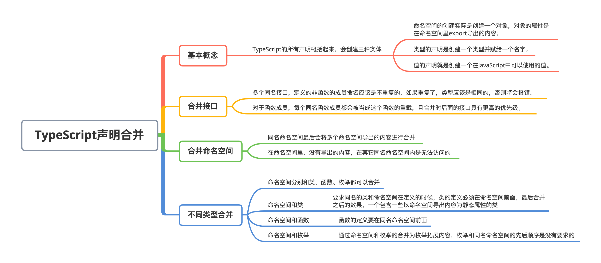

# TypeScript 声明合并和混入

### 全文概览：




## 1. 声明合并的概念

声明合并是指 **TypeScript 编译器会将名字相同的多个声明合并为一个声明，合并后的声明同时拥有多个声明的特性。**在 JavaScrip 中，使用var关键字定义变量时，定义相同名字的变量，后面的会覆盖前面的值。使用 let 定义变量和使用 const 定义常量时，不允许名字重复。在 TypeScript 中，接口、命名空间是可以多次声明的，最后 TypeScript 会将多个同名声明合并为一个：

```typescript
interface Info {
    name: string
}
interface Info {
    age: number
}
let info: Info
info = { // error 类型“{ name: string; }”中缺少属性“age”
    name: 'TypeScript'
}
info = { // right
    name: 'TypeScript',
    age: 18
}
```

这里定义了两个同名接口Info，每个接口里都定义了一个必备属性，最后定义info类型为Info时，info的定义要求同时包含name和age属性。


TypeScript的所有声明概括起来，会创建这三种实体之一：**命名空间、类型**和**值**：

- 命名空间的创建实际是创建一个对象，对象的属性是在命名空间里export导出的内容；
- 类型的声明是创建一个类型并赋给一个名字；

- 值的声明就是创建一个在JavaScript中可以使用的值。

| **声明类型**       | **创建了命名空间** | **创建了类型** | **创建了值** |
| ------------------ | ------------------ | -------------- | ------------ |
| Namespace          | ✔️                  |                | ✔️            |
| Class              |                    | ✔️              | ✔️            |
| Enum               |                    | ✔️              | ✔️            |
| Interface          |                    | ✔️              |              |
| Type Alias类型别名 |                    | ✔️              |              |
| Function           |                    |                | ✔️            |
| Variable           |                    |                | ✔️            |

可以看到，只要命名空间创建了命名空间这种实体。Class、Enum两个，Class即是实际的值也作为类使用，Enum编译为JavaScript后也是实际值，在一定条件下，它的成员可以作为类型使用；Interface和类型别名是纯粹的类型；而Funciton和Variable只是创建了JavaScript中可用的值，不能作为类型使用，注意这里Variable是变量，不是常量，常量是可以作为类型使用的。

## 2. 合并接口

多个同名接口，定义的非函数的成员命名应该是不重复的，如果重复了，类型应该是相同的，否则将会报错。

```typescript
interface Info {
    name: string
}
interface Info {
    age: number
}
interface Info {
    age: boolean // error 后续属性声明必须属于同一类型。属性“age”的类型必须为“number”，但此处却为类型“boolean”
}
```

对于函数成员，每个同名函数成员都会被当成这个函数的重载，且合并时后面的接口具有更高的优先级。来看下多个同名函数成员的例子：

```typescript
interface Res {
    getRes(input: string): number
}
interface Res {
    getRes(input: number): string
}
const res: Res = {
    getRes: (input: any): any => {
        if (typeof input === 'string') return input.length
        else return String(input)
    }
}
res.getRes('123').length // error 类型“number”上不存在属性“length”
```

## 3. 合并命名空间

同名命名空间最后会将多个命名空间导出的内容进行合并，如下面两个命名空间：

```typescript
namespace Validation {
    export const checkNumber = () => {}
}
namespace Validation {
    export const checkString = () => {}
}
```

这就相当于：

```typescript
namespace Validation {
    export const checkNumber = () => {}
    export const checkString = () => {}
}
```

在命名空间里，有时我们并不是把所有内容都对外部可见，对于没有导出的内容，在其它同名命名空间内是无法访问的：

```typescript
namespace Validation {
    const numberReg = /^[0-9]+$/
    export const stringReg = /^[A-Za-z]+$/
    export const checkString = () => {}
}
namespace Validation {
    export const checkNumber = (value: any) => {
        return numberReg.test(value) // error 找不到名称“numberReg”
    }
}
```

上面定义的两个命名空间，numberReg没有使用export导出，所以在第二个同名命名空间内是无法使用的，如果给 const numberReg 前面加上 export，就可以在第二个命名空间使用了。

## 4. 不同类型合并

命名空间分别和类、函数、枚举都可以合并：

- **命名空间和类**

这里要求同名的类和命名空间在定义的时候，类的定义必须在命名空间前面，最后合并之后的效果，一个包含一些以命名空间导出内容为静态属性的类：

```typescript
class Validation {
    checkType() { }
}
namespace Validation {
    export const numberReg = /^[0-9]+$/
    export const stringReg = /^[A-Za-z]+$/
    export const checkString = () => { }
}
namespace Validation {
    export const checkNumber = (value: any) => {
        return numberReg.test(value)
    }
}
console.log(Validation.prototype) // { checkType: fun () {} }
console.log(Validation.prototype.constructor) 
/**
{
    checkNumber: ...
    checkString: ...
    numberReg: ...
    stringReg: ...
}
*/
```

- **命名空间和函数**

在JavaScript中，函数也是对象，所以可以给一个函数设置属性，在TypeScript中，就可以通过声明合并实现。但同样要求，函数的定义要在同名命名空间前面，我们再拿之前讲过的计数器的实现来看下，如何利用声明合并实现计数器的定义：

```typescript
function countUp () {
    countUp.count++
}
namespace countUp {
    export let count = 0
}
countUp()
countUp()
console.log(countUp.count) // 2
```

- **命名空间和枚举**

可以通过命名空间和枚举的合并，为枚举拓展内容，枚举和同名命名空间的先后顺序是没有要求的：

```typescript
enum Colors {
    red,
    green,
    blue
}
namespace Colors {
    export const yellow = 3
}
console.log(Colors)
/*
{
    0: "red",
    1: "green",
    2: "blue",
    red: 0,
    green: 1,
    blue: 2,
    yellow: 3 
}
*/
```

通过打印结果可以发现，虽然使用命名空间增加了枚举的成员，但是最后输出的值只有key到index的映射，没有index到key的映射。

## 5. 混入

混入即把两个对象或者类的内容，混合起来，从而实现一些功能的复用。Vue 中有个api 是 mixins，它可以允许你将一些抽离到对象的属性、方法混入到一些组件。先来看看个在 JavaScript 中实现的简单混入：

```typescript
class A {
  constructor() {}
  funcA() {
    console.log("here");
  }
}
class B {
  constructor() {}
  funcB() {}
}
const mixin = (target, from) => { // 这里定义一个函数来将一个类混入到目标类
  Object.getOwnPropertyNames(from).forEach(key => { // 通过Object.getOwnPropertyNames可以获取一个对象自身定义的而非继承来的属性名组成的数组
    target[key] = from[key]; // 将源类原型对象上的属性拿来添加到目标类的原型对象上
  });
};
mixin(B.prototype, A.prototype); // 传入两个类的原型对象
const b = new B();
b.funcA(); // here
```

通过`Object.getOwnPropertyNames`方法获取一个对象自身的属性，这里自身指除去继承的属性，获取到属性后将属性赋值给目标对象。


这是 JavaScript 中的简单混入，在 TypeScript 中除了值还有类型的概念，所以简单地将属性赋值到目标元素是不行的，还要处理类型定义，来看下 TypeScript 中混入的例子：

```typescript
class ClassAa {
  isA: boolean;
  funcA() {}
}
class ClassBb {
  isB: boolean;
  funcB() {}
}
// 定义一个类类型接口AB，我们在讲类的时候补充过类和接口之间的继承，也讲过类类型接口
// 这里是让类AB继承ClassAa和ClassBb的类型，所以使用implements关键字，而不是用extends
class AB implements ClassAa, ClassBb {        
  constructor() {}
  isA: boolean = false; // 定义两个实例属性
  isB: boolean = false;
  funcA: () => void; // 定义两个方法，并指定类型
  funcB: () => void;
}
function mixins(base: any, from: any[]) { // 这里我们改造一下，直接传入类，而非其原型对象，base是我们最后要汇总而成的类，from是个数组，是我们要混入的源类组成的数组
  from.forEach(fromItem => {
    Object.getOwnPropertyNames(fromItem.prototype).forEach(key => {
      base.prototype[key] = fromItem.prototype[key];
    });
  });
}
mixins(AB, [ClassAa, ClassBb]);
const ab = new AB();
console.log(ab);
/*
{
    isA: false,
    isB: false,
    __proto__: {
        funcA: f ()
        funcB: f ()
        constructor: f
    }
}
*/
```

来看下这个例子。这里定义了两个类 A 和 B，它们分别有自己的方法和实例属性。如果想使用它们的所有属性和方法来创建实例，就需要将它们做一个混合。因为包含类型定义，所以首先要定义一个接口，来包含着两个类中元素类型的定义。所以定义一个类类型接口，然后让这个类类型接口 AB 通过 implements 继承 A 和 B 这两个类，这样类 AB 就会同时拥有类 A 和 B 的类型定义，还有自身定义的一些类型和值。所以此时类 AB 相当于：

```typescript
class AB {
  isA: boolean = false;
  isB: boolean = false;
  funcA: () => void;
  funcB: () => void;
}
```

然后通过 mixins 函数将类 A 和类 B 的原型对象的属性方法赋值给类 AB，因为类 AB 有 funcA 和 funcB 的类型定义，所以可以把 funcA 和 funcB 函数实体赋值给类 AB。