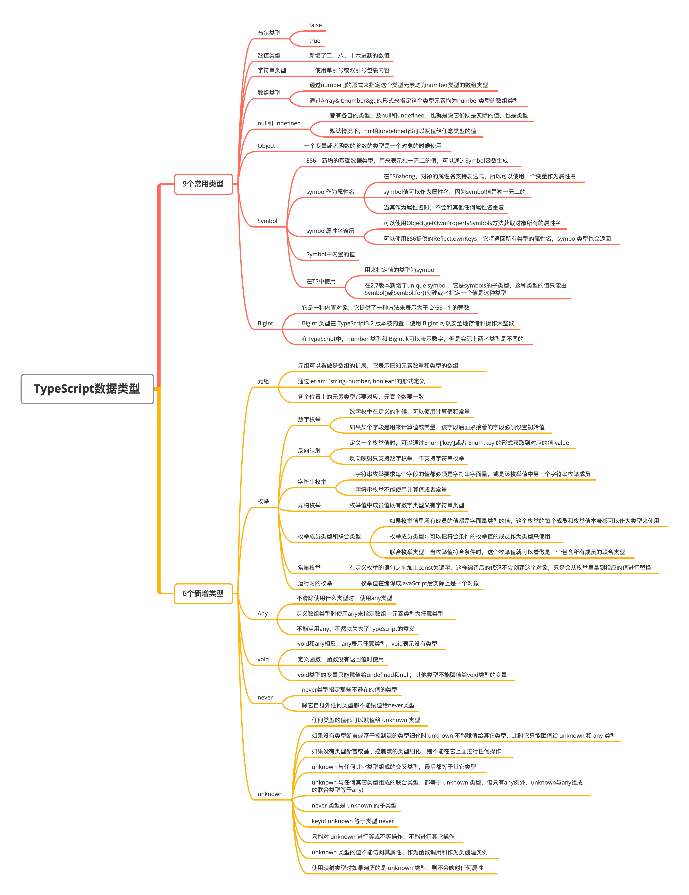
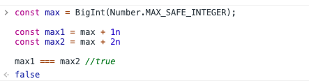

# TypeScript 数据类型

### 本文概览：



## 1. TypeScript的数据类型概述

### （1）常见的9种数据类型

目前TypeScript 支持的常见的数据类型：number、boolean、string、array、null、undefined、object、symbol、BigInt。这是JavaScript中现有的数据类型。


在TypeScript中，为变量指定类型的语法：“**变量:类型**”

```javascript
let num:number = 996
```

如果没有给这个变量指定数据类型，那么编译器就会根据赋给这个变量的值来判断这个变量的类型，比如上面的代码，如果给num赋值为一个字符串，编译器就会报错，因为它已经根据变量值996的类型将其设置为数字类型，当赋值其他类型数据时，就会报错。


需要注意**number**和**Number**的区别：TypeScript中指定类型的时候要用 number ，这个是TypeScript的类型关键字。而 Number 为JavaScript的原生构造函数，用它来创建数值类型的值，这两个是不一样的。包括**string**、**boolean**等都是TypeScript的类型关键字，不是JavaScript语法。


**1）数值类型**

TypeScript 和 JavaScript 一样，所有数字都是浮点数，所以只有一个 number 类型，而没有像C++中的 int 或 float 类型。而且 TypeScript 还支持 ES6 中新增的二进制和八进制数字字面量，所以 TypeScript 中共支持**二、八、十和十六**这4种进制的数值。

```javascript
let num: number;
num = 123;
num = "123";     // error 不能将类型"123"分配给类型"number"
num = 0b1111011; // 二进制的123
num = 0o173;     // 八进制的123
num = 0x7b;      // 十六进制的123
```

**2）字符串类型**

字符串类型可以使用单引号和双引号包裹内容，但是如果使用 Tslint 规则，会对引号进行检测，使用单引号还是双引号可以在 Tslint 规则里配置。还可以使用 ES6 语法——模板字符串，拼接变量和字符串会更为方便。

```javascript
let str: string = "Hello World";
str = "Hello TypeScript";
const first = "Hello";
const last = "TypeScript";
str = `${first} ${last}`;
console.log(str) // 打印结果为:Hello TypeScript
```

**3）布尔类型**

类型为布尔值类型的变量的值只能是true或者false。除此之外，赋值给布尔值的值也可以是一个计算之后是布尔值的表达式：

```javascript
let bool: boolean = false;
bool = true;

let bool: boolean = !!0
console.log(bool) // false
```

**4）数组类型**

在 TypeScript 中有两种定义数组的方式：

```
- 第一种形式通过 number[] 的形式来指定这个类型元素均为number类型的数组类型，推荐使用这种写法。
- 第二种形式通过 Array<number> 的形式来定义，使用这种形式定义时，tslint 可能会警告让我们使用第一种形式定义，可以通过在`tslint.json` 的 rules 中加入 "array-type":`false` 关闭 tslint 对这条的检测。
```

```javascript
let list1: number[] = [1, 2, 3];
let list2: Array<number> = [1, 2, 3];
```

注意，这两种写法中的 number 指定的是数组元素的类型，也可以在这里将数组的元素指定为其他任意类型。如果要指定一个数组里的元素既可以是数值也可以是字符串，那么可以使用这种方式： number|string[] 


**5）null和undefined**

在 JavaScript 中，undefined和 null 是两个基本数据类型。在 TypeScript 中，这两者都有各自的类型即 undefined 和 null，也就是说它们既是实际的值，也是类型。

```javascript
let u: undefined = undefined;
let n: null = null;
```

注意，第一行代码可能会报一个tslint的错误：`Unnecessary initialization to 'undefined'`，意思是不能给一个值赋undefined，但这是可以的，所以如果想让这种代码合理化，可以配置tslint，将"`no-unnecessary-initializer`"设为false即可。


默认情况下 undefined 和 null 可以赋值给任意类型的值，也就是说可以把 undefined 赋值给 void 类型，也可以赋值给 number 类型。当在 `tsconfig.json` 的"compilerOptions"里设置了 "strictNullChecks": true 时，那必须严格对待。undefined 和 null 将只能赋值给它们自身和 void 类型。


**6）Object**

在JavaScript中，Object是引用类型，Object类型变量的存的是引用。在TypeScript中，当想让一个变量或者函数的参数的类型是一个对象的形式时，可以使用这个类型：

```javascript
let obj: object
obj = { name: 'TypeScript' }
obj = 123   // error 不能将类型“123”分配给类型“object”
console.log(obj.name) // error 类型“object”上不存在属性“name”
```

可以看到，当给一个对象类型的变量赋值一个对象时，就会报错。对象类型更适合以下场景:

```javascript
function getKeys (obj: object) {
  return Object.keys(obj) // 会以列表的形式返回obj中的值
}
getKeys({ a: 'a' }) // ['a']
getKeys(123)        // error 类型“123”的参数不能赋给类型“object”的参数
```

**7）Symbol**

symbol 是 ES6 新增的一种基本数据类型，它和 number、string、boolean、undefined 和 null 是同类型的，object 是引用类型。它用来表示独一无二的值，可以通过 Symbol 函数生成。

```javascript
const s = Symbol(); 
typeof s; // 'symbol'
```

注意：Symbol 前面不能加 new关键字，直接调用即可创建一个独一无二的 symbol 类型的值。 


可以在使用 Symbol 方法创建 symbol 类型值的时候传入一个参数，这个参数需要是一个字符串。如果传入的参数不是字符串，会先自动调用传入参数的 toString 方法转为字符串：

```javascript
const s1 = Symbol("TypeScript"); 
const s2 = Symbol("Typescript"); 
console.log(s1 === s2); // false
```

上面代码的第三行可能会报一个错误：This condition will always return 'false' since the types 'unique symbol' and 'unique symbol' have no overlap. 这是因为编译器检测到这里的s1 === s2始终是false，所以编译器提醒这代码写的多余，建议进行优化。


上面使用Symbol创建了两个symbol对象，方法中都传入了相同的字符串，但是两个symbol值仍然是false，这就是说，Symbol 方法会返回一个独一无二的值，这个值和任何一个值都不等。Symbol 方法传入的这个字符串，就是方便在控制台或程序中用来区分 symbol 值的。可以调用 symbol 值的 toString 方法将它转为字符串： 

```javascript
const s1 = Symbol("Typescript"); 
console.log(s1.toString()); // 'Symbol(Typescript)'
console.log(Boolean(s));    // true 
console.log(!s);            // false
```

可以理解为 symbol 值是字符串类型的值，但是它和字符串有很大的区别，它不可以和其他类型的值进行运算，但是可以转为字符串和布尔类型值。


**8）BigInt**

BigInt是ES6中新引入的数据类型，它是一种内置对象，它提供了一种方法来表示大于 `253 - 1` 的整数。这原本是 Javascript中可以用 Number 表示的最大数字。BigInt可以表示任意大的整数。


`BigInt` 类型在 TypeScript3.2 版本被内置，使用 `BigInt` 可以安全地存储和操作大整数，即使这个数已经超出了JavaScript构造函数 `Number` 能够表示的安全整数范围。


在 JavaScript 中采用双精度浮点数，这导致精度有限，比如 `Number.MAX_SAFE_INTEGER` 给出了可以安全递增的最大可能整数，即`253 - 1`，来看一个案例:

```javascript
const max = Number.MAX_SAFE_INTEGER;
const max1 = max + 1
const max2 = max + 2
max1 === max2  //true
```

`max1`与`max2`居然相等？这就是超过精读范围造成的问题，而`BigInt`正是解决这类问题而生的:

```javascript
const max = BigInt(Number.MAX_SAFE_INTEGER);
const max1 = max + 1n
const max2 = max + 2n
max1 === max2 // false
```

这是在 Chrome 浏览器 console.log 的结果:



值得注意的是需要用 `BigInt(number)` 把 Number 转化为 `BigInt`，同时如果类型是 `BigInt` ，那么数字后面需要加 `n` ，就像上面例子的 `const max1 = max + 1n` 中的 `1n`。


在TypeScript中，`number` 类型虽然和 `BigInt` 都是有表示数字的意思，但是实际上两者类型是不同的:

```javascript
declare let foo: number;
declare let bar: bigint;
foo = bar; // error: Type 'bigint' is not assignable to type 'number'.
bar = foo; // error: Type 'number' is not assignable to type 'bigint'.
```

### （2）新增的6种数据类型

TypeScript中除了JavaScript中已有的八种数据类型，还提供了六种新的数据类型：元组、枚举、Any、void、never、unknown。


**1）元组**

元组可以看做是数组的扩展，它表示已知元素数量和类型的数组。确切的说，就是已知数组中每一个位置上的元素的类型，可以通过元组的索引为元素赋值：：

```javascript
let arr: [string, number, boolean];
arr = ["a", 2, false];
arr = [2, "a", false]; // error 不能将类型“number”分配给类型“string”。 不能将类型“string”分配给类型“number”。
arr = ["a", 2]; // error Property '2' is missing in type '[string, number]' but required in type '[string, number, boolean]'
arr[1] = 996
```

可以看到，定义的arr元组中，元素的个数和每个元素的数据类型都是确定的，当为arr赋值时，各个位置上的元素类型都要对应，元素个数也要一致。


当访问元组元素时，TypeScript也会对元素做类型检查，如果元素是一个字符串，那么它只能使用字符串方法，如果使用别的类型的方法，就会报错。


**在TypeScript 2.6及其之后的版本，TypeScript会对元组做越界判断。超出规定个数的元素称作越界元素，元素赋值必须类型和个数都对应，不能超出定义的元素个数。**


在 2.6 之后的版本，[string, number]元组类型的声明效果上可以看做等同于下面的声明：

```javascript
interface Tuple extends Array<number | string> { 
   0: string; 
   1: number;
   length: 2; 
}
```

上面这个声明中，定义了接口 Tuple ，它继承数组类型，并且数组元素的类型是 number 和 string 构成的联合类型，这样接口 Tuple 就拥有了数组类型所有的特性。并且指定索引为0的值为 string 类型，索引为1的值为 number 类型，同时指定 length 属性的类型字面量为 2，这样在指定一个类型为这个接口 Tuple 时，这个值必须是数组，而且如果元素个数超过2个时，它的length就不是2是大于2的数了，就不满足这个接口定义了，所以就会报错；当然，如果元素个数不够2个也会报错，因为索引为0或1的值缺失。


**2）枚举**

枚举类型在C++这种语言中是非常常见的，TypeScript 在 ES 原有类型基础上加入枚举类型，使我们在 TypeScript 中也可以给一组数值赋予名字，这样对开发者来说较为友好。枚举类型使用enum来定义：

```js
enum Roles {
  SUPER_ADMIN,
  ADMIN,
  USER
}
```

上面定义的枚举类型的Roles，它有三个值，TypeScript会为他们每个值分配编号，默认从0开始，在使用时，就可以使用名字而不需要记数字和名称的对应关系了：

```javascript
enum Roles {
  SUPER_ADMIN = 0,
  ADMIN = 1,
  USER = 2 
}

const superAdmin = Roles.SUPER_ADMIN;
console.log(superAdmin); // 0
console.log(Roles[1])    // ADMIN
```

除此之外，还可以修改这个数值，让SUPER_ADMIN = 1，这样后面的值就分别是2和3。当然还可以给每个值赋予不同的、不按顺序排列的值：

```javascript
enum Roles {
   SUPER_ADMIN = 1,
   ADMIN = 3,
   USER = 7 
}
```

**3）Any**

JavaScript是非常灵活的，有时在编写代码时，并不清楚一个值到底使用什么类型，这时就需要用到any类型，即任意类型，也就是说可以为变量赋值任何类型的值。除此之外，可以在定义数组类型时使用any来指定数组中的元素类型为任意类型：

```javascript
let value: any;
value = 123;
value = "abc";
value = false;

const array: any[] = [1, "a", true];
```

需要注意：不要滥用any类型，不然TypeScript的意义就不存在了。


**4）void**

void 和 any 相反，any 是表示任意类型，而 void 是表示没有任意类型，就是什么类型都不是。这在**定义函数，函数没有返回值时会用到**：

```javascript
const consoleText = (text: string): void => {
  console.log(text); 
};
```

需要注意：**void** 类型的变量只能赋值为 undefined 和 null ，其他类型不能赋值给 **void** 类型的变量。


**5）never**

never 类型指那些永不存在的值的类型，它是那些总会抛出异常或根本不会有返回值的函数表达式的返回值类型，当变量被永不为真的类型保护所约束时，该变量也是 never 类型。


下面的函数，总是会抛出异常，所以它的返回值类型是never，用来表明他的返回值是永不存在的。

```javascript
const errorFunc = (message: string): never => {
   throw new Error(message); 
};
```

never 类型是任何类型的子类型，所以它可以赋值给任何类型；而没有类型是 never 的子类型，所以除了它自身没有任何类型可以赋值给 never 类型，any 类型也不能赋值给 never 类型。

```javascript
let neverVariable = (() => {
   while (true) {} 
})();
neverVariable = 123; // error 不能将类型"number"分配给类型"never"   
```

上面代码定义了一个立即执行函数，也就是 "let neverVariable = " 右边的内容。右边的函数体内是一个死循环，所以这个函数调用后的返回值类型为 never，所以赋值之后neverVariable 的类型是 never 类型，当给neverVariable 赋值 123 时，就会报错，因为除它自身外任何类型都不能赋值给 never 类型。


**6）unknown**

unknown类型是TypeScript在3.0版本新增的类型，它表示未知的类型，看起来和any很像，但是还是有区别的，也就是所谓的“**unknown****相对于****any****是安全的**”。


对于any，来看一个例子：

```javascript
let value: any
console.log(value.name)
console.log(value.toFixed())
console.log(value.length)
```

上面这些语句都不会报错，因为value是any类型，所以后面三个操作都有合法的情况，当value是一个对象时，访问name属性是没问题的；当value是数值类型的时候，调用它的toFixed方法没问题；当value是字符串或数组时获取它的length属性是没问题的。


当指定值为unknown类型的时候，**如果没有通过基于控制流的类型断言来缩小范围的话，是不能对它进行任何操作的**。总之，unknown类型的值不是可以随便操作的。


关于 unknown 类型，有如下几点需要注意：

-  **任何类型的值都可以赋值给 unknown 类型：**

```javascript
let value1: unknown;
value1 = "a";
value1 = 123;
```

- **如果没有类型断言或基于控制流的类型细化时 unknown 不可以赋值给其它类型，此时它只能赋值给 unknown 和 any 类型：**

```javascript
let value2: unknown;
let value3: string = value2; // error 不能将类型“unknown”分配给类型“string”
value1 = value2;
```

- **如果没有类型断言或基于控制流的类型细化，则不能在它上面进行任何操作：**

```javascript
let value4: unknown;
value4 += 1; // error 对象的类型为 "unknown"
```

- **unknown 与任何其它类型组成的交叉类型，最后都等于其它类型：**

```javascript
type type1 = unknown & string; // type1 => string
type type2 = number & unknown; // type2 => number
type type3 = unknown & unknown; // type3 => unknown
type type4 = unknown & string[]; // type4 => string[]
```

- **unknown 与任何其它类型组成的联合类型，都等于 unknown 类型，但只有any例外，unknown与any组成的联合类型等于any)：**

```javascript
type type5 = string | unknown; // type5 => unknown
type type6 = any | unknown; // type6 => any
type type7 = number[] | unknown; // type7 => unknown
```

- **never 类型是 unknown 的子类型：**

```javascript
type type8 = never extends unknown ? true : false; // type8 => true
```

- **keyof unknown 等于类型 never：**

```javascript
type type9 = keyof unknown; // type9 => never
```

- **只能对 unknown 进行等或不等操作，不能进行其它操作：**

```javascript
value1 === value2;
value1 !== value2;
value1 += value2; // error
```

- **unknown 类型的值不能访问其属性、作为函数调用和作为类创建实例：**

```javascript
let value5: unknown;
value5.age; // error
value5(); // error
new value5(); // error
```

- **使用映射类型时如果遍历的是 unknown 类型，则不会映射任何属性：**

```javascript
type Types<T> = { [P in keyof T]: number };
type type10 = Types<any>; // type10 => { [x: string]: number }
type type11 = Types<unknown>; // type10 => {}
```

在实际使用中，如果有类型无法确定的情况，要尽量避免使用 any，因为 any 会丢失类型信息，一旦一个类型被指定为 any，那么在它上面进行任何操作都是合法的，所以会有意想不到的情况发生。因此如果遇到无法确定类型的情况，要先考虑使用 unknown。

## 2. 详解symbol类型

上面对symbol进行了简单的介绍，下面来详细介绍一下symbol相关的方法和值。

### （1）symbol 作为属性名

在ES6中，对象的属性是支持表表达式的，可以使用于一个变量来作为属性名，这对于代码的简化有很多用处，表达式必须放在大括号内：

```javascript
let prop = "name"; 
const obj = { 
  [prop]: "TypeScript" 
};
console.log(obj.name); // 'TypeScript'
```

symbol也是可以作为属性名的，因为symbol的值是独一无二的，所以当它作为属性名时，不会与其他任何属性名重复，可以想访问这个属性，只能使用这个这个symbol值来访问（必须使用方括号来访问）：

```javascript
let name = Symbol(); 
let obj = { 
  [name]: "TypeScript" 
};
console.log(obj); // { Symbol(): 'TypeScript' }

console.log(obj[name]); // 'TypeScript' 
console.log(obj.name);  // undefined
```

在使用obj.name访问时，实际上是字符串'name'，这和访问普通字符串类型的属性名是一样的，要想访问属性名为symbol类型的属性时，必须使用方括号。方括号中的name才是我们定义的symbol类型的变量name。

### （2）symbol 属性名遍历

使用 Symbol 类型值作为属性名，这个属性不会被 for…in遍历到，也不会被 Object.keys() 、 Object.getOwnPropertyNames() 、 JSON.stringify() 获取到： 

```javascript
const name = Symbol("name"); 
const obj = { 
  [name]: "TypeScript", 
  age: 18 
};
for (const key in obj) { 
  console.log(key); 
}  
// => 'age' 
console.log(Object.keys(obj));  // ['age'] 
console.log(Object.getOwnPropertyNames(obj));  // ['age'] 
console.log(JSON.stringify(obj)); // '{ "age": 18 }
```

虽然这些方法都不能访问到Symbol类型的属性名，但是Symbol类型的属性并不是私有属性，可以使用 Object.getOwnPropertySymbols 方法获取对象的所有symbol类型的属性名： 

```javascript
const name = Symbol("name"); 
const obj = { 
  [name]: "TypeScript", 
  age: 18 
};
const SymbolPropNames = Object.getOwnPropertySymbols(obj); 
console.log(SymbolPropNames); // [ Symbol(name) ] 
console.log(obj[SymbolPropNames[0]]); // 'TypeScript' 
```

除了这个方法，还可以使用ES6提供的Reflect 对象的静态方法 Reflect.ownKeys ，它可以返回所有类型的属性名，Symbol 类型的也会返回：

```javascript
const name = Symbol("name"); 
const obj = { 
  [name]: "TypeScript", 
  age: 18 
};
console.log(Reflect.ownKeys(obj)); // [ 'age', Symbol(name) ]
```

### （3）symbol 静态方法

Symbol 包含两个静态方法， for 和 keyFor 。


**1）Symbol.for()**

用Symbol创建的symbol类型的值都是独一无二的，每个值都与其他任何值不相等。即使传入相同的字符串参数，创建出来的symbol的值也是不相等的。使用 Symbol.for 方法传入字符串，会先检查有没有使用该字符串调用 Symbol.for 方法创建的 symbol 值，如果有，返回该值，如果没有，则使用该字符串新创建一个。**使用该方法创建 symbol 值后会在全局范围进行注册。**

```javascript
const iframe = document.createElement("iframe"); 
iframe.src = String(window.location); 
document.body.appendChild(iframe); 

iframe.contentWindow.Symbol.for("TypeScript") === Symbol.for("TypeScript"); // true // 注意：如果你在JavaScript环境中这段代码是没有问题的，但是如果在TypeScript开发环境中，可能会报错：类型“Window”上不存在属性“Symbol”。 // 因为这里编译器推断出iframe.contentWindow是Window类型，但是TypeScript的声明文件中，对Window的定义缺少Symbol这个字段，所以会报错，
```

上面代码中，创建了一个iframe节点并把它放在body中，通过这个 iframe 对象的 contentWindow 拿到这个 iframe 的 window 对象，在 iframe.contentWindow上添加一个值就相当于在当前页面定义一个全局变量一样，可以看到，在 iframe 中定义的键为'TypeScript'的 symbol 值在和在当前页面定义的键为'TypeScript'的symbol 值相等，说明它们是同一个值。 


**2）****Symbol.keyFor()** 

该方法传入一个 symbol 值，返回该值在全局注册的键名：

```javascript
const sym = Symbol.for("TypeScript"); 
console.log(Symbol.keyFor(sym)); // 'TypeScript'
```

### （4）symbol 内置值

ES6 提供了 11 个内置的 Symbol 值，指向 JS 内部使用的属性和方法。看到它们第一眼你可能会有疑惑，这些不是 Symbol 对象的一个属性值吗？没错，这些内置的 Symbol 值就是保存在 Symbol 上的，可以把`Symbol.xxx`看做一个 symbol 值。


**1）Symbol.hasInstance**

对象的 Symbol.hasInstance 指向一个内部方法，当给一个对象设置以 Symbol.hasInstance 为属性名的方法后，当其他对象使用 instanceof 判断是否为这个对象的实例时，会调用你定义的这个方法，参数是其他的这个对象，来看例子：

```javascript
const obj = {
  [Symbol.hasInstance](otherObj) {
    console.log(otherObj);
  }
};
console.log({ a: "a" } instanceof obj); // false
// 注意：在TypeScript中这会报错，"instanceof" 表达式的右侧必须属于类型 "any"，或属于可分配给 "Function" 接口类型的类型。
// 是要求你instanceof操作符右侧的值只能是构造函数或者类，或者类型是any类型。这里你可以使用类型断言，将obj改为obj as any
```

可以看到当使用 instanceof 判断{ a: 'a' }是否是 obj 创建的实例的时候，Symbol.hasInstance 这个方法被调用了。


**2）Symbol.isConcatSpreadable**

这个值是一个可读写布尔值，当一个数组的 Symbol.isConcatSpreadable 设为 true 时，这个数组在数组的 concat 方法中不会被扁平化：

```javascript
let arr = [1, 2];
console.log([].concat(arr, [3, 4])); // 打印结果为[1, 2, 3, 4]，length为4
let arr1 = ["a", "b"];
console.log(arr1[Symbol.isConcatSpreadable]); // undefined
arr1[Symbol.isConcatSpreadable] = false;
console.log(arr1[Symbol.isConcatSpreadable]); // false
console.log([].concat(arr1, [3, 4])); // 打印结果如下：
/*
 [ ["a", "b", Symbol(Symbol.isConcatSpreadable): false], 3, 4 ]
 最外层这个数组有三个元素，第一个是一个数组，因为我们设置了arr1[Symbol.isConcatSpreadable] = false
 所以第一个这个数组没有被扁平化，第一个元素这个数组看似是有三个元素，但你在控制台可以看到这个数组的length为2
 Symbol(Symbol.isConcatSpreadable): false不是他的元素，而是他的属性，我们知道数组也是对象，所以我们可以给数组设置属性
 你可以试试如下代码，然后看下打印出来的效果：
  let arr = [1, 2]
  arr.props = 'value'
  console.log(arr)
 */
```

**(3) Symbol.species**

这里需要在纯JavaScript的开发环境中才能看出效果，可以在浏览器开发者工具的控制台尝试。在TypeScript中，下面两个例子都是一样的会报a.getName is not a function错误。首先使用 class 定义一个类 C，使用 extends 继承原生构造函数 Array，那么类 C 创建的实例就能继承所有 Array 原型对象上的方法，比如 map、filter 等：

```javascript
’class C extends Array {
  getName() {
    return "TypeScript";
  }
}
const c = new C(1, 2, 3);
const a = c.map(item => item + 1);
console.log(a); // [2, 3, 4]
console.log(a instanceof C); // true
console.log(a instanceof Array); // true
console.log(a.getName()); // "TypeScript"
```

这个例子中，a 是由 c 通过 map 方法衍生出来的，可以看到，a 既是 C 的实例，也是 Array 的实例。但是如果只让衍生的数组是 Array 的实例，就需要用 Symbol.species：

```javascript
class C extends Array {
  static get [Symbol.species]() {
    return Array;
  }
  getName() {
    return "TypeScript";
  }
}
const c = new C(1, 2, 3);
const a = c.map(item => item + 1);
console.log(a); // [2, 3, 4]
console.log(a instanceof C); // false
console.log(a instanceof Array); // true
console.log(a.getName()); // error a.getName is not a function
```

就是给类 C 定义一个静态 get 存取器方法，方法名为 Symbol.species，然后在这个方法中返回要构造衍生数组的构造函数。所以最后看到，`a instanceof C`为 false，也就是 a 不再是 C 的实例，也无法调用继承自 C 的方法。


**4）Symbol.match、Symbol.replace、Symbol.search 和 Symbol.split**

这个 Symbol.match 值指向一个内部方法，当在字符串 str 上调用 match 方法时，会调用这个方法：

```javascript
let obj = {
  [Symbol.match](string) {
    return string.length;
  }
};
console.log("abcde".match(obj)); // 5
```

相同的还有 Symbol.replace、Symbol.search 和 Symbol.split，使用方法和 Symbol.match 是一样的。


**5）Symbol.iterator**

数组的 Symbol.iterator 属性指向该数组的默认遍历器方法：

```javascript
const arr = [1, 2, 3];
const iterator = arr[Symbol.iterator]();
console.log(iterator);
console.log(iterator.next());
console.log(iterator.next());
console.log(iterator.next());
console.log(iterator.next());
```

这个 Symbol.iterator 方法是可写的，我们可以自定义遍历器方法。


**6）Symbol.toPrimitive**

对象的这个属性指向一个方法，当这个对象被转为原始类型值时会调用这个方法，这个方法有一个参数，是这个对象被转为的类型：

```javascript
let obj = {
  [Symbol.toPrimitive](type) {
    console.log(type);
  }
};
// const b = obj++ // number
const a = `abc${obj}`; // string
```

**7）Symbol.toStringTag**

Symbol.toStringTag 和 Symbol.toPrimitive 相似，对象的这个属性的值可以是一个字符串，也可以是一个存取器 get 方法，当在对象上调用 toString 方法时调用这个方法，返回值将作为"[object xxx]"中 xxx 这个值：

```javascript
let obj = {
  [Symbol.toStringTag]: "TypeScript"
};
obj.toString(); // "[object TypeScript]"
let obj2 = {
  get [Symbol.toStringTag]() {
    return "haha";
  }
};
obj2.toString(); // "[object haha]"
```

**8）Symbol.unscopables**

这个值和 with 命令有关，先来看下 with 怎么使用：

```javascript
const obj = {
  a: "a",
  b: "b"
};
with (obj) {
  console.log(a); // "a"
  console.log(b); // "b"
}
// 如果是在TypeScript开发环境中，这段代码可能with会报错：不支持 "with" 语句，这是因为在严格模式下，是不允许使用with的。
```

可以看到，使用 with 传入一个对象后，在代码块中访问对象的属性就不需要写对象了，直接就可以用它的属性。对象的 Symbol.unscopables 属性指向一个对象，该对象包含了当使用 with 关键字时，哪些属性被 with 环境过滤掉：

```javascript
console.log(Array.prototype[Symbol.unscopables]);
/*
{
    copyWithin: true
    entries: true
    fill: true
    find: true
    findIndex: true
    includes: true
    keys: true
    values: true
}
*/
```

### （5）在TypeScript中使用symbol

在TypeScript中使用symbol主要就是指定一个值的类型为symbol类型：

```javascript
let a: symbol = Symbol()
```

TypeScript在2.7版本对Symbol做了补充，增加了**unique symbol**这种类型，它是symbols的子类型，这种类型的值只能由`Symbol()`或`Symbol.for()`创建，或者通过指定类型来指定一个值是这种类型。这种类型的值仅可用于常量的定义和用于属性名。另外需要注意，定义unique symbol类型的值，必须用const不能用let。来看个在TypeScript中使用Symbol值作为属性名的例子：

```javascript
const key1: unique symbol = Symbol()
let key2: symbol = Symbol()
const obj = {
    [key1]: 'value1',
    [key2]: 'value2'
}
console.log(obj[key1])
console.log(obj[key2]) // error 类型“symbol”不能作为索引类型使用。
```

## 3. 详解枚举类型

枚举类型是TypeScript中新增的一种数据类型，它在C++的语言中是非常常见的，但是JavaScript中却没有，使用枚举，可以给一些难以理解的常量赋予一组具有意义的直观的名字，使其更为直观，可以理解枚举就是一个字典。枚举使用 enum 关键字定义，TypeScript 支持数字和字符串的枚举。

### （1）数字枚举

在上面已经简单介绍了数字枚举：

```javascript
// 修改起始编号
enum Color {
  Red = 2,
  Blue,
  Yellow
}
console.log(Color.Red, Color.Blue, Color.Yellow); // 2 3 4
// 指定任意字段的索引值
enum Status {
  Success = 200,
  NotFound = 404,
  Error = 500
}
console.log(Status.Success, Status.NotFound, Status.Error); // 200 404 500
// 指定部分字段，其他使用默认递增索引
enum Status {
  Ok = 200,
  Created,
  Accepted,
  BadRequest = 400,
  Unauthorized
}
console.log(Status.Created, Status.Accepted, Status.Unauthorized); // 201 202 401
```

可以对一个字段指定一个索引值，那他后面没有指定索引值的就会依次加一。还可以给每个字段指定不连续的任意索引值。


数字枚举在定义值时，可以使用计算值和常量。但是要注意，如果某个字段使用了计算值或常量，那么该字段后面紧接着的字段必须设置初始值，这里不能使用默认的递增值了，来看例子：

```javascript
const getValue = () => {
  return 0;
};
enum ErrorIndex {
  a = getValue(),
  b, // error 枚举成员必须具有初始化的值
  c
}
enum RightIndex {
  a = getValue(),
  b = 1,
  c
}
const Start = 1;
enum Index {
  a = Start,
  b, // error 枚举成员必须具有初始化的值
  c
}
```

### （2）反向映射

定义一个枚举值的时候，可以通过 Enum[‘key’]或者 Enum.key 的形式获取到对应的值 value。TypeScript 还支持反向映射，但是反向映射只支持数字枚举，字符串枚举是不支持的。反向映射的例子：

```javascript
enum Status {
  Success = 200,
  NotFound = 404,
  Error = 500
}
console.log(Status["Success"]); // 200
console.log(Status[200]); // 'Success'
console.log(Status[Status["Success"]]); // 'Success'
```

TypeScript 中定义的枚举，编译之后其实是对象，我们来看下上面这个例子中的枚举值 Status 编译后的样子：

```javascript
{
    200: "Success",
    404: "NotFound",
    500: "Error",
    Error: 500,
    NotFound: 404,
    Success: 200
}
```

可以看到，TypeScript 会把定义的枚举值的字段名分别作为对象的属性名和属性值，把枚举值的字段值分别作为对象的属性值和属性名，同时添加到对象中。这样既可以通过枚举值的字段名得到值，也可以通过枚举值的值得到字段名。

### （3）字符串枚举

TypeScript2.4 版本新增了字符串枚举，字符串枚举值要求**每个字段的值都必须是字符串字面量****，或者是该枚举值中另一个字符串枚举成员**：

```javascript
// 使用字符串字面量
enum Message {
  Error = "Sorry, error",
  Success = "Hoho, success"
}
console.log(Message.Error); // 'Sorry, error'

// 使用枚举值中其他枚举成员
enum Message {
  Error = "error message",
  ServerError = Error,
  ClientError = Error
}
console.log(Message.Error); // 'error message'
console.log(Message.ServerError); // 'error message'
```

注意，这里的其他枚举成员指的是同一个枚举值中的枚举成员，因为字符串枚举不能使用常量或者计算值，所以也不能使用其他枚举值中的成员。

### （4）异构枚举

简单来说异构枚举就是枚举值中成员值既有数字类型又有字符串类型，如下：

```javascript
enum Result {
  Faild = 0,
  Success = "Success"
}
```

不建议使用。因为往往将一类值整理为一个枚举值时，它们的特点是相似的。比如在做接口请求时的返回状态码，如果是状态码都是数值，如果是提示信息，都是字符串，所以在使用枚举的时候，往往是可以避免使用异构枚举的，重点是做好类型的整理。

### （5）枚举成员类型和联合枚举类型

如果枚举值里所有成员的值都是字面量类型的值，那么这个枚举的每个成员和枚举值本身都可以作为类型来使用，满足条件的枚举成员的值有以下三种：

- 不带初始值的枚举成员，例如：`enum E { A }`
- 值为字符串字面量，例如：`enum E { A = ‘a’ }`

- 值为数值字面量，或者带有`-`符号的数值字面量，例如：`enum E { A = 1 }`、`enum E { A = -1 }`


当枚举值的所有成员的值都是上面这三种情况的时候，枚举值和成员就可以作为类型来用：

- **枚举成员类型：**把符合条件的枚举值的成员作为类型来使用：

```javascript
enum Animal {
  Dog = 1,
  Cat = 2
}
interface Dog {
  type: Animal.Dog; // 这里使用Animal.Dog作为类型，指定接口Dog的必须有一个type字段，且类型为Animal.Dog
}
interface Cat {
  type: Animal.Cat; // 这里同上
}
let cat1: Cat = {
  type: Animal.Dog // error [ts] 不能将类型“Animal.Dog”分配给类型“Animal.Cat”
};
let dog: Dog = {
  type: Animal.Dog
};
```

- **联合枚举类型：**当枚举值符合条件时，这个枚举值就可以看做是一个包含所有成员的联合类型：

```javascript
enum Status {
  Off,
  On
}
interface Light {
  status: Status;
}
enum Animal {
  Dog = 1,
  Cat = 2
}
const light1: Light = {
  status: Animal.Dog // error 不能将类型“Animal.Dog”分配给类型“Status”
};
const light2: Light = {
  status: Status.Off
};
const light3: Light = {
  status: Status.On
};
```

上面例子定义接口 Light 的 status 字段的类型为枚举值 Status，那么此时 status 的属性值必须为 Status.Off 和 Status.On 中的一个，也就是相当于`status: Status.Off | Status.On`。

### （6）运行时的枚举

枚举在编译成 JavaScript 之后实际是一个对象。既然是对象，那么就可以当成对象来使用：

```javascript
enum E {
  A,
  B
}
const getIndex = (enumObj: { A: number }): number => {
  return enumObj.A;
};
console.log(getIndex(E)); // 0
```

上面这个例子要求 getIndex 的参数为一个对象，且必须包含一个属性名为'A'的属性，其值为数值类型，只要有这个属性即可。当我们调用这个函数，把枚举值 E 作为实参传入是可以的，因为它在运行的时候是一个对象，包含'A'这个属性，因为它在运行的时候相当于下面这个对象：

```javascript
{
    0: "A",
    1: "B",
    A: 0,
    B: 1
}
```

### （7）常量枚举

定义了枚举值之后，编译成 JavaScript 的代码会创建一个对应的对象，这个对象可以在程序运行时使用。但是如果使用枚举只是为了让程序可读性好，并不需要编译后的对象呢？这样会增加一些编译后的代码量。所以 TypeScript 在 1.4 新增 const enum(常量枚举)，在定义枚举的语句之前加上`const`关键字，这样编译后的代码不会创建这个对象，只是会从枚举里拿到相应的值进行替换：

```javascript
enum Status {
  Off,
  On
}
const enum Animal {
  Dog,
  Cat
}
const status = Status.On;
const animal = Animal.Dog;
```

上面的代码编译成 JavaScript 之后是这样的：

```javascript
var Status;
(function(Status) {
  Status[(Status["Off"] = 0)] = "Off";
  Status[(Status["On"] = 1)] = "On";
})(Status || (Status = {}));
var status = Status.On;
var animal = 0; // Dog 
```

对于 Status 的处理，先是定义一个变量 Status，然后定义一个立即执行函数，在函数内给 Status 添加对应属性，首先`Status[“Off”] = 0`是给`Status`对象设置`Off`属性，并且值设为 0，这个赋值表达式的返回值是等号右边的值，也就是 0，所以`Status[Status[“Off”] = 0] = "Off"`相当于`Status[0] = “Off”`。创建了这个对象之后，将 Status 的 On 属性值赋值给 status；再来看下 animal 的处理，编译后的代码并没有像`Status`创建一个`Animal`对象，而是直接把`Animal.Dog`的值`0`替换到了`const animal = Animal.Dog`表达式的`Animal.Dog`位置，这就是**const enum**的用法了。