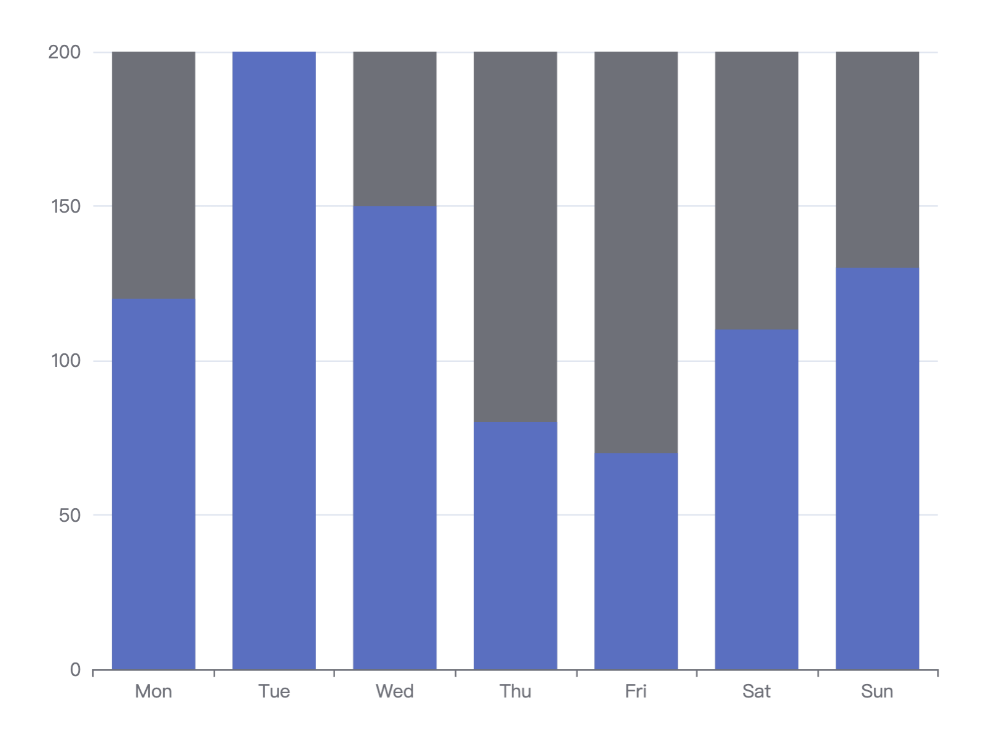
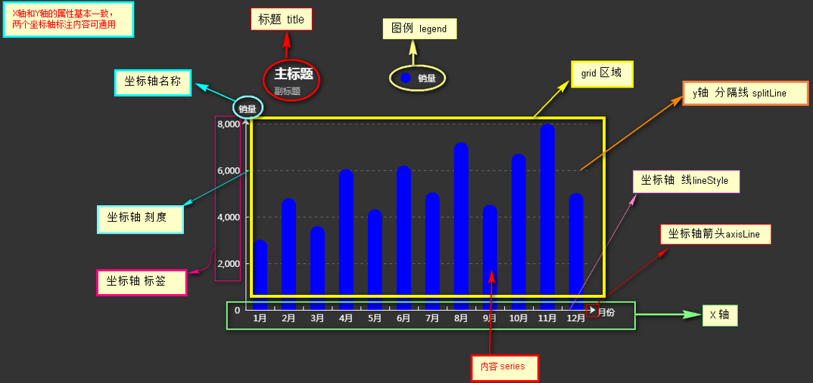
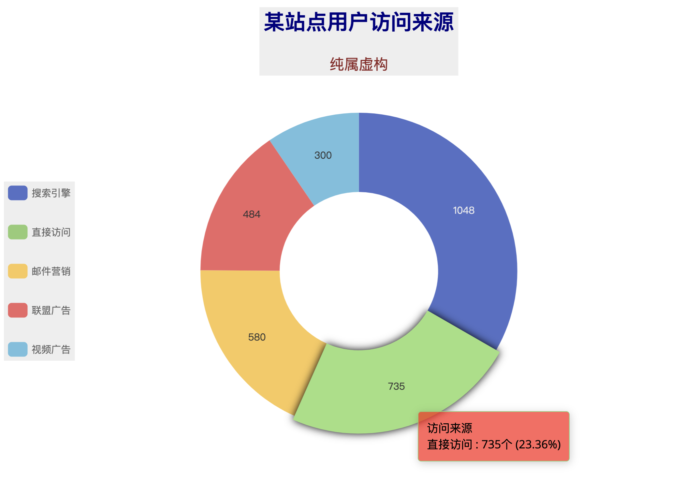
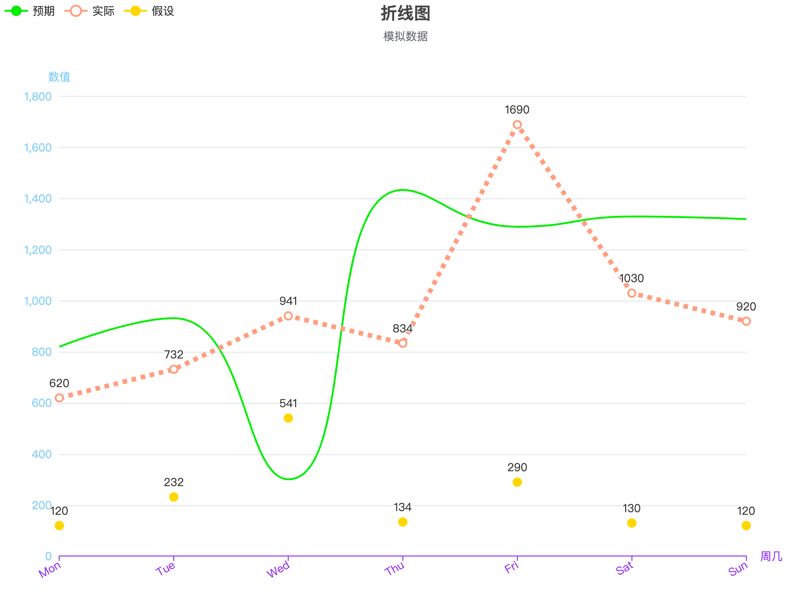

# Echarts基础配置

## 1. Echarts 简介

Echarts 是一个开源的、免费的、成熟的、商业级图表可视化框架，是 Apache 开源社区的顶级项目之一，也是国内使用最多和最为广泛的可视化图表框架之一。 数据可视化图表框架并没有一个统一的行业标准，比较常见的有 D3、Highcharts 等，Echarts 因其图表丰富、主题多样美观大方、开源免费、文档资料健全，逐渐成为国内用户的首选，是事实上的行业标准。


Echarts 的特性，从实践者的视角而言，主要体现在图表类型、主题样式、源码开源、文档教程和技术社区这五个方面。

- **图表类型丰富**：ECharts 提供了常规的折线图、柱状图、散点图、饼图、K 线图，用于统计的盒形图，用于地理数据可视化的地图、热力图、线图，用于关系数据可视化的关系图、旭日图，多维数据可视化的平行坐标，还有用于 BI 的漏斗图，仪表盘。Echarts 支持几乎所有的主流图表，并且支持图与图之间的混搭。图表类型的丰富程度，代表了图表可视化呈现能力的强弱，在这一点上，Echarts 表现得十分优异。
- **主题样式美观**：Echarts 提供了丰富的图表主题样式，并且提供了主题样式的定制和拓展能力。默认情况下，Echarts 支持两种主题：light 和 dark，其他样式需要手动下载，在配置后方可使用。

- **源码开源免费**：Echarts 遵循开源协议 Apache 2.0，可以免费应用到商业场景。这也是 Echarts 得到广泛应用的一个主要原因。
- **文档教程完备**：Echarts 具有丰富的用户文档资源，包括教程、案例等，这些文档可以有效地降低使用者的学习门槛。

- **技术社区活跃**：一个开源项目的技术社区活跃程度，一方面代表该项目的受欢迎程度，另一方面则代表该项目的生存状态。Echarts 的技术社区具有非常高的社区活跃度，说明 Echarts 项目欣欣向荣。

## 2. Echarts 导入

使用 Echarts 图表组件库之前，需要引入对应的 JavaScript 库文件。文件的引入方式有本地引入和远程引入。本地引入是需要把 Echarts 库文件下载到本地服务器，具体的引入方式如下所示：

```js
<!DOCTYPE html>
<html>
<head>
    <meta charset="utf-8">
    <!-- 引入 ECharts 文件 -->
    <script src="echarts.min.js"></script>
</head>
</html>
```

采用本地方式引入 Echarts 文件的时候，需要注意文件目录，必须与 echarts.min.js 实际所在的位置保持一致。


看完本地引入后，再来看看远程引入。远程引入是通过网络方式，引入第三方提供的 Echarts 文件，用得最多的就是由百度提供 Echarts 库文件，具体的引入方式如下所示：

```js
<head>
  <meta charset="utf-8">
  <!-- 引入 echarts.js -->
  <script src="https://echarts.baidu.com/dist/echarts.min.js">          </script>
</head>
```

以上介绍了 Echarts 文件引入的方式，这类引入方式属于标准的 JavaScript 库文件引入，差异只在于引入的目标文件和路径不同。

## 3. Echarts 案例

Echarts 图表开发的过程主要分为四个步骤：Echarts 文件引入、HTML DOM 对象声明、图表对象初始化和参数设置。先来看一下案例运行之后的效果，然后再逐步拆解，还原过程。下图是一个柱状图的 Echarts 呈现效果：



要想实现以上的柱状图，首先需要在源码中，引入 Echarts 库文件，具体的代码如下所示：

```js
<head>
  <meta charset="utf-8">
  <!-- 引入 echarts.js -->
  <script src="https://cdn.staticfile.org/echarts/4.3.0/echarts.min.js"></script>
</head>
```

引入文件完成以后，就可以使用 Echarts 图表组件里面定义的图表对象了，接下来，需要定义一个 HTML DOM 对象，用来作为 Echarts 图表元素的容器，源码如下所示：

```js
<div id="container" style="height: 100%"></div>
```

对象声明就是声明一个带有 ID 属性的占位符 DIV，占位符名称为："container"，并且赋予了一个高度属性。接下来，我们需要完成的工作是**Echarts 对象绑定**，绑定的代码如下所示：

```js
var dom = document.getElementById("container");
```

上述代码，实现了页面元素"container" 与 JavaScript 变量 dom 之间的关系绑定，完成对象绑定后，对于变量操作，可以直接作用到对应的页面对象上，接下来要做的，就是 Echarts 的参数配置，这一步包括图表对象初始化和参数设置，两部分内容，具体的代码如下所示：

```js
<script type="text/javascript">
  var dom = document.getElementById("container");
  var myChart = echarts.init(dom);
  var app = {};
  option = null;
  option = {
      xAxis: {
          type: 'category',
          data: ['Mon', 'Tue', 'Wed', 'Thu', 'Fri', 'Sat', 'Sun']
      },
      yAxis: {
          type: 'value'
      },
      series: [{
          data: [120, 200, 150, 80, 70, 110, 130],
          type: 'bar',
          showBackground: true,
          backgroundStyle: {
              color: 'rgba(220, 220, 220, 0.8)'
          }
      }]
  };
  ;
  if (option && typeof option === "object") {
      myChart.setOption(option, true);
  }
</script>
```

上图中，首先声明了一个变量 dom，完成页面元素与 Javascript 变量之间的关联，然后创建一个 Echarts 图表对象 myChart，并进行初始化。接下来进行 myChart 图表对象的参数设置，其中 option 是图表的参数对象，其中 xAxis、yAxis 代表坐标轴 x 和 y 轴的设置，series 代表的是图表的数值系列。此处为了简化程序的复杂度，把 option 属性参数写成了固定内容，实际工作中，需要根据业务需求进行数据内容的替换。配置完成 option 参数之后，myChart 对象需要执行一次设置操作 setOption，一个完整的配置过程就结束了。


通过以上的操作，就完成了一个 Echarts 基本的图表对象的创建工作，通过浏览器就可以直接预览图表内容。该文件完整的代码结构如下所示：

```js
<!DOCTYPE html>
<html style="height: 100%">
   <head>
       <meta charset="utf-8">
       <!-- 引入 echarts.js -->
       <script src="https://cdn.staticfile.org/echarts/4.3.0/echarts.min.js"></script>
   </head>
  
   <body style="height: 100%; margin: 0">
       <div id="container" style="height: 100%"></div>
     
       <script type="text/javascript">
        var dom = document.getElementById("container");
        var myChart = echarts.init(dom);
        var app = {};
        option = null;
        option = {
            xAxis: {
                type: 'category',
                data: ['Mon', 'Tue', 'Wed', 'Thu', 'Fri', 'Sat', 'Sun']
            },
            yAxis: {
                type: 'value'
            },
            series: [{
                data: [120, 200, 150, 80, 70, 110, 130],
                type: 'bar',
                showBackground: true,
                backgroundStyle: {
                    color: 'rgba(220, 220, 220, 0.8)'
                }
            }]
        };
         
        if (option && typeof option === "object") {
            myChart.setOption(option, true);
        }
       </script>
   </body>
</html>
```

## 4. Options 配置

在开发过程中，我们可能需要UI给的设计图来配置，这时我们就需要配置option配置项，官网上也有详细的配置项，这里来总结一下**柱形图**和**饼状图**常用的配置项。


### （1）柱形图配置项



```js
// 指定图表的配置项和数据
var option = {
  // ----  标题 -----
  title: {
    text: '主标题',
    textStyle: {
      color: 'red'
    },
    subtext: '副标题',
    subtextStyle: {
      color: 'blue'
    },
    padding: [0, 0, 10, 100]  // 位置
  },
  // ---- legend ----
  legend: {
    type: 'plain',  // 图列类型，默认为 'plain'
    top: '1%',  // 图列相对容器的位置 top\bottom\left\right
    selected: {
      // '销量': true  // 图列选择，图形加载出来会显示选择的图列，默认为true
    },
    textStyle: {  // 图列内容样式
      color: '#fff',  // 字体颜色
      backgroundColor: 'black'  // 字体背景色
    },
    tooltip: {  // 图列提示框，默认不显示
      show: true,
      color: 'red'  
    },
    data: [   // 图列内容
      {
        name: '销量',
        icon: 'circle',
        textStyle: {
          color: 'red',  // 单独设置某一个图列的颜色
          backgroundColor: '#fff' // 单独设置某一个图列的字体背景色
        }
      }
    ]
  },
  // ---  提示框 ----
  tooltip: {
    show: true,   // 是否显示提示框，默认为true
    trigger: 'item', // 数据项图形触发
    axisPointer: {   // 指示样式
      type: 'shadow',
      axis: 'auto'
    },
    padding: 5,
    textStyle: {   // 提示框内容的样式
      color: '#fff'  
    }
  },
  // ---- gird区域 ---
  gird: {
    show: false,    // 是否显示直角坐标系网格
    top: 80,  // 相对位置 top\bottom\left\right
    containLabel: false, // gird 区域是否包含坐标轴的刻度标签
    tooltip: {
      show: true,
      trigger: 'item',   // 触发类型
      textStyle: {
        color: '#666'
      }
    }
  },
  //  ------  X轴 ------
  xAxis: {
    show: true,  // 是否显示
    position: 'bottom',  // x轴的位置
    offset: 0, // x轴相对于默认位置的偏移
    type: 'category',   // 轴类型， 默认为 'category'
    name: '月份',    // 轴名称
    nameLocation: 'end',  // 轴名称相对位置
    nameTextStyle: {   // 坐标轴名称样式
      color: 'red',
      padding: [5, 0, 0, -5]
    },
    nameGap: 15, // 坐标轴名称与轴线之间的距离
    nameRotate: 0,  // 坐标轴名字旋转
    axisLine: {       // 坐标轴 轴线
      show: true,  // 是否显示
      symbol: ['none', 'arrow'],  // 是否显示轴线箭头
      symbolSize: [8, 8], // 箭头大小
      symbolOffset: [0, 7],  // 箭头位置
      // ------   线 ---------
      lineStyle: {
        color: 'blue',
        width: 1,
        type: 'solid'
      }
    },
    axisTick: {    // 坐标轴 刻度
      show: true,  // 是否显示
      inside: true,  // 是否朝内
      length: 3,     // 长度
      lineStyle: {   // 默认取轴线的样式
        color: 'red',
        width: 1,
        type: 'solid'
      }
    },
    axisLabel: {    // 坐标轴标签
      show: true,  // 是否显示
      inside: false, // 是否朝内
      rotate: 0, // 旋转角度
      margin: 5, // 刻度标签与轴线之间的距离
      color: 'red'  // 默认取轴线的颜色 
    },
    splitLine: {    // gird区域中的分割线
      show: false,  // 是否显示
      lineStyle: {
        // color: 'red',
        // width: 1,
        // type: 'solid'
      }
    },
    splitArea: {    // 网格区域
      show: false  // 是否显示，默认为false
    },
    data: ['1月', '2月', '3月', '4月', '5月', '6月', '7月', '8月', '9月', '10月', '11月', '12月']
  },
  //   ------   y轴  ----------
  yAxis: {
    show: true,  // 是否显示
    position: 'left', // y轴位置
    offset: 0, // y轴相对于默认位置的偏移
    type: 'value',  // 轴类型，默认为 ‘category’
    name: '销量',   // 轴名称
    nameLocation: 'end', // 轴名称相对位置value
    nameTextStyle: {    // 坐标轴名称样式
      color: '#fff',
      padding: [5, 0, 0, 5]  // 坐标轴名称相对位置
    },
    nameGap: 15, // 坐标轴名称与轴线之间的距离
    nameRotate: 270,  // 坐标轴名字旋转

    axisLine: {    // 坐标轴 轴线
      show: true,  // 是否显示
      //  -----   箭头 -----
      symbol: ['none', 'arrow'],  // 是否显示轴线箭头
      symbolSize: [8, 8],  // 箭头大小
      symbolOffset: [0, 7], // 箭头位置

      // ----- 线 -------
      lineStyle: {
        color: 'blue',
        width: 1,
        type: 'solid'
      }
    },
    axisTick: {      // 坐标轴的刻度
      show: true,    // 是否显示
      inside: true,  // 是否朝内
      length: 3,      // 长度
      lineStyle: {
        color: 'red',  // 默认取轴线的颜色
        width: 1,
        type: 'solid'
      }
    },
    axisLabel: {      // 坐标轴的标签
      show: true,    // 是否显示
      inside: false,  // 是否朝内
      rotate: 0,     // 旋转角度
      margin: 8,     // 刻度标签与轴线之间的距离
      color: 'red',  // 默认轴线的颜色
    },
    splitLine: {    // gird 区域中的分割线
      show: true,   // 是否显示
      lineStyle: {
        color: '#666',
        width: 1,
        type: 'dashed'
      }
    },
    splitArea: {     // 网格区域
      show: false   // 是否显示，默认为false
    }
  },
  //  -------   内容数据 -------
  series: [
    {
      name: '销量',      // 序列名称
      type: 'bar',      // 类型
      legendHoverLink: true,  // 是否启用图列 hover 时的联动高亮
      label: {   // 图形上的文本标签
        show: false,
        position: 'insideTop', // 相对位置
        rotate: 0,  // 旋转角度
        color: '#eee'
      },
      itemStyle: {    // 图形的形状
        color: 'blue',
        barBorderRadius: [18, 18, 0 ,0]
      },
      barWidth: 20,  // 柱形的宽度
      barCategoryGap: '20%',  // 柱形的间距
      data: [3000, 4000, 4200, 4500, 6000, 5600, 4500, 5020, 4500, 5400, 4300, 1200]
    }
  ]
};
```

### （2）柱状图配置项



```js
option = {
    // 默认的色板
    color: ['#7EC0EE', '#FF9F7F', '#FFD700', '#C9C9C9', '#E066FF', '#C0FF3E']
  
    // 背景颜色
    backgroundColor: 'pink',
  
    // 标题，包含主标题和副标题
    title: {
        text: '某站点用户访问来源',
        subtext: '纯属虚构',
        // x 设置水平安放位置，默认左对齐，可选值：'center' ¦ 'left' ¦ 'right' ¦ {number}（x坐标，单位px）
        x: 'center',
        // y 设置垂直安放位置，默认全图顶端，可选值：'top' ¦ 'bottom' ¦ 'center' ¦ {number}（y坐标，单位px）
        y: 'top',
        // itemGap设置主副标题纵向间隔，单位px，默认为10，
        itemGap: 30,
        // 标题背景颜色
        backgroundColor: '#EEE',
        // 主标题文本样式设置
        textStyle: {
          fontSize: 26,
          fontWeight: 'bolder',
          color: '#000080'
        },
        // 副标题文本样式设置
        subtextStyle: {
          fontSize: 18,
          color: '#8B2323'
        }
    },
      
    // 提示
    tooltip: {
         // trigger 设置触发类型，默认数据触发，可选值：'item' ¦ 'axis'
        trigger: 'item',
        showDelay: 20,   // 显示延迟，添加显示延迟可以避免频繁切换，单位ms
        hideDelay: 20,   // 隐藏延迟，单位ms
        backgroundColor: 'rgba(255,0,0,0.7)',  // 提示框背景颜色
        textStyle: {
          fontSize: '16px',
          color: '#000'  // 设置文本颜色 默认#FFF
        },
        // formatter设置提示框显示内容
        // {a}指series.name  {b}指series.data的name
        // {c}指series.data的value  {d}%指这一部分占总数的百分比
        formatter: '{a} <br/>{b} : {c}个 ({d}%)'
    },
      
    // 图例设置
    legend: {
        // orient 设置布局方式，默认水平布局，可选值：'horizontal'（水平） ¦ 'vertical'（垂直）
        orient: 'vertical',
        // x 设置水平安放位置，默认全图居中，可选值：'center' ¦ 'left' ¦ 'right' ¦ {number}（x坐标，单位px）
        x: 'left',
        // y 设置垂直安放位置，默认全图顶端，可选值：'top' ¦ 'bottom' ¦ 'center' ¦ {number}（y坐标，单位px）
        y: 'center',
        itemWidth: 24,   // 设置图例图形的宽
        itemHeight: 18,  // 设置图例图形的高
        textStyle: {
          color: '#666'  // 图例文字颜色
        },
        // itemGap设置各个item之间的间隔，单位px，默认为10，横向布局时为水平间隔，纵向布局时为纵向间隔
        itemGap: 30,
        backgroundColor: '#eee',  // 设置整个图例区域背景颜色
        data: ['搜索引擎','直接访问','邮件营销','联盟广告','视频广告']
    },
      
    // 值域设置
    series: [
        {
            name: '访问来源',
            type: 'pie',
            radius: '50%',  // 设置饼状图大小，100%时，最大直径=整个图形的min(宽，高)
            radius: ['30%', '60%'],  // 设置环形饼状图， 第一个百分数设置内圈大小，第二个百分数设置外圈大小
            center: ['50%', '50%'],  // 设置饼状图位置，第一个百分数调水平位置，第二个百分数调垂直位置
            data: [
                {value: 1048, name: '搜索引擎'},
                {value: 735, name: '直接访问'},
                {value: 580, name: '邮件营销'},
                {value: 484, name: '联盟广告'},
                {value: 300, name: '视频广告'}
             ],
            // itemStyle 设置饼状图扇形区域样式
            itemStyle: {
                // emphasis：英文意思是 强调;着重;（轮廓、图形等的）鲜明;突出，重读
                // emphasis：设置鼠标放到哪一块扇形上面的时候，扇形样式、阴影
                emphasis: {
                shadowBlur: 10,
                shadowOffsetX: 0,
                shadowColor: 'rgba(30, 144, 255，0.5)'
            }
        },
        // 设置值域的那指向线
        labelLine: {
            normal: {
                 show: false   // show设置线是否显示，默认为true，可选值：true ¦ false
            }
        },
        // 设置值域的标签
        label: {
            normal: {
              position: 'inner',  // 设置标签位置，默认在饼状图外 可选值：'outer' ¦ 'inner（饼状图上）'
              // formatter: '{a} {b} : {c}个 ({d}%)'   设置标签显示内容 ，默认显示{b}
              // {a}指series.name  {b}指series.data的name
              // {c}指series.data的value  {d}%指这一部分占总数的百分比
              formatter: '{c}'
            }
          }
        }
    ]
};
```

### （3）折线图配置项



```js
var option = {
  backgroundColor: '#fff',
  color: ['#00EE00', '#FF9F7F','#FFD700']
  title: {
    text: '折线图',
    subtext: '模拟数据',
    x: 'center'
  },

  legend: {
    // orient 设置布局方式，默认水平布局，可选值：'horizontal'（水平） ¦ 'vertical'（垂直）
    orient: 'horizontal',
    // x 设置水平安放位置，默认全图居中，可选值：'center' ¦ 'left' ¦ 'right' ¦ {number}（x坐标，单位px）
    x: 'left',
    // y 设置垂直安放位置，默认全图顶端，可选值：'top' ¦ 'bottom' ¦ 'center' ¦ {number}（y坐标，单位px）
    y: 'top',
    data: ['预期','实际','假设']
  },

  //  图表距边框的距离,可选值：'百分比'¦ {number}（单位px）
  grid: {
    top: '16%',   // 等价于 y: '16%'
    left: '3%', 
    right: '8%',
    bottom: '3%',
    containLabel: true
  },

  //工具框，可以选择
  toolbox: {
    feature: {
      saveAsImage: {} //下载工具
    }
  },

  xAxis: {
    name: '周几',
    type: 'category',
    axisLine: {
      lineStyle: {
        // 设置x轴颜色
        color: '#912CEE'
      }
    },
    // 设置X轴数据旋转倾斜
    axisLabel: {
      rotate: 30, // 旋转角度
      interval: 0  //设置X轴数据间隔几个显示一个，为0表示都显示
    },
    // boundaryGap值为false的时候，折线第一个点在y轴上
    boundaryGap: false,
    data: ['Mon', 'Tue', 'Wed', 'Thu', 'Fri', 'Sat', 'Sun']
  },

  yAxis: {
    name: '数值',
    type: 'value',
    min:0, // 设置y轴刻度的最小值
    max:1800,  // 设置y轴刻度的最大值
    splitNumber:9,  // 设置y轴刻度间隔个数
    axisLine: {
      lineStyle: {
        // 设置y轴颜色
        color: '#87CEFA'
      }
    },
  },

  series: [
    {
      name: '预期',
      data: [820, 932, 301, 1434, 1290, 1330, 1320],
      type: 'line',
      // 设置小圆点消失
      symbol: 'none',
      // 设置折线弧度，取值：0-1之间
      smooth: 0.5,
    },

    {
      name: '实际',
      data: [620, 732, 941, 834, 1690, 1030, 920],
      type: 'line',
      // 设置折线上圆点大小
      symbolSize:8,
      smooth:false, //关键点，为true是不支持虚线的，默认值为实线(true)
      itemStyle:{
        normal:{
          // 拐点上显示数值
          label : {
            show: true
          },
          borderColor:'red',  // 拐点边框颜色
          lineStyle:{                 
            width:5,  // 设置线宽
            type:'dotted'  //'dotted'虚线 'solid'实线
          }
        }
      }
    },

    {
      name: '假设',
      data: [120, 232, 541, 134, 290, 130, 120],
      type: 'line',
      // 设置折线上圆点大小
      symbolSize:10,
      // 设置拐点为实心圆
      symbol:'circle',            
      itemStyle: {
        normal: {
          // 拐点上显示数值
          label : {
            show: true
          },
          lineStyle:{
            // 使用rgba设置折线透明度为0，可以视觉上隐藏折线
            color: 'rgba(0,0,0,0)'
          }
        }
      }
    }
  ],
};
```