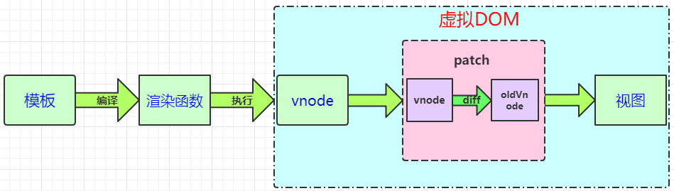
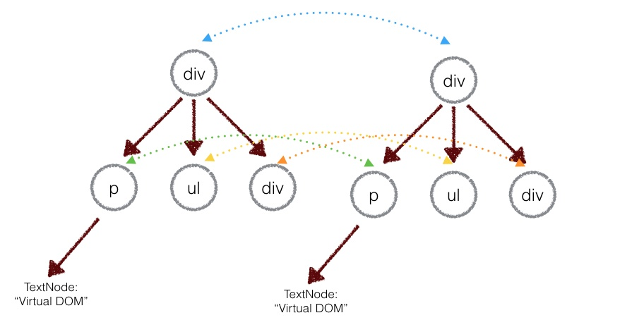
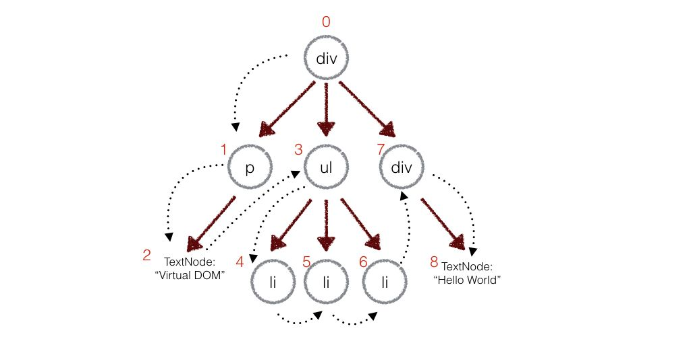

# 虚拟DOM

## 1. 什么是虚拟DOM?

Vue.js 2.0 引入了虚拟DOM，比之前版本的渲染速度提高了很多，并且大大的降低了内存的消耗。

Virtual DOM 其实就是一棵以 JavaScript 对象( VNode 节点)作为基础的树，用对象属性来描述节点，实际上它只是一层对真实 DOM 的抽象。最终可以通过一系列操作使这棵树映射到真实环境中。它是为了解决频繁操作DOM而产生的性能问题才出现的，这样比创建一个新的DOM代价更小。

简单来说，可以把Virtual DOM 理解为一个简单的JS对象，并且最少包含标**签名( tag)**、**属性(attrs)** 和**子元素对象( children)** 三个属性。

例如：

```javascript
<ul style="color:#FFF">
    <li>苹果</li>
    <li>香蕉</li>
    <li>橙子</li>
</ul>
```

可以用如下JS表示：

```javascript
{
    sel: 'ul',
    data: { style: {color: '#000'}}, // 节点属性及绑定事件等
    children: [ 
        {sel: 'li', text: '苹果'},
        {sel: 'li', text: '香蕉'},
        {sel: 'li', text: '橙子'}
    ]
}
```

## 2. 模板转化为视图的过程

首先要构建虚拟DOM： **template编译成AST语法树 -> 转换为render函数 -> 返回一个VNode**(VNode就是Vue的虚拟DOM节点)。



构建完虚拟节点之后，在对 Model 进行操作的时候，会触发对应 Dep 中的 Watcher 对象。Watcher 对象会调用对应的 update 来修改视图。这个过程主要是将新旧虚拟节点进行差异对比，然后根据对比结果进行DOM操作来更新视图。

所以实际的转化过程：**模板 → 渲染函数 → 虚拟DOM树 → 真实DOM**

其中：

- **渲染函数**：渲染函数是用来生成Virtual DOM的。Vue推荐使用模板来构建我们的应用界面，在底层实现中Vue会将模板编译成渲染函数，当然我们也可以不写模板，直接写渲染函数，以获得更好的控制。
- **VNode 虚拟节点**：它可以代表一个真实的 DOM 节点。通过 createElement 方法能将 VNode 渲染成 DOM 节点。简单地说，vnode可以理解成节点描述对象，它描述了应该怎样去创建真实的DOM节点。

- **patch算法**：虚拟DOM最核心的部分，它可以将vnode渲染成真实的DOM，这个过程是对比新旧虚拟节点之间有哪些不同，然后根据对比结果找出需要更新的节点进行更新。

## 3. 虚拟DOM的优势

虚拟DOM的优势如下：

- **运行效率高**

因为DOM操作的执行速度远不如Javascript的运算速度快。因此，把大量的DOM操作放在到Javascript中，运用patch算法来计算出真正需要更新的节点，最大限度地减少DOM操作，从而显著提高性能。

- **提高渲染的性能**

Virtual DOM的优势在于在大量、频繁的数据更新下，能够对视图进行合理、高效的更新。

- **具备跨平台的优势**

由于 Virtual DOM 是以 JavaScript 对象为基础而不依赖真实平台环境，所以使它具有了跨平台的能力。

## 4. diff 算法

虚拟DOM的最终目的就是将虚拟节点渲染到视图上。如果是用虚拟节点直接覆盖原来的旧的节点的话，那么就会有很多不必要的DOM操作。为了避免这些不必要的DOM操作，虚拟DOM的虚拟节点映射到视图的过程中，**将虚拟节点与上一次渲染视图所使用的旧虚拟节点做对比，找出真正需要更新的节点来进行DOM操作。** 之后在更新视图。

上面的过程就是所谓的虚拟DOM的算法，也就是diff算法，它主要包括两个步骤：

- 初次渲染，用JavaScript对象结构表示DOM树的结构，用这个树转化为虚拟节点在渲染成真正的DOM，并插入到容器里面
- 再次渲染，将新的VNode和旧的VNode进行对比，然后将两者之间的差异更新到真正的DOM树上，完成视图的更新

下面就来简单实现一下diff算法（参考github）：

**（1）模拟虚拟DOM树**

只需要记录DOM树的节点类型、属性、还有子节点就可以了：

```javascript
// element.js
function Element (tagName, props, children) {
  this.tagName = tagName
  this.props = props
  this.children = children
}
module.exports = function (tagName, props, children) {
  return new Element(tagName, props, children)
}
```

上面的DOM结构可以这样表示：

```javascript
var el = require('./element')
var ul = el('ul', {id: 'list'}, [
  el('li', {class: 'item'}, ['Item 1']),
  el('li', {class: 'item'}, ['Item 2']),
  el('li', {class: 'item'}, ['Item 3'])
])
```

下载ul只是用js对象表示的DOM结构，页面上并没有这个结构，可以根据这个ui创建`<ul>`标签：

```javascript
Element.prototype.render = function () {
  var el = document.createElement(this.tagName) // 根据tagName构建
  var props = this.props
  for (var propName in props) { // 设置节点的DOM属性
    var propValue = props[propName]
    el.setAttribute(propName, propValue)
  }
  var children = this.children || []
  children.forEach(function (child) {
    var childEl = (child instanceof Element)
      ? child.render() // 如果子节点是虚拟DOM，递归构建DOM节点
      : document.createTextNode(child) // 如果字符串，只构建文本节点
    el.appendChild(childEl)
  })
  return el
}
```

上面的render方法会根据tagName构建一个真正的DOM节点，然后设置这个节点的属性，最后递归的将自己的子节点构建出来，将这个节点插入页面：

```javascript
var ulRoot = ul.render()
document.body.appendChild(ulRoot)
```

这俩的ulRoot才是真正的DOM节点，将它放在文档中 ，就有这个节点的真正DOM结构了：

```javascript
<ul id='list'>
  <li class='item'>Item 1</li>
  <li class='item'>Item 2</li>
  <li class='item'>Item 3</li>
</ul>
```

**（2）比较两棵虚拟DOM树的差异**‘’

diff算法实际上就是比较两棵虚拟DOM树的差异。在diff算法中，两颗树的对比复杂度为O(n3)，但是在前端中我们很少有跨层移动DOM元素的情况，所以只考虑对同一层级的元素进行对比。



首先，会对新旧两棵树进行**深度优先遍历**，这样就可以对树的每个节点做一个唯一的标记。

在遍历的时候，每遍历一个节点就把该节点和新的树进行对比，如果有差异，就记录在一个对象中：

```javascript
function diff (oldTree, newTree) {
  var index = 0 // 当前节点的标志
  var patches = {} // 用来记录每个节点差异的对象
  dfsWalk(oldTree, newTree, index, patches)
  return patches
}
// 对两棵树进行深度优先遍历
function dfsWalk (oldNode, newNode, index, patches) {
  // 对比oldNode和newNode的不同，记录下来
  patches[index] = [...]
  diffChildren(oldNode.children, newNode.children, index, patches)
}
// 遍历子节点
function diffChildren (oldChildren, newChildren, index, patches) {
  var leftNode = null
  var currentNodeIndex = index
  oldChildren.forEach(function (child, i) {
    var newChild = newChildren[i]
    currentNodeIndex = (leftNode && leftNode.count) // 计算节点的标识
      ? currentNodeIndex + leftNode.count + 1
      : currentNodeIndex + 1
    dfsWalk(child, newChild, currentNodeIndex, patches) // 深度遍历子节点
    leftNode = child
  })
}
```

例如上面的div和新的div有差异，当前的标记为0，用数组存储新旧节点的不同：

```javascript
patches[0] = [{difference}, {difference}, ...] 
```

节点的差异可能有以下几种情况：

- 替换掉原来的节点，
- 移动、删除、新增子节点

- 修改了节点的属性
- 对于文本节点，文本内容可能会改变。

对于上面四种情况，可以定义差异类型：

```javascript
var REPLACE = 0
var REORDER = 1
var PROPS = 2
var TEXT = 3
```

对于节点替换，很简单。判断新旧节点的tagName是否一样，如果不一样的说明需要替换掉，例如section替换div：

```javascript
patches[0] = [{
  type: REPALCE,
  node: newNode // el('section', props, children)
}]
```

如果再给div 新增属性：

```javascript
patches[0] = [{
  type: REPALCE,
  node: newNode // el('section', props, children)
}, {
  type: PROPS,
  props: {
    id: "container"
  }
}]
```

如果是文本节点，如上面的文本节点2，就记录下：

```javascript
patches[2] = [{
  type: TEXT,
  content: "Virtual DOM"
}]
```

那如果是将上面的div的子节点顺序进行变化呢？如果按照同级对比，改变顺序的绩点都会被替换掉，这样DOM的开销就会很。实际上，不需要将所有的节点都替换掉，只要交换顺序就可以了。

移动操作实际上可以看做是删除和插入操作的组合，将新旧子节点进行对比，然后记录下来即可：

```javascript
patches[0] = [{
  type: REORDER,
  moves: [{remove or insert}, {remove or insert}, ...]
}]
```

**（3）将差异用到DOM树上**

上面第一步中构建的DOM树和render出来的真正的DOM树的信息和结构一致，所以我们可以对那棵DOM树也进行深度优先的遍历，遍历的时候从步骤二生成的`patches`对象中找出当前遍历的节点差异，然后进行 DOM 操作。

```javascript
function patch (node, patches) {
  var walker = {index: 0}
  dfsWalk(node, walker, patches)
}
function dfsWalk (node, walker, patches) {
  var currentPatches = patches[walker.index] // 从patches拿出当前节点的差异
  var len = node.childNodes
    ? node.childNodes.length
    : 0
  for (var i = 0; i < len; i++) { // 深度遍历子节点
    var child = node.childNodes[i]
    walker.index++
    dfsWalk(child, walker, patches)
  }
  if (currentPatches) {
    applyPatches(node, currentPatches) // 对当前节点进行DOM操作
  }
}
```

最后，根据不同类型的差异对当前节点进行 DOM 操作：

```javascript
function applyPatches (node, currentPatches) {
  currentPatches.forEach(function (currentPatch) {
    switch (currentPatch.type) {
      case REPLACE:
        node.parentNode.replaceChild(currentPatch.node.render(), node)
        break
      case REORDER:
        reorderChildren(node, currentPatch.moves)
        break
      case PROPS:
        setProps(node, currentPatch.props)
        break
      case TEXT:
        node.textContent = currentPatch.content
        break
      default:
        throw new Error('Unknown patch type ' + currentPatch.type)
    }
  })
}
```

所以实现虚拟DOM的算法总共有以下几个步骤：

```javascript
// 1. 构建虚拟DOM
var tree = el('div', {'id': 'container'}, [
    el('h1', {style: 'color: blue'}, ['simple virtal dom']),
    el('p', ['Hello, virtual-dom']),
    el('ul', [el('li')])
])
// 2. 通过虚拟DOM构建真正的DOM
var root = tree.render()
document.body.appendChild(root)
// 3. 生成新的虚拟DOM
var newTree = el('div', {'id': 'container'}, [
    el('h1', {style: 'color: red'}, ['simple virtal dom']),
    el('p', ['Hello, virtual-dom']),
    el('ul', [el('li'), el('li')])
])
// 4. 比较两棵虚拟DOM树的不同
var patches = diff(tree, newTree)
// 5. 在真正的DOM元素上应用变更
patch(root, patches)
```

