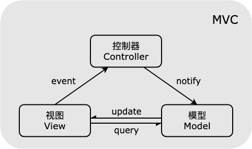
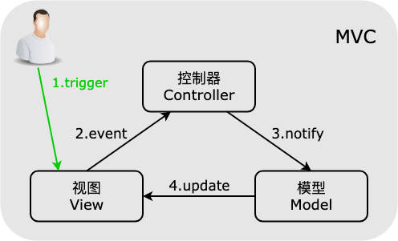
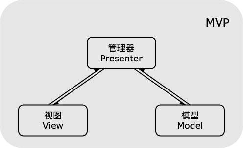
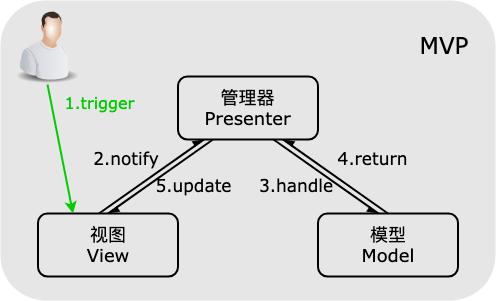
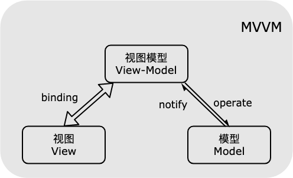
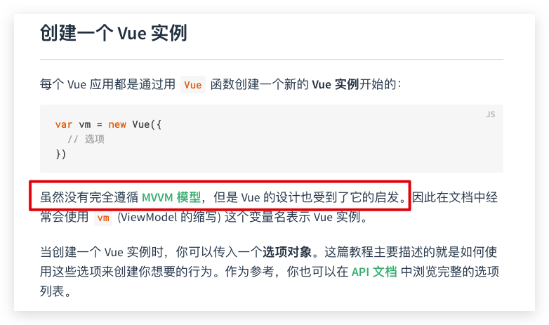

# MVC、MVP、MVVM

MVC、MVP、MVVM 模式是我们经常遇到的概念，其中 MVVM 是最常用到的，在实际项目中往往没有严格按照模式的定义来设计的系统，开发中也不要纠结自己用的到底是哪个模式，合适的才是最好的。

下面来看一下这三中模式的特点：

1. **MVC 模式：** 从大锅烩时代进化，引入了分层的概念，但是层与层之间耦合明显，维护起来不容易；
2. **MVP 模式：** 在 MVC 基础上进一步解耦，视图层和模型层完全隔离，交互只能通过管理层来进行，问题是更新视图需要管理层手动来进行；

1. **MVVM 模式：** 引入双向绑定机制，帮助实现一些更新视图层和模型层的工作，让开发者可以更专注于业务逻辑，相比于之前的模式，可以使用更少的代码量完成更复杂的交互；

## 1. MVC （Model View Controller）

**MVC** 模式将程序分为三个部分：模型（Model）、视图（View）、控制器（Controller）。

1. **Model 模型层：** 业务数据的处理和存储，数据更新后更新；
2. **View 视图层：** 人机交互接口，一般为展示给用户的界面；

1. **Controller 控制器层 ：** 负责连接 Model 层和 View 层，接受并处理 View 层触发的事件，并在 Model 层的数据状态变动时更新 View 层；

MVC 模式的目的是**通过引入 Controller 层来将 Model 层和 View 层分离**，分层的引入是原来大锅烩方式的改进，使得系统在可维护性和可读性上有了进步。

MVC 模式的典型思路是 View 层通过事件通知到 Controller 层，Controller 层经过对事件的处理完成相关业务逻辑，要求 Model 层改变数据状态，Model 层再将新数据更新到 View 层。示意图如下：

在实际操作时，用户可以直接对 View 层的 UI 进行操作，以通过事件通知 Controller 层，经过处理后修改 Model 层的数据，Model 层使用最新数据更新 View。示意图如下：

用户也可以直接触发 Controller 去更新 Model 层状态，再更新 View 层：

某些场景下，View 层直接采用观察者/发布订阅模式监听 Model 层的变化，这样 View 层和 Model 层相互持有、相互操作，导致紧密耦合，在可维护性上有待提升。由此，MVP 模式应运而生 。

## 2. MVP （Model View Presenter）

**MVP** 模式将程序分为三个部分：模型（Model）、视图（View）、管理层（Presenter）。

1. **Model 模型层：** 只负责存储数据，与 View 呈现无关，也与 UI 处理逻辑无关，发生更新也不用主动通知 View；
2. **View 视图层：** 人机交互接口，一般为展示给用户的界面；

1. **Presenter 管理层 ：** 负责连接 Model 层和 View 层，处理 View 层的事件，负责获取数据并将获取的数据经过处理后更新 View；

MVC 模式的 View 层和 Model 层存在耦合，为了解决这个问题，MVP 模式将 View 层和 Model 层解耦，之间的交互只能通过 Presenter 层，实际上，MVP 模式的目的就是**将 View 层和 Model 层完全解耦**，使得对 View 层的修改不会影响到 Model 层，而对 Model 层的数据改动也不会影响到 View 层。

典型流程是 View 层触发的事件传递到 Presenter 层中处理，Presenter 层去操作 Model 层，并且将数据返回给 View 层，这个过程中，View 层和 Model 层没有直接联系。而 View 层不部署业务逻辑，除了展示数据和触发事件之外，其它时间都在等着 Presenter 层来更新自己，被称为「被动视图」。

示意图如下：

在实际操作时，用户可以直接对 View 层的 UI 进行操作，View 层通知 Presenter 层，Presenter 层操作 Model 层的数据，Presenter 层获取到数据之后更新 View。示意图如下：

由于 Presenter 层负责了数据获取、数据处理、交互逻辑、UI 效果等等功能，所以 Presenter 层就变得强大起来，相应的，Model 层只负责数据存储，而 View 层只负责视图，Model 和 View 层的责任纯粹而单一，如果我们需要添加或修改功能模块，只需要修改 Presenter 层就够了。由于 Presenter 层需要调用 View 层的方法更新视图，Presenter 层直接持有 View 层导致了 Presenter 对 View 的依赖。

正如上所说，更新视图需要 Presenter 层直接持有 View 层，并通过调用 View 层中的方法来实现，还是需要一系列复杂操作，有没有什么机制自动去更新视图而不用我们手动去更新呢，所以，MVVM 模式应运而生。

## 3. MVVM （Model View ViewModel）

**MVVM** 模式将程序分为三个部分：模型（Model）、视图（View）、视图模型（View-Model）。

和 MVP 模式类似，Model 层和 View 层也被隔离开，彻底解耦，ViewModel 层相当于 Presenter 层，负责绑定 Model 层和 View 层，相比于 MVP 增加了双向绑定机制。

结构图如下：

MVVM 模式的特征是 ViewModel 层和 View 层采用双向绑定的形式（Binding），View 层的变动，将自动反映在 ViewModel 层，反之亦然。

但是双向绑定给调试和错误定位带来困难，View 层的异常可能是 View 的代码有问题，也有可能是 Model 层的问题。数据绑定使得一个位置的 Bug 被传递到别的位置，要定位原始出问题的地方就变得不那么容易了。

对简单 UI 来说，实现 MVVM 模式的开销是不必要的，而对于大型应用来说，引入 MVVM 模式则会节约大量手动更新视图的复杂过程，是否使用，还是看使用场景。

Vue 的双向绑定机制应该算是比较有 MVVM 模式的影子，但 [Vue 文档](https://cn.vuejs.org/v2/guide/instance.html#创建一个-Vue-实例) 里面是这么描述：

这是为什么呢，因为 MVVM 模式要求 Model 层和 View 层完全解耦，但是由于 Vue 还提供了 `ref` 这样的 API，使得 Model 也可以直接持有 View：

但是大家都称 Vue 为 MVVM 框架，可见这些模式的划分也不是那么严格。

## 4. 总结

**（1）MVC**

MVC 通过分离 Model、View 和 Controller 的方式来组织代码结构。其中 View 负责页面的显示逻辑，Model 负责存储页面的业务数据，以及对相应数据的操作。并且 View 和 Model 应用了观察者模式，当 Model 层发生改变的时候它会通知有关 View 层更新页面。Controller 层是 View 层和 Model 层的纽带，它主要负责用户与应用的响应操作，当用户与页面产生交互的时候，Controller 中的事件触发器就开始工作了，通过调用 Model 层，来完成对 Model 的修改，然后 Model 层再去通知 View 层更新。

**（2）MVVM**

MVVM 分为 Model、View、ViewModel 三者。

- Model代表数据模型，数据和业务逻辑都在Model层中定义；
- View代表UI视图，负责数据的展示；

- ViewModel负责监听Model中数据的改变并且控制视图的更新，处理用户交互操作；

Model和View并无直接关联，而是通过ViewModel来进行联系的，Model和ViewModel之间有着双向数据绑定的联系。因此当Model中 的数据改变时会触发View层的刷新，View中由于用户交互操作而改变的 数据也会在Model中同步。

这种模式实现了 Model和View的数据自动同步，因此开发者只需要专注 对数据的维护操作即可，而不需要自己操作DOM。

**（3）MVP**

MVP 模式与 MVC 唯一不同的在于 Presenter 和 Controller。在 MVC 模式中我们使用观察者模式，来实现当 Model 层数据发生变化的时候，通知 View 层的更新。这样 View 层和 Model 层耦合在一起，当项目逻辑变得复杂的时候，可能会造成代码的混乱，并且可能会对代码的复用性造成一些问题。MVP 的模式通过使用 Presenter 来实现对 View 层和 Model 层的解耦。MVC 中的Controller 只知道 Model 的接口，因此它没有办法控制 View 层的更新，MVP 模式中，View 层的接口暴露给了 Presenter 因此我们可以在 Presenter 中将 Model 的变化和 View 的变化绑定在一起，以此来实现 View 和 Model 的同步更新。这样就实现了对 View 和 Model 的解耦，Presenter 还包含了其他的响应逻辑。

