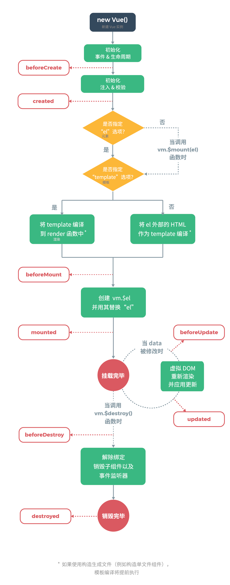
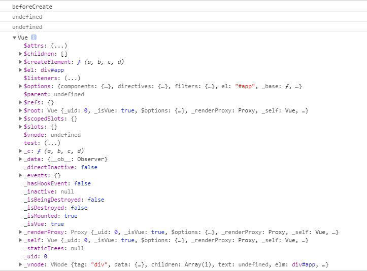
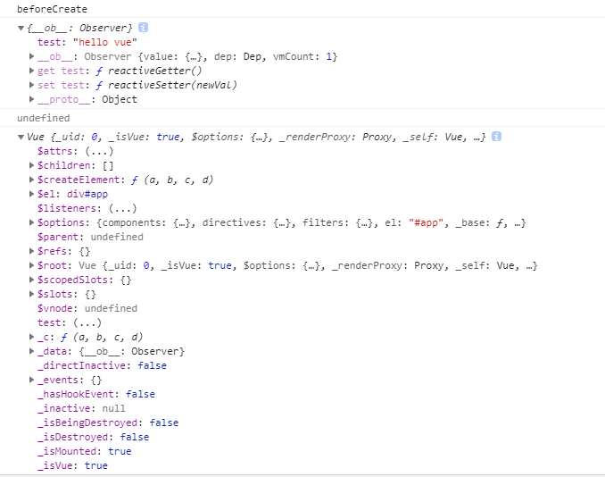
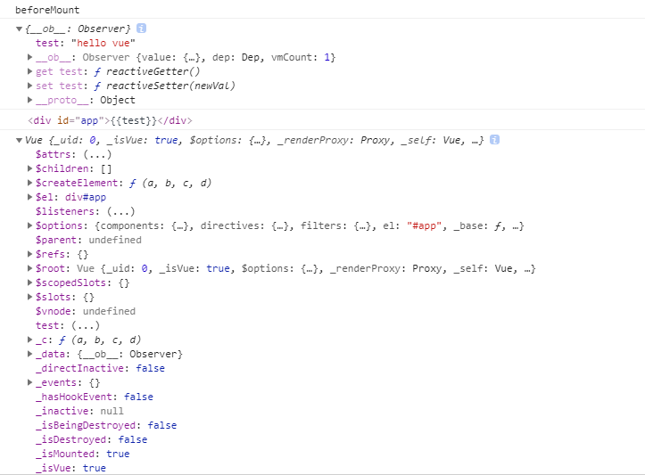
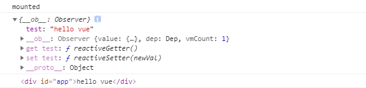
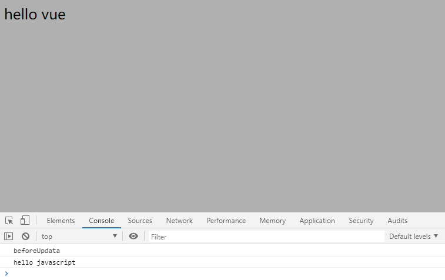
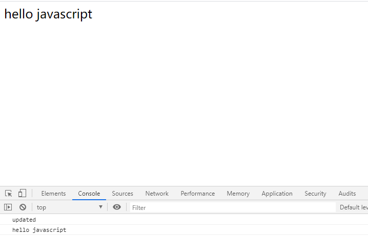

# 生命周期

## 1. Vue生命周期是什么？

在每个Vue实例在被创建时，都会经过创建、初始化数据、模板编译、挂载DOM，数据更新使得DOM更新、实例卸载等一系列的过程。这一系列过程就是Vue的生命周期。


简单来说，Vue实例从初始化到销毁的过程就是Vue的生命周期。在这个过程中，会有一些**生命周期钩子函数**用户可以在不同阶段的钩子函数中添加相应的业务代码。


下图是Vue官网中给出的Vue生命周期的图示：



## 2. 生命周期钩子

Vue 一共有8个生命阶段，分别是创建前、创建后、加载前、加载后、更新前、更新后、销毁前和销毁后，每个阶段对应了一个生命周期的钩子函数。

（1）beforeCreate 钩子函数，在实例初始化之后，在数据监听和事件配置之前触发。因此在这个事件中我们是获取不到 data 数据的。

（2）created 钩子函数，在实例创建完成后触发，此时可以访问 data、methods 等属性。但这个时候组件还没有被挂载到页面中去，所以这个时候访问不到 $el 属性。一般我们可以在这个函数中进行一些页面初始化的工作，比如通过 ajax 请求数据来对页面进行初始化。

（3）beforeMount 钩子函数，在组件被挂载到页面之前触发。在 beforeMount 之前，会找到对应的 template，并编译成 render 函数。

（4）mounted 钩子函数，在组件挂载到页面之后触发。此时可以通过 DOM API 获取到页面中的 DOM 元素。

（5）beforeUpdate 钩子函数，在响应式数据更新时触发，发生在虚拟 DOM 重新渲染和打补丁之前，这个时候我们可以对可能会被移除的元素做一些操作，比如移除事件监听器。

（6）updated 钩子函数，虚拟 DOM 重新渲染和打补丁之后调用。

（7）beforeDestroy 钩子函数，在实例销毁之前调用。一般在这一步我们可以销毁定时器、解绑全局事件等。

（8）destroyed 钩子函数，在实例销毁之后调用，调用后，Vue 实例中的所有东西都会解除绑定，所有的事件监听器会被移除，所有的子实例也会被销毁。


当我们使用 keep-alive 的时候，还有两个钩子函数，分别是 activated 和 deactivated 。用 keep-alive 包裹的组件在切换时不会进行销毁，而是缓存到内存中并执行 deactivated 钩子函数，命中缓存渲染后会执行 actived 钩子函数。


### 2.1 beforeCreate

`beforeCreate`是发生在实例初始化之后，创建实例之前的钩子事件。


在这个过程中会创建一个Vue实例，此时实例上只有一些生命周期函数和默认的事件，此时`data` `computed` `watch` `methods`上的方法和数据均不能访问：

```javascript
const vm = new Vue({
      el: '#app',
      data() {
        return {
          test: 'hello vue'
        }
      },
      beforeCreate() {
        console.log('beforeCreate');
        console.log(this.$data);
        console.log(this.$el);
        console.log(this);
      }
    })
```

打印结果：



### 2.2 created

这是实例创建完成后的钩子，此时我们可以读取`data`的值，并可以对其进行操作，把方法、计算属性也都挂载到了实例。但是依旧不能访问`el`，不能获取到DOM元素。


在这个钩子函数中，我们可以进行数据请求，并把请求到的数据储存在`data`中。但是请求的数据不宜过多。

```javascript
const vm = new Vue({
      el: '#app',
      data() {
        return {
          test: 'hello vue'
        }
      },
      created() {
        console.log('created');
        console.log(this.$data);
        console.log(this.$el);
        console.log(this);
      }
    })
```


打印结果：



### 2.3 beforeMounted

在这个钩子中，首先会判断el的挂载方式，挂载方式有两种：`el:'#app'` 和 `vm.$mount('#app')`，然后判断是否有指定的`template`选项，如果有就将`template`编译到`render`函数中，没有则将`el`外部的HTML作为`template` 编译。


这个过程将`template`进行渲染保存到内存当中，但是还未挂载在页面上。

```javascript
const vm = new Vue({
      // el: '#app',
      data() {
        return {
          test: 'hello vue'
        }
      },
      beforeMount() {
        console.log('beforeMount');
        console.log(this.$data);
        console.log(this.$el);
        console.log(this);
      }
    })
    vm.$mount('#app')
```

打印结果：



### 2.4 mounted

在这个钩子中，会将实例挂载到DOM上，我们可以操作页面上的DOM，一般会在此钩子函数中做一些数据请求获取数据，进行数据初始化。 `mounted`在整个实例中只执行一次。

```javascript
const vm = new Vue({
      // el: '#app',
      data() {
        return {
          test: 'hello vue'
        }
      },
      mounted() {
        console.log('mounted');
        console.log(this.$data);
        console.log(this.$el);
      }
    })
    vm.$mount('#app')
```

打印结果：



### 2.5 beforeUpdata

在此钩子中，data中的数据已经进行了更新，但是页面数据并没有进行更新


```javascript
 const vm = new Vue({
      // el: '#app',
      data() {
        return {
          test: 'hello vue'
        }
      },
      beforeUpdate() {
        console.log('beforeUpdata');
        console.log(this.test);
        debugger
      }
    })
    vm.$mount('#app')
    vm.test = 'hello javascript'
```

打印结果：



### 2.6 upDated

将data中的最新数据渲染出DOM，并将最新的DOM挂载页面，此时data数据与页面数据一致：

```javascript
 const vm = new Vue({
      // el: '#app',
      data() {
        return {
          test: 'hello vue'
        }
      },
      updated() {
        console.log('updated');
        console.log(this.test);
      }
    })
    vm.$mount('#app')
    vm.test = 'hello javascript'
```

打印结果：



### 2.7 beforeDestroy

实例销毁之前调用，此时组件的data、计算属性、过滤器等都还处于可用的状态，销毁还并未执行。

### 2.8 destroyed

组件已经完全销毁，组件中的数据、方法、计算属性、过滤器等都已经不可用。


我们可以进行手动的销毁组件：`vm.$destory()`

## 3. 面试题

### （1）简单说一下Vue的生命周期

1. beforeCreate
   实例初始化后被调用，此时 data 的响应式追踪、event/watcher 都还没有被设置，也就是说不能访问到data、computed、watch、methods上的方法和数据。
2. created
   实例创建完成，实例上配置的 options 包括 data、computed、watch、methods 等都配置完成，但是此时渲染得节点还未挂载到 DOM，所以不能访问到 `$el` 属性。

1. beforeMount
   在挂载开始之前被调用，`render` 函数马上就会被调用。
2. mounted
   实例挂载到 DOM上，此时可以通过 DOM API 获取到 DOM 节点，`$el` 属性可以访问。

1. beforeUpdate
   响应式数据更新时调用，此时虽然响应式数据更新了，但是对应的真实 DOM 还没有被渲染
2. updated
   此时 DOM 已经根据响应式数据的变化更新了。

1. beforeDestroy
   实例销毁之前调用。这一步，实例仍然完全可用，`this` 仍能获取到实例。
2. destroyed
   实例销毁后调用，调用后，Vue 实例指示的所有东西都会解绑定，所有的事件监听器会被移除，所有的子实例也会被销毁。

### （2）Vue 的父组件和子组件生命周期钩子执行顺序是什么

- 首次加载渲染过程： `父beforeCreate->父created->父beforeMount->子beforeCreate->子created->子beforeMount->子mounted->父mounted`
- 子组件更新过程： `父beforeUpdate->子beforeUpdate->子updated->父updated`

- 父组件更新过程： `父beforeUpdate->父updated`
- 销毁过程： `父beforeDestroy->子beforeDestroy->子destroyed->父destroyed`
