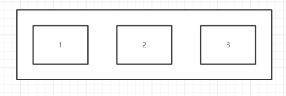

# Flex布局


### 1. 什么是Flex布局？

**概念：** Flex 是 Flexible Box 的缩写，即弹性布局（也叫Flex布局，弹性盒子布局）。

**主要思想：** 弹性布局的主要思想是使父元素能够调整子元素的宽度、高度、排列方式，从而更好的适应可用的布局空间。

**特点：** Flex布局更适合小规模的布局，可以简便、完整、响应式的实现各种页面布局。但是，设为Flex布局以后，其子元素的`float`、`clear`和`vertical-align`属性将失效。Flex弹性盒模型的优势在于开发 ⼈员只是声明布局应该具有的⾏为，⽽不需要给出具体的实现⽅式，浏览器负责完成实际布局，当布局涉及到不定宽 度，分布对⻬的场景时，就要优先考虑弹性盒布局。

**布局概念：** 采用 Flex 布局的元素，称为 Flex 容器，简称"**容器**"。它的所有子元素自动成为容器成员，称为 Flex 项目，简称"**项目**"。

容器默认存在两个轴：**水平交叉轴**（main axis）和**垂直交叉轴**（cross axis），项目默认沿主轴排列。


### 2. 父元素属性

父元素有以下六个属性：

- flex-direction
- flex-wrap

- flex-flow
- justify-content

- align-items
- align-content

#### 2.1 flex-direction

**flex-direction**：容器内元素排列方向

- `flex-direction:row`：默认值，沿水平主轴从左到右排列

​    

- `flex-direction:row-reverse`：沿水平主轴从右到左排列
​    
- `flex-direction:column`：沿垂直主轴从上到下排列
​    
    

- `flex-direction:column-reverse`：沿垂直主轴从下到上排列

 

#### 2.2 flex-wrap

**flex-wrap**：容器内元素是否换行

- `flex-wrap: nowrap`：默认值，不换行

- `flex-wrap: wrap`：换行，第一行在上面
 

- `flex-wrap: wrap-reverse`：换行，第一行在下面
 

#### 2.3 flex-flow

```javascript
flex-direction`属性和`flex-wrap`属性的简写，默认为:`flex-flow:row nowrap
```

#### 2.4 justify-content

**justify-content**：元素在主轴的对齐方式

- `justify-content : center` ：元素在主轴上**居中**
  
- `justify-content : flex-start`：元素在主轴上**左对齐**或**上对齐**
  

- `justify-content : flex-end`：元素在主轴上**右对齐**或**下对齐**
  
- `justify-content : space-between`：元素在主轴上**两端对齐**，元素之间间隔相等
  

- `justify-content : space-around` ：每个项目两侧的间隔相等。所以，项目之间的间隔比项目与边框的间隔大一倍。
  
  

#### 2.5 align-items

**align-item**：元素在交叉轴上对齐方式

- `align-item：flex-start`：交叉轴的起点对齐（上面或左边）
  
- `align-item：flex-end`：交叉轴的终点对齐（下面或有右边）
   

- `align-item：center`：交叉轴的中点对齐
   
- `align-item：stretch`：默认值、如果元素未设置高度或设为auto，将占满整个容器的高度
   

- `align-item：baseline`：以元素的第一行文字的基线对齐
 

#### 2.6 align-content

**align-content**：多根轴线对齐方式。如果元素只有一根轴线，该属性不起作用。

- `align-content:stretch`：默认值，轴线占满整个交叉轴
   
- `align-content: flex-start`：从交叉轴开始位置填充
   

- `align-content: flex-end`：从交叉轴结尾位置填充
 
- `align-content: center`：与交叉轴中点对齐
  


- `align-content: space-between`：与交叉轴两端对齐，轴线之前的间隔平均分布
  

- `align-content: space-around`：每根轴线两侧的间隔都相等。所以，轴线之间的间隔比轴线与边框的间隔大一倍

 


### 3. 子元素属性

子元素有以下六个属性：

- order
- flex-grow

- flex-shrink
- flex-basis

- flex
- align-self

#### 3.1 order


`order`属性定义项目的排列顺序。数值越小，排列越靠前，默认为`0`

 


#### 3.2 flex-grow

`flex-grow`属性定义项目的放大比例，默认为0，即如果存在剩余空间，也不放大。

 


 


#### 3.3 flex-shrink

`flex-shrink`属性定义了项目的缩小比例，默认为1，即如果空间不足，该项目将缩小。

 


#### 3.4 flex-basis

`flex-basis`属性定义了在分配多余空间之前，项目占据的主轴空间，浏览器根据这个属性，计算主轴是否有多余空间。它的默认值为auto，即项目的本来大小。

#### 3.5 flex

`flex`属性是`flex-grow`, `flex-shrink` 和 `flex-basis`的简写，后两个属性可选。默认值为：`flex:0 1 auto`


#### 3.6 align-self

`align-self`属性允许单个项目有与其他项目不一样的对齐方式，可覆盖`align-items`属性。默认值为`auto`，表示继承父元素的`align-items`属性，如果没有父元素，则等同于`stretch`。

```javascript
align-self: auto | flex-start | flex-end | center | baseline | stretch;
```

